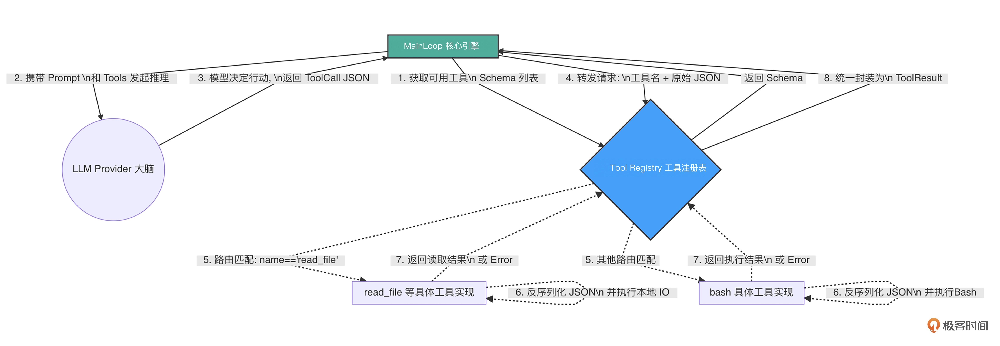

你好，我是 Tony Bai。欢迎来到《从 0 开始构建 Agent Harness》专栏的第五讲。

在上一讲中，我们通过设计优雅的 Provider 适配层，成功为 tiny-claw 接入了真实的”大脑”（兼容 OpenAI/Claude 协议的智谱 GLM 模型）。并且，我们前瞻性地探讨了自适应推理（Adaptive Reasoning），通过一个开关控制大模型是否进行”慢思考”。

然而，那个聪明的“大脑”，目前只能通过一个伪造的 mockRegistry 查询一段固定的“假天气”数据。

一个真正的工业级 Agent，它的使命是改变现实世界，比如：它需要读取本地代码、修改配置、执行终端命令，甚至调用集群的微服务。如果面对成百上千种潜在的工具需求，我们在核心引擎（Main Loop）里用一堆 if-else 或 switch-case 去硬编码每个工具的解析和执行逻辑，代码很快就会变成一座无法维护的垃圾山。

这就是为什么顶级开源 Agent（如 OpenClaw）在底层架构中，都必不可少地引入了一个核心中间件：Tool Registry（工具注册表）。

今天，我们将正式踏入专栏的第二章：极简工具与物理交互（Action & Tools）。我们将拔掉假肢，亲手用 Python 构建一个强扩展、高内聚的 Tool Registry，并实现我们的第一个物理级工具：read_file（读取本地文件）。

## 架构设计：为什么需要 Tool Registry？

在 Harness（驾驭工程）的理念中，Main Loop 永远是“瞎子”和“聋子”。它不应该知道 bash 命令怎么调用，也不应该知道 read_file 需要什么参数格式。它只负责维护上下文，并将模型吐出来的 JSON 字符串丢给执行层。

因此，Tool Registry 扮演了一个极其关键的“集线器（Hub）”和“路由器（Router）”的角色。它的核心职责有三：

动态挂载（Register）：允许开发者在引擎启动时，随时随地向系统插拔新的工具实现（在 Python 中，其本质上是实现了特定抽象基类的类）。

描述暴露（Expose Schema）：在每次向大模型发起推理前，Registry 负责把当前所有已挂载工具的名称、描述以及 JSON Schema 打包成列表，交给 Provider 翻译给大模型听。

路由分发与执行（Dispatch & Execute）：当大模型决定调用某个工具，并吐出一串 JSON 参数（ToolCall）时，Registry 负责找到对应的 Python 方法，把参数丢给它执行，最后将结果封装成统一的 ToolResult 返回给 Main Loop。

我们可以用一张示意图来清晰地展示这个解耦过程：



有了这个 Registry，我们未来给 Agent 添加任何新能力，都只需要写一个独立的源码文件实现特定接口，然后 Register 进去即可，核心引擎（Main Loop）一行代码都不用改！

## 代码实战：构建动态 Registry 与 Tool 接口

接下来，我们将把理论转化为纯粹的 Python 代码。

### 目录结构回顾与更新

今天我们将清空之前测试用的 mockRegistry，并在 internal/tools 目录下实现真正的核心逻辑和 read_file 工具。
```
tiny-claw/
├── cmd/
│   └── claw/
│       └── main.py          # 【修改】接入真实的 Registry 和 read_file 工具
├── internal/
│   ├── engine/              # 保持不变
│   ├── provider/            # 保持不变
│   ├── schema/              # 保持不变
│   └── tools/               # 【工具与执行层】(本次核心)
│       ├── registry.py      # 【新增】Tool Registry 接口与实现
│       └── readfile.py      # 【新增】真实的 read_file 工具实现
├── requirements.txt
└── setup.py
```

### 第 1 步：定义 BaseTool 接口

在 internal/tools/registry.py 中，我们首先规范什么样的数据结构可以被称为一个”工具”。

对于 tiny-claw 来说，一个工具必须能说出自己的名字、描述，能给出严谨的参数要求（JSON Schema），并且能接收一段原始的 JSON 字节数组去执行具体逻辑。
```python
# internal/tools/registry.py
import logging
from abc import ABC, abstractmethod
from typing import Any, List
from ..schema.message import ToolDefinition


# BaseTool 是所有具体工具必须实现的通用接口
class BaseTool(ABC):
    """BaseTool 定义所有具体工具都要实现的通用接口。"""

    @abstractmethod
    def name(self) -> str:
        """返回工具的全局唯一名称 (大模型通过这个名字调用它)。"""
        pass

    @abstractmethod
    def definition(self) -> ToolDefinition:
        """返回用于提交给大模型的工具元信息和参数 JSON Schema。"""
        pass

    @abstractmethod
    def execute(self, args: Any) -> str:
        """接收大模型吐出的 JSON 参数，执行具体业务逻辑。

        注意：参数是 Any (通常是 dict)，反序列化由各个具体工具内部自行处理。
        """
        pass
```

### 第 2 步：实现 Registry 的路由与分发

紧接着在同一个文件里，我们实现注册表的挂载和执行逻辑。
```python
# internal/tools/registry.py (续)

from typing import Dict, List, Optional, Tuple, Callable

from ..schema.message import ToolCall, ToolResult


# MiddlewareFunc 定义全局中间件签名：
# 接收当前 ToolCall，返回是否放行以及拦截原因。
MiddlewareFunc = Callable[[ToolCall], Tuple[bool, str]]


# Registry 定义了工具的注册与分发接口
class Registry(ABC):
    """Registry 定义工具的注册与分发接口。"""

    @abstractmethod
    def register(self, tool: BaseTool) -> None:
        """挂载一个新的工具到系统中。"""
        pass

    @abstractmethod
    def get_available_tools(self) -> List[ToolDefinition]:
        """返回当前系统挂载的所有工具 Schema，供 Main Loop 交给 Provider。"""
        pass

    @abstractmethod
    def execute(self, call: ToolCall) -> ToolResult:
        """实际路由并执行模型请求的工具调用。"""
        pass


# ToolRegistry 是 Registry 接口的默认实现
class ToolRegistry(Registry):
    """Registry 的默认实现，使用工具名做 O(1) 路由查找。"""

    def __init__(self):
        # 使用 dict 以工具的 Name 作为 Key 进行快速 O(1) 路由查找
        self.tools: Dict[str, BaseTool] = {}

    def register(self, tool: BaseTool) -> None:
        name = tool.name()
        if name in self.tools:
            logging.warning("工具 '%s' 已经被注册，将被覆盖。", name)
        self.tools[name] = tool
        logging.info("[Registry] 成功挂载工具: %s", name)

    def get_available_tools(self) -> List[ToolDefinition]:
        return [tool.definition() for tool in self.tools.values()]

    def execute(self, call: ToolCall) -> ToolResult:
        # 1. 路由查找：如果在注册表中找不到该工具，这是模型产生了幻觉，直接向模型抛出错误
        tool = self.tools.get(call.name)
        if tool is None:
            return ToolResult(
                tool_call_id=call.id,
                output=f"Error: 系统中不存在名为 '{call.name}' 的工具。",
                is_error=True,  # 标记为错误，模型看到后会尝试纠正
            )

        # 2. 执行工具逻辑：将原始的参数直接丢给具体工具
        try:
            output = tool.execute(call.arguments)
        except Exception as exc:
            # 3. 封装结果：将执行结果或底层物理错误封装后返回给 Main Loop
            logging.error(f"[Registry] ❌  工具调用失败: {call.name} - {exc}")
            return ToolResult(
                tool_call_id=call.id,
                output=f"Error executing {call.name}: {exc}",
                is_error=True,
            )

        return ToolResult(
            tool_call_id=call.id,
            output=output,
            is_error=False,
        )


def new_registry() -> Registry:
    """创建一个新的 ToolRegistry 实例。"""
    return ToolRegistry()


# PascalCase 别名，兼容 Go 风格命名
NewRegistry = new_registry
```

代码非常清爽。Registry 就像一个忠实的前台总机，只负责接线（接收 ToolCall），查黄页（找 tools map），然后转接给具体的业务部门（具体工具的 Execute 方法）。

### 第 3 步：编写第一个物理工具 read_file

对于一个 Coding Agent 来说，阅读源代码是它感知物理环境的最基础能力。我们将实现 read_file 工具。

在实现这个工具时，我们将注入驾驭工程（Harness Engineering）中极其重要的防御底线思维：容错与截断。

新建 internal/tools/readfile.py：
```python
# internal/tools/readfile.py
import os
from typing import Any

from ..schema.message import ToolDefinition
from .registry import BaseTool

# 【核心防线】长度截断保护的阈值
MAX_LEN = 8000


# ReadFileTool 实现了读取本地文件内容的工具
class ReadFileTool(BaseTool):
    """读取工作区内本地文件内容的工具。"""

    def __init__(self, work_dir: str):
        # 将引擎的 WorkDir 注入给工具，限制它只能在此目录及其子目录下操作
        self.work_dir = work_dir

    def name(self) -> str:
        return "read_file"

    # Definition 向大模型清晰地描述这个工具的用途和参数格式
    def definition(self) -> ToolDefinition:
        return ToolDefinition(
            name=self.name(),
            description="读取指定路径的文件内容。请提供相对工作区的路径。",
            # 遵循 JSON Schema 规范定义参数
            input_schema={
                "type": "object",
                "properties": {
                    "path": {
                        "type": "string",
                        "description": "要读取的文件路径，如 cmd/claw/main.py",
                    }
                },
                "required": ["path"],
            },
        )

    def execute(self, args: Any) -> str:
        # 1. 延迟解析：将大模型传过来的 JSON 参数解析为强类型结构体
        # 返回 error 会被 Registry 捕获并传给大模型，模型会知道自己 JSON 格式写错了
        path = self._extract_path(args)

        # 2. 拼接绝对路径 (注意：生产环境中需要做路径穿越检测防范，防止 ../../etc/passwd)
        full_path = os.path.join(self.work_dir, path)

        # 3. 执行物理 IO 操作
        try:
            with open(full_path, "r", encoding="utf-8") as file:
                content = file.read()
        except OSError as exc:
            raise RuntimeError(f"打开文件失败: {exc}") from exc

        # 4. 【核心防线】长度截断保护
        # 为了防止大模型读取几百 MB 的日志文件导致 Context 瞬间爆炸 (OOM)，
        # 我们在工具内部直接进行物理截断。
        if len(content) > MAX_LEN:
            return (
                f"{content[:MAX_LEN]}\n\n"
                f"...[由于内容过长，已被系统截断至前 {MAX_LEN} 字节]..."
            )
        return content

    def _extract_path(self, args: Any) -> str:
        """从参数中提取路径，进行基本验证。"""
        if not isinstance(args, dict):
            raise ValueError("参数解析失败: 参数必须是包含 path 的对象")

        path = args.get("path")
        if not isinstance(path, str) or not path:
            raise ValueError("参数解析失败: path 必须是非空字符串")
        return path


def new_read_file_tool(work_dir: str) -> ReadFileTool:
    """创建一个新的 ReadFileTool 实例。"""
    return ReadFileTool(work_dir)


# PascalCase 别名，兼容 Go 风格命名
NewReadFileTool = new_read_file_tool
```

请仔细体会这 4 步中的第 4 步（长度截断保护）。

在大模型的 API 调用中，Token 就是金钱，Context 就是生命线。如果你放任大模型读取超大文件，不仅会引发高昂的账单，还会导致上下文爆炸，甚至导致 API 拒绝服务。驾驭工程的真谛就是：绝不把系统的安全性寄希望于大模型的理智，而是在底层的工具实现中强制兜底。

## 运行与验证：连接真实大脑与真实手脚

一切就绪。让我们回到程序的入口，把”真实的大脑”连接到”真实的手脚”上。为了测试效果，请在你的项目根目录下创建一个测试文件 hello.txt：
```bash
echo “Hello, tiny-claw 引擎！我是来自物理文件系统的一段神秘文本。大模型今天终于看到了我！” > hello.txt
```

现在，修改 cmd/claw/main.py，移除之前的 mockRegistry，接入正规军：
```python
# cmd/claw/main.py
import os
import logging

from internal.engine.loop import AgentEngine
from internal.provider.openai_provider import OpenAIProvider
from internal.tools.registry import NewRegistry
from internal.tools.readfile import NewReadFileTool


def main() -> None:
    # 确保设置了 ZHIPU_API_KEY
    if not os.environ.get("ZHIPU_API_KEY"):
        raise RuntimeError("请先导出 ZHIPU_API_KEY 环境变量")

    # 1. 获取工作区物理边界
    work_dir = os.getcwd()

    # 2. 初始化真实的大脑 (指向智谱 GLM-4.5，使用上一讲的 OpenAI 适配器)
    llm_provider = OpenAIProvider(model="glm-4.5-air")

    # 3. 初始化真实的 Tool Registry
    registry = NewRegistry()

    # 4. 将真实的 ReadFile 工具挂载到注册表中
    read_file_tool = NewReadFileTool(work_dir)
    registry.register(read_file_tool)

    # 5. 实例化核心引擎，由于任务简单，我们关闭思考阶段 (enable_thinking=False) 以加快速度
    eng = AgentEngine(llm_provider, registry, work_dir, enable_thinking=False)

    # 6. 下发一个必须通过真实工具才能完成的任务
    prompt = "请调用工具读取一下当前工作区目录下 hello.txt 文件的内容，并用一句话向我总结它说了什么。"

    eng.run(prompt)


if __name__ == "__main__":
    main()
```

### 奇迹时刻：Agent 的第一次物理交互

在终端中执行启动命令：
```bash
python cmd/claw/main.py
```

你将看到如下振奋人心的日志流转：
```
INFO:root:[Registry] 成功挂载工具: read_file
INFO:root:[Engine] 引擎启动，锁定工作区: /path/to/tiny-claw
INFO:root:[Engine] 慢思考模式 (Thinking Phase): False

========== [Turn 1] 开始 ==========
INFO:root:[Engine][Phase 2] 恢复工具挂载，等待模型采取行动...
🤖 [对外回复]:

INFO:root:[Engine] 模型请求调用 1 个工具...
INFO:root:  -> 🛠️ 执行工具: read_file, 参数: {"path":"hello.txt"}
INFO:root:  -> ✅ 工具执行成功 (返回 120 字节)

========== [Turn 2] 开始 ==========
INFO:root:[Engine][Phase 2] 恢复工具挂载，等待模型采取行动...
🤖 [对外回复]:
文件内容是一个问候语，神秘文本向 tiny-claw 引擎打招呼并表达被大模型发现的喜悦。
INFO:root:[Engine] 模型未请求调用工具，任务宣告完成。
```

看！整个流程行云流水：

大模型阅读了 Registry 暴露的 read_file 的 JSON Schema，精准推断出需要调用它。

模型输出符合要求的 JSON 参数 {"path":"hello.txt"}。

Registry 成功将 JSON 路由给 ReadFileTool 的 Execute 方法。

Python 底层利用 open() 执行物理 I/O，读取了文本。

文本被安全地包装进 ToolResult，反馈给大模型所在的 Main Loop。

模型在 Turn 2 中阅读了文件内容，给出了完美的总结！

至此，我们的 tiny-claw 真正地睁开了眼睛，看到了现实世界。

## 反思：关于文件读取截断的思考

在本讲的 read_file 实现中，我们采用了极其“粗暴”的 8000 字符硬截断（Hard Truncation）。作为单工具的兜底防御，这确实能防止单次读取把大模型撑爆。但在真实的实践中，比如代码库探索场景中，如果大模型需要分析一个 20000 行的核心业务类，这种粗暴截断会让模型永远看不到文件的后半部分，导致任务必然失败。

更成熟的解决方案是什么？

工具输出卸载（Tool Call Offloading）：工业级 Harness 的主流做法是在工具执行层实现输出卸载策略——当文件或命令输出超过阈值（通常为数千至数万字符）时，Harness 自动将完整内容写入磁盘临时目录，并向模型返回一段“头部预览 + 尾部预览 + 文件路径引用”的摘要消息，例如：“文件过长（共 5000 行，已卸载至 <path>）。以下为首尾预览，如需完整内容请调用 read_file('<path>')。” 通过这种方式，既保留了模型的决策依据，又倒逼其按需局部读取。

结合全局 Context Compaction：即使我们在单工具内通过卸载策略放宽了读取限制，在引擎的全局层面，工业级 Harness 依然在 Main Loop 中设有上下文窗口监控机制。当 Token 使用量接近模型上下文窗口的预设阈值（通常为 75%~98%）时，Harness 会触发 Compaction——对历史会话进行压缩（策略有多种，比如智能摘要等)，保留架构决策、未解决的 Bug 等高价值信息，裁剪冗余工具输出，使 Agent 得以在不丢失关键上下文的前提下继续长时运行。关于这道全局级别的终极防 OOM（内存溢出）防线，我们将在专栏的 第 12 讲 为你揭秘。

## 本讲小结

今天，我们完成了 Harness 工程中极度核心的一环：将抽象的意图落地为具体的物理执行。

Tool Registry 架构之美：它充当了模型意图（JSON）与系统级代码（Python Function）之间的绝缘层。有了它，为 Agent 扩充新技能变得像堆乐高积木一样简单，且不会污染核心控制流。

严格的契约精神：通过实现 BaseTool 接口，我们强制每个工具必须清晰地描述自己的能力和 InputSchema。这是大模型能够准确调用工具的基础前提。

底线防御思维：在实现 read_file 时，我们主动加入了基于长度的物理截断。记住：大模型是冲动且无知的，一切可能导致系统 OOM（内存溢出）或超支的风险，必须在执行层被死死按住。

有了注册表，我们是不是应该趁热打铁，给 Agent 挂载几十个、上百个工具，甚至引入极其复杂的 MCP（Model Context Protocol）协议，把它打造成一个“万能兵器”呢？

恰恰相反！在下一讲中，我们将探索 OpenClaw 中最受争议但也最伟大的设计哲学——极简工具集法则与 YOLO（You Only Live Once）模式。我们将剖析为什么顶级 Coding Agent 只需要 Read、Write、Bash 这寥寥几个基础工具，就能实现近乎无所不能的复杂功能。

注：本讲的示例代码，可以在这里下载。

## 思考题

在目前的 Registry.execute 方法中，如果工具执行抛出了异常，我们将错误信息格式化为了纯文本，并通过 ToolResult(is_error=True) 的形式反馈给了大模型。

大模型收到错误日志后（比如：“文件不存在：路径解析错误”），通常会在下一个 Turn 尝试自己修改路径参数并重新发起请求。这被称为大模型的自纠错能力（Self-Correction）。

结合驾驭工程的理念，你认为这种“完全依靠大模型去盲目试错重试”的机制，在真实的工业场景下会存在什么致命隐患？如果在 Registry 层面或者外围框架层面，你会设计什么样的防线来控制这种潜在的失控重试？

欢迎在留言区分享你的工程设计思路，我们将在后续的第 14 和 15 讲中为你揭晓解法。我们下一讲见！
