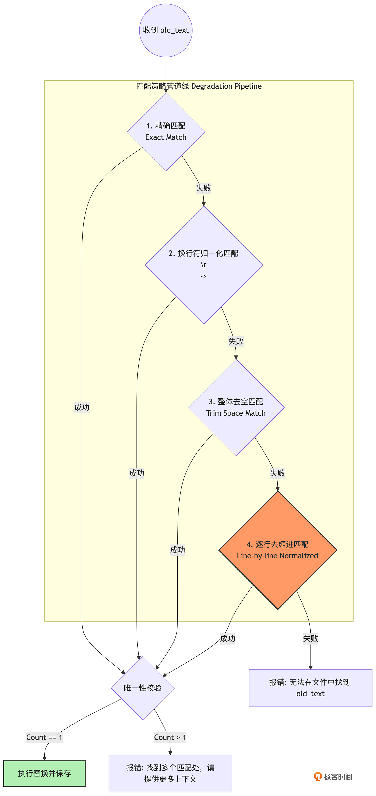

你好，我是 Tony Bai。欢迎来到《从 0 开始构建 Agent Harness》专栏的第七讲。

在上一讲中，我们探讨了 OpenClaw 的极简工具法则，并用 Go 原生的 os/exec 为 Agent 打造了终极武器——bash 工具。配合 read_file 和 write_file，我们的 tiny-claw 已经能够在文件系统中自由穿梭。

现在，设想这样一个真实的业务场景：你的代码库里有一个长达 2000 行的 server.go 文件。你让 Agent 去修复其中第 543 行的一个空指针逻辑 Bug。

Agent 读懂了代码，它知道怎么改。但接下来，它应该如何把改动落回磁盘？

如果用 write_file，它必须把这 2000 行代码完整地重新生成一遍。这不仅极其消耗 API Token（既慢又贵），而且大模型在长文本生成中极易发生截断或引入新的语法错误。

如果用 bash，大模型需要手写一段极其复杂的 sed 或 awk 正则表达式。但经验表明，大模型在处理包含特殊转义字符的多行正则表达式时，翻车率高达 80% 以上，极易把整个文件搞坏。

这就是为什么在驾驭工程（Harness Engineering）中，除了提供底层的原语外，我们必须为大模型提供一把“外科手术刀”——也就是专属的 edit_file（代码编辑）工具。

然而，大模型是一台基于概率的机器，它常常带有幻觉。今天，我们就来直面大模型最大的幻觉之一：格式丢失。我们将亲手实现一个带有多级模糊匹配（Fuzzy Match）容错机制的强健 Edit 工具，学习驾驭工程中的容错艺术。

## 大模型的“缩进幻觉”与模糊匹配

对于一个理想的 edit 工具，它的 JSON Schema 应该非常简单：提供 path（文件路径）、old_text（你要替换的旧代码）和 new_text（新代码）。

如果用 Python 语言的思路，底层实现无非就是一句 `fileContent.replace(oldText, newText, 1)`。但在 AI Agent 的世界里，绝对不能这么写。

大模型在输出 old_text 时，经常会犯一种极其顽固的错误——格式幻觉。

假设原始代码是这样的（前面带有 8 个空格的缩进）：
```
 if user == nil {
 return err
        }
```

大模型在返回的 JSON 工具参数中，为了节省字数或者受限于其内部的注意力机制，它吐出的 old_text 很可能是去掉了缩进的：
```
if user == nil {
 return err
}
```

如果你使用精确匹配，`str.replace()` 会直接失败，因为找不到要替换的字符串。在没有容错机制的 Harness 中，Agent 会收到 Error: old_text not found。接着，Agent 会在下一个 Turn 拼命重试，依然不带缩进，最终陷入死循环，任务宣告失败。

### 降级策略：多级模糊匹配链（Chain of Responsibility）

顶级引擎（如 Claude Code/OpenClaw）是如何解决这个问题的？答案是：把容错做在底层工具里，吸收大模型的误差。

我们不再要求精确匹配，而是实现一条多级模糊匹配链。



在这套多级匹配的管道线中：

级别 1：最快最安全的精确匹配。

级别 2：解决不同操作系统（Windows vs Unix）换行符导致的幻觉。

级别 3：忽略整个代码块首尾的多余空行。

级别 4（核心容错）：将 old_text 和原始文件都按行切分，去掉每一行的首尾空格（消除缩进差异），然后再进行比对。

最关键的安全底线是“唯一性校验”：模糊匹配可能会导致匹配到代码里多个相似的片段。如果匹配结果 > 1，工具绝对不能盲目替换，而是必须抛出错误，要求大模型提供更多的上下行代码以精确定位。

## 代码实战：实现健壮的 Edit 工具

接下来，我们将用 Python 语言将这套容错艺术转化为代码。

### 目录结构回顾与更新

我们将在 internal/tools 目录下新增 edit_file.py。
```
tiny-claw/
├── cmd/
│   └── claw/
│       └── main.py          # 【修改】注册 Edit 工具，并测试修改代码场景
├── internal/
│   ├── engine/              # 保持不变
│   ├── provider/            # 保持不变
│   ├── schema/              # 保持不变
│   └── tools/               
│       ├── registry.py      # 保持不变
│       ├── readfile.py     
│       ├── write.py    
│       ├── Bash.py          
│       └── edit_file.py     # 【新增】多级模糊匹配替换工具
└── workspace/
```

### 第 1 步：定义工具与 JSON Schema

新建 internal/tools/edit_file.py，首先完成工具的标准化定义。我们需要在 Description 中用自然语言教导大模型如何使用这个工具。
```python
# internal/tools/edit_file.py
import os
from typing import Any

from ..schema.message import ToolDefinition
from .registry import BaseTool


class EditFileTool(BaseTool):
    """对现有文件进行局部字符串替换的工具。"""

    def __init__(self, work_dir: str):
        self.work_dir = work_dir

    def name(self) -> str:
        return "edit_file"

    def definition(self) -> ToolDefinition:
        return ToolDefinition(
            name=self.name(),
            description=(
                "对现有文件进行局部的字符串替换。这比重写整个文件更安全、更快速。"
                "请提供足够的 old_text 上下文以确保匹配的唯一性。"
            ),
            input_schema={
                "type": "object",
                "properties": {
                    "path": {
                        "type": "string",
                        "description": "要修改的文件路径",
                    },
                    "old_text": {
                        "type": "string",
                        "description": (
                            "文件中原有的文本。必须包含足够的上下文（建议上下各多包含几行），"
                            "以确保在文件中的唯一性。"
                        ),
                    },
                    "new_text": {
                        "type": "string",
                        "description": "要替换成的新文本",
                    },
                },
                "required": ["path", "old_text", "new_text"],
            },
        )
```

### 第 2 步：实现多级模糊匹配算法

这是本讲的灵魂代码。为了保持代码整洁，我们将模糊匹配逻辑抽离成一个内部函数 fuzzy_replace。
```python
# internal/tools/edit_file.py (续)


def fuzzy_replace(original_content: str, old_text: str, new_text: str) -> str:
    """按四级降级策略执行字符串替换。"""
    # L1: 精确匹配
    count = original_content.count(old_text)
    if count == 1:
        return original_content.replace(old_text, new_text, 1)
    if count > 1:
        raise ValueError(f"old_text 匹配到了 {count} 处，请提供更多的上下文代码以确保唯一性")

    # L2: 换行符归一化 (统一将 \r\n 转换为 \n)
    normalized_content = original_content.replace("\r\n", "\n")
    normalized_old = old_text.replace("\r\n", "\n")

    count = normalized_content.count(normalized_old)
    if count == 1:
        return normalized_content.replace(normalized_old, new_text, 1)

    # L3: Trim Space 匹配 (忽略首尾的空行和空格)
    trimmed_old = normalized_old.strip()
    if trimmed_old:
        count = normalized_content.count(trimmed_old)
        if count == 1:
            # 注意：这里替换时，我们只能替换被 Trim 后的部分，不能直接用 new_text 破坏原本的缩进
            # 为了保持本专栏代码不过于冗长复杂，当触发 L3/L4 时，如果 new_text 没有带有正确的缩进，
            # 可能会导致替换后代码格式不美观。但这总比直接报错让 Agent 死循环要好。
            return normalized_content.replace(trimmed_old, new_text, 1)

    # L4: 逐行去缩进匹配 (最强力的容错：消除大模型遗漏缩进的幻觉)
    return line_by_line_replace(normalized_content, normalized_old, new_text)


def line_by_line_replace(content: str, old_text: str, new_text: str) -> str:
    """逐行去除首尾空白后做滑动窗口匹配。"""
    content_lines = content.split("\n")
    old_lines = old_text.strip().split("\n")

    if len(old_lines) == 0 or len(content_lines) < len(old_lines):
        raise ValueError("找不到该代码片段")

    # 清理 old_lines 的每行首尾空白
    normalized_old_lines = [line.strip() for line in old_lines]

    match_count = 0
    match_start_index = -1
    match_end_index = -1

    # 滑动窗口在原始文件中寻找匹配块
    for i in range(len(content_lines) - len(normalized_old_lines) + 1):
        is_match = True
        for j, old_line in enumerate(normalized_old_lines):
            if content_lines[i + j].strip() != old_line:
                is_match = False
                break

        if is_match:
            match_count += 1
            match_start_index = i
            match_end_index = i + len(normalized_old_lines)

    if match_count == 0:
        raise ValueError("在文件中未找到 old_text，请大模型先调用 read_file 仔细确认文件内容和缩进")
    if match_count > 1:
        raise ValueError(f"模糊匹配到了 {match_count} 处相似代码，请提供更多上下行代码以精确定位")

    # 执行替换：将匹配到的原始行范围替换为 new_text 拆分后的行
    # (这里简单处理，将 new_text 直接作为整体替换进去)
    new_content_lines = (
        content_lines[:match_start_index]
        + [new_text]
        + content_lines[match_end_index:]
    )
    return "\n".join(new_content_lines)
```

### 第 3 步：组装 Execute 方法

最后，我们将这个算法接入 Execute 流程，补齐读取和回写的物理 I/O 操作。
```python
# internal/tools/edit_file.py (续)

    def execute(self, args: Any) -> str:
        path, old_text, new_text = self._extract_args(args)
        full_path = os.path.join(self.work_dir, path)

        # 1. 读取原文件内容
        try:
            with open(full_path, "r", encoding="utf-8") as file:
                original_content = file.read()
        except OSError as exc:
            raise RuntimeError(f"读取文件失败，请确认路径是否正确: {exc}") from exc

        # 2. 调用多级模糊替换算法
        # 【驾驭哲学】将具体的报错原因 (如匹配到多处) 原样返回，让大模型自行纠正
        new_content = fuzzy_replace(original_content, old_text, new_text)

        # 3. 将新内容安全地写回磁盘
        try:
            with open(full_path, "w", encoding="utf-8", newline="") as file:
                file.write(new_content)
        except OSError as exc:
            raise RuntimeError(f"写回文件失败: {exc}") from exc

        return f"✅ 成功修改文件: {path}"

    def _extract_args(self, args: Any) -> tuple[str, str, str]:
        if not isinstance(args, dict):
            raise ValueError("参数解析失败: 参数必须是包含 path、old_text、new_text 的对象")

        path = args.get("path")
        old_text = args.get("old_text")
        new_text = args.get("new_text")

        if not isinstance(path, str) or not path:
            raise ValueError("参数解析失败: path 必须是非空字符串")
        if not isinstance(old_text, str):
            raise ValueError("参数解析失败: old_text 必须是字符串")
        if not isinstance(new_text, str):
            raise ValueError("参数解析失败: new_text 必须是字符串")

        return path, old_text, new_text


def new_edit_file_tool(work_dir: str) -> EditFileTool:
    return EditFileTool(work_dir)


NewEditFileTool = new_edit_file_tool
```

代码完成！你不要将其简单看成是一个字符串替换工具，这是一个包容了大模型缺陷的“防御阵地”。

## 运行与实战测试：检验容错能力

现在，让我们在 cmd/claw/main.py 中挂载这个新工具，并故意给大模型设置一个陷阱：我们将在物理文件中包含很多缩进，看看大模型生成的缺少缩进的 old_text 能否被成功匹配和替换。

首先，在工作区根目录下创建一个有格式的测试文件 server.go：
```
cat << 'EOF' > server.go
package main

import "fmt"

func main() {
    // 启动服务器
    fmt.Println("Server is starting on port 8080...")

    // TODO: 增加鉴权逻辑
 if true {
        fmt.Println("No auth, everyone can access.")
    }
}
EOF
```

接着，更新 cmd/claw/main.py，将 EditFileTool 挂载进去。虽然这是修改代码的任务，但我们给 Agent 的任务提示词仅仅是一次简单的代码替换。因此，这里我们关闭了慢思考。如果开启慢思考，会出现什么问题呢？大家也不妨思考一下。
```python
# cmd/claw/main.py
import logging

from common import (
    configure_logging,
    require_env_vars,
    new_cli_session,
    build_engine_with_provider_for_work_dir,
)
from internal.provider.openai import new_zhipu_openai_provider
from internal.tools.readfile import new_read_file_tool
from internal.tools.write import new_write_file_tool
from internal.tools.Bash import new_bash_tool
from internal.tools.edit_file import new_edit_file_tool


def main():
    configure_logging()
    require_env_vars(["ZHIPU_API_KEY"])

    work_dir = "workspace"
    llm_provider = new_zhipu_openai_provider("glm-4.5-air")

    # 挂载工具全家桶
    tool_factories = [
        new_read_file_tool,
        new_write_file_tool,
        new_bash_tool,
        # 【新增挂载】
        new_edit_file_tool,
    ]

    # 实例化引擎，关闭慢思考 (enable_thinking=False)
    eng = build_engine_with_provider_for_work_dir(
        provider=llm_provider,
        work_dir=work_dir,
        tool_factories=tool_factories,
        enable_thinking=False,
    )

    # 发起一个需要局部修改的指令
    prompt = """
    我当前目录下有一个 server.go 文件。
    请帮我把里面 "TODO: 增加鉴权逻辑" 下面的那个 if 语句，整个替换为：
    if user == nil {
        fmt.Println("Forbidden!")
        return
    }
    """

    session = new_cli_session()
    err = eng.run(prompt, session=session)
    if err is not None:
        logging.error("引擎运行崩溃: %s", err)
        raise SystemExit(1)


if __name__ == "__main__":
    main()
```

### 执行与奇迹时刻

运行命令：
```bash
python cmd/claw/main.py
```

观察终端中大模型的行为。由于大模型无法直接看到文件，它首先会调用 read_file，然后再调用 edit_file。

最精彩的部分在于，大模型吐出的 ToolCall 参数中，old_text 很可能是没有携带那 4 个空格缩进的。这个因使用的大模型的不同，可能看到的现象不同：
```
{
 "path": "server.go",
 "old_text": "// TODO: 增加鉴权逻辑\nif true {\nfmt.Println(\"No auth, everyone can access.\")\n}",
 "new_text": "if user == nil {\n\tfmt.Println(\"Forbidden!\")\n\treturn\n}"
}
```

如果在传统框架里，这一步直接抛出 old_text not found 报错。

但在我们的 tiny-claw 中，输出日志如下（以下是在我的环境下执行的输出结果）：
```
20206/04/07 10:40:26 [Registry] 成功挂载工具: read_file
20206/04/07 10:40:26 [Registry] 成功挂载工具: write_file
20206/04/07 10:40:26 [Registry] 成功挂载工具: bash
20206/04/07 10:40:26 [Registry] 成功挂载工具: edit_file
20206/04/07 10:40:26 [Engine] 引擎启动，锁定工作区: build-agent-harness-from-scratch/part2/source/ch07/tiny-claw/workspace
20206/04/07 10:40:26 [Engine] 慢思考模式 (Thinking Phase): false
20206/04/07 10:40:26 
========== [Turn 1] 开始 ==========
20206/04/07 10:40:26 [Engine][Phase 2] 恢复工具挂载，等待模型采取行动...
🤖 [对外回复]: 
我需要先读取 server.go 文件来查看当前的内容，然后找到 "TODO: 增加鉴权逻辑" 下面的 if 语句并进行替换。

20206/04/07 10:40:29 [Engine] 模型请求调用 1 个工具...
20206/04/07 10:40:29   -> 🛠️ 执行工具: read_file, 参数: {"path":"server.go"}
20206/04/07 10:40:29   -> ✅ 工具执行成功 (返回 231 字节)
20206/04/07 10:40:29 
========== [Turn 2] 开始 ==========
20206/04/07 10:40:29 [Engine][Phase 2] 恢复工具挂载，等待模型采取行动...
🤖 [对外回复]: 

20206/04/07 10:40:49 [Engine] 模型请求调用 1 个工具...
20206/04/07 10:40:49   -> 🛠️ 执行工具: edit_file, 参数: {"path":"server.go","old_text":"// TODO: 增加鉴权逻辑\n    if true {\n        fmt.Println(\"No auth, everyone can access.\")\n    }","new_text":"// TODO: 增加鉴权逻辑\n    if user == nil {\n        fmt.Println(\"Forbidden!\")\n        return\n    }"}
20206/04/07 10:40:49   -> ✅ 工具执行成功 (返回 33 字节)
20206/04/07 10:40:49 
========== [Turn 3] 开始 ==========
20206/04/07 10:40:49 [Engine][Phase 2] 恢复工具挂载，等待模型采取行动...
🤖 [对外回复]: 
已经成功将 server.go 文件中 "TODO: 增加鉴权逻辑" 下面的 if 语句替换为您提供的代码。

修改前：

// TODO: 增加鉴权逻辑
if true {
    fmt.Println("No auth, everyone can access.")
}


修改后：

// TODO: 增加鉴权逻辑
if user == nil {
    fmt.Println("Forbidden!")
 return
}

现在鉴权逻辑会检查 user 是否为 nil，如果为空则输出 "Forbidden!" 并返回，实现了基本的鉴权功能。
20206/04/07 10:40:51 [Engine] 模型未请求调用工具，任务宣告完成。
```

注：我使用的大模型比较聪明，并没有丢掉原先文本的“格式”。

打开 server.go 文件，你会发现那段包含缩进的原始代码，被完美且精准地替换成了新的逻辑。
```
$cat server.go
package main

import "fmt"

func main() {
 // 启动服务器
    fmt.Println("Server is starting on port 8080...")

 // TODO: 增加鉴权逻辑
 if user == nil {
        fmt.Println("Forbidden!")
 return
    }
}
```

这就是多级模糊匹配在底层悄无声息地为你化解危机的表现。

## 本讲小结

今天，我们通过手写一个看似普通的 edit 工具，深入洞察了驾驭工程的另一重境界：容错艺术。

正视大模型缺陷：大模型本质上是一个概率预测引擎，要求它 100% 精确输出多行代码的缩进和特殊符号是不现实的。硬抗只会导致死循环。

降级管线（Degradation Pipeline）：我们在底层设计了 L1 到 L4 四个级别的匹配算法，从精确匹配一路降级到“逐行去空格匹配”。这就像是给 Agent 戴上了一副“宽容的眼镜”，自动矫正了它的幻觉。

唯一性安全底线：在容错的同时，我们坚守了“如果匹配到多处，绝不替换”的安全底线。把 count > 1 的报错原样丢回给大模型，让大模型自己提供更多上下文。这完美利用了 LLM 强大的 Self-Correction（自我纠错）能力。

至此，我们的 tiny-claw 在单轮（Turn）的串行执行上已经”无懈可击”。但是，现代大模型的 API 实际上早就支持了 Parallel Tool Calling（并行工具调用）。这意味着在一次思考中，大模型可能会一次性吐出 5 个 read_file 的请求，要求同时读取 5 个独立的文件。

按照我们目前在 loop.py 中的顺序写法，这 5 个文件会被阻塞地逐个读取。这在网络和磁盘 I/O 上是极大的浪费。

在下一讲中，我们将充分发挥 Python 语言的优势，用 ThreadPoolExecutor 重构 Main Loop 的工具执行环节，让我们的 Agent 拥有真正并发探索物理世界的高性能能力！

注：本讲的示例代码，可以在这里下载。

## 思考题

在我们今天的 L4 逐行模糊匹配（line_by_line_replace）算法中，虽然我们成功去除了首尾空格的干扰找到了匹配块，但在进行文本替换时，我们采用了一个极其粗暴的做法：直接将原有的那几行删掉，塞入未经任何处理的 new_text。

这会带来一个小问题：如果目标代码块是在一个嵌套极深的函数中（比如前面有 12 个空格的缩进），而大模型输出的 new_text 只有 4 个空格的缩进，替换完之后，这部分代码的格式就会显得非常难看。

结合你对字符串处理的经验，如果在匹配到目标行的同时，我们要提取出目标行原来的”基础缩进前缀（Base Indentation）”，并将其自动补齐到 new_text 的每一行前面，你会如何在现有的 line_by_line_replace 中进行代码优化？

欢迎在留言区分享你的代码思路。我们下一讲，开启并发提效之旅！
