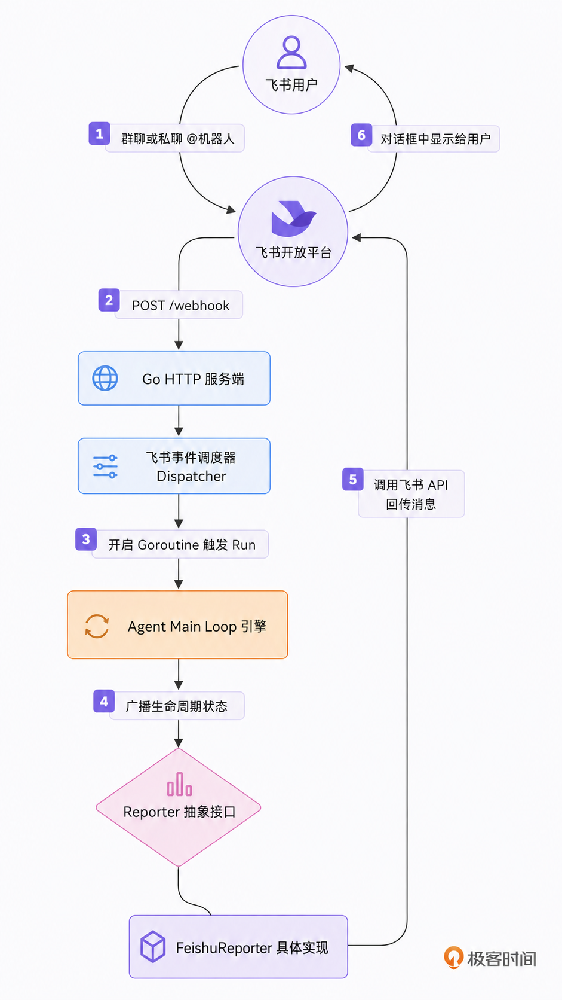
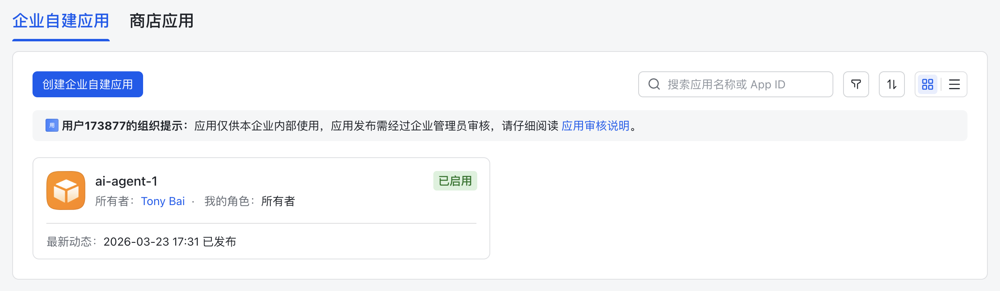
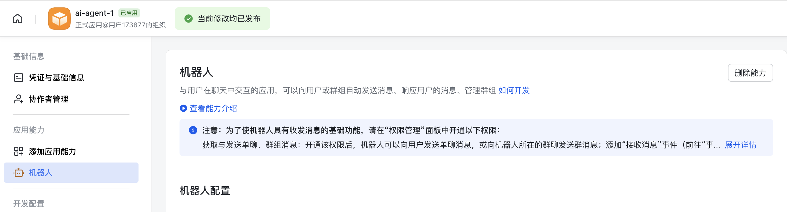
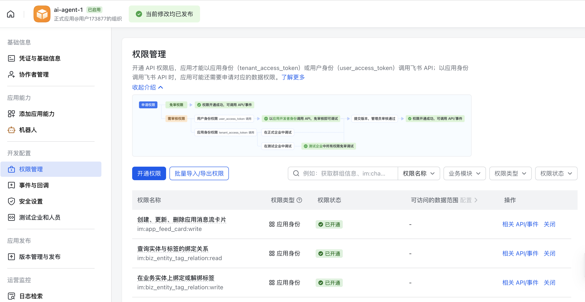
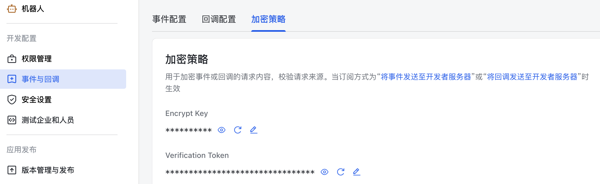
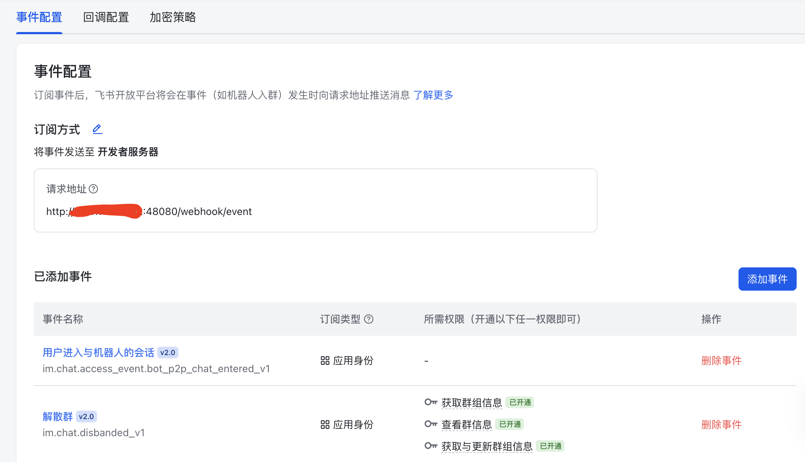
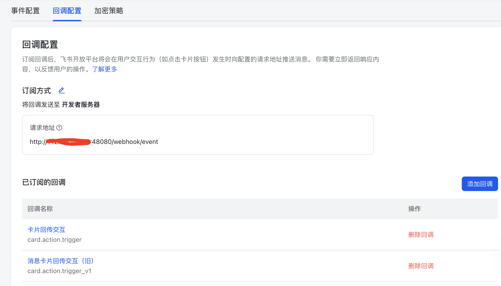
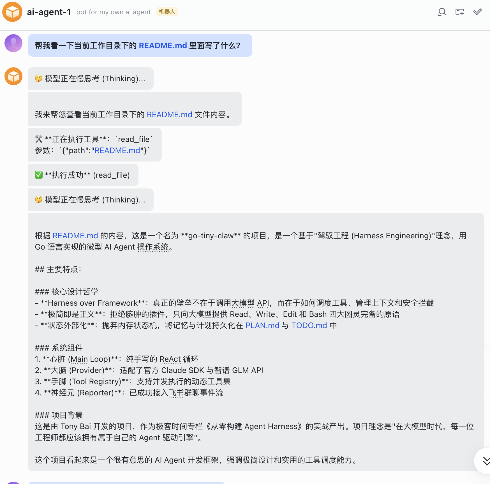
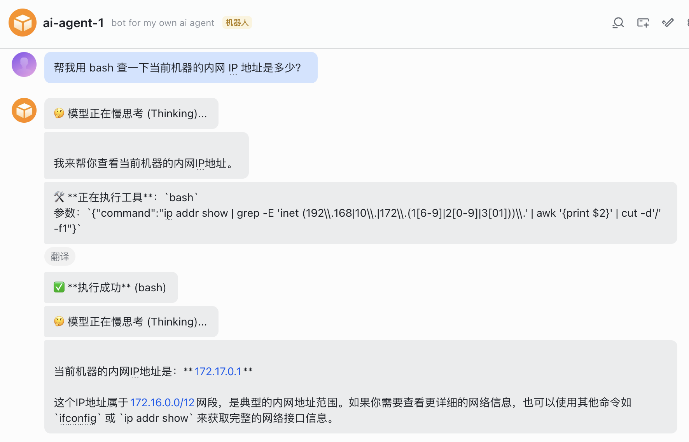

你好，我是 Tony Bai。欢迎来到《从 0 开始构建 Agent Harness》专栏的第九讲。

在前面的 8 讲中，我们潜心于 tiny-claw 的底层基础设施建设。我们用纯 Python 代码手写了带”慢思考”的两阶段 ReAct 循环，设计了优雅的 Provider 接口对接智谱与 Claude，打造了支持极简 4 大原语的 Tool Registry，甚至在上一讲中，利用 ThreadPoolExecutor 将工具的执行效率推向了并发的极限。

只要你在终端运行 python main.py，你的 Agent 已经像一个成熟的本地开发者一样，能在你的电脑上穿梭自如了。但是，在真实的软件工程与团队协作中，触发 Agent 工作的场景往往是这样的：

线上系统突然爆出 502，运维老哥在飞书群里发了一句：“@机器人 帮我去这台机器上查一下 nginx 报错日志。”

CI/CD 流水线构建失败了，测试同学在群里吼了一句：“@机器人 帮我看看昨天的提交是不是破坏了什么配置？”

当你允许 Agent 执行高危的 bash 命令时，你希望它在执行前能通过一张交互卡片弹到你的手机上，等你点击“Approve（同意）”后它才真正动手。

这一切，都要求我们的驾驭工程（Harness Engineering）必须拥有一个极其灵活的“入口交互层”。

今天这一讲，我们将打破终端的物理隔离。利用飞书官方的 Python SDK（lark-oapi），将 tiny-claw 从一个孤独的本地进程，进化为随时随地响应团队召唤的 ChatOps（对话驱动运维）机器人。

## I/O 彻底解耦与 Reporter 反转

如果你回看我们在 02 讲和 03 讲中编写的 internal/engine/loop.py，当 Agent 开始思考、决定调用工具或者输出最终结果时，我们使用的是 logging.info 和 print。

如果我们将这个引擎放在一台云服务器上作为后台进程运行，用户在飞书群里发了一条消息，引擎在云端默默 logging.info 了一堆日志……飞书里的用户怎么可能看得到呢？

因此，在 Harness 架构设计中，引擎的核心循环（Main Loop）必须与输入输出（I/O）彻底解耦。

这就像 Linux 的设计哲学：内核（Kernel）只负责调度和运算，显示内容交给终端设备。我们的引擎也不应该关心自己是在哪里运行，它只需要在特定的生命周期节点（如：开始思考、执行工具、结束回答），向外“广播”事件即可。

我们可以用一张示意图来展示这种解耦与飞书交互的消息流转：



通过引入 Reporter 接口，输出能力被完全剥离。当在终端运行时，我们注入 TerminalReporter；当接入飞书时，我们注入 FeishuReporter。这就是驾驭工程的灵活性所在。

## 代码实战：解耦引擎与接入飞书事件流

为了实现上述架构，请确保你已经安装了飞书官方的 Python SDK。
```bash
pip install lark-oapi
```

### 目录结构回顾与更新

我们将在这个模块中新增 reportor.py 用于定义接口，并在 internal/feishu 中实现机器人的回调服务。同时，我们将改造入口 main_feishu.py，让它通过 WebSocket 长连接与飞书通信。
```
tiny-claw/
├── cmd/
│   └── claw/
│       └── main_feishu.py   # 【重构】启动飞书 WebSocket 长连接
├── internal/
│   ├── engine/
│   │   ├── loop.py          # 【重构】将 print 替换为 Reporter 接口调用
│   │   ├── reportor.py      # 【新增】定义 Reporter 接口规范
│   │   └── terminal_reporter.py # (本讲暂时用不到，预留给后续的 CLI)
│   ├── feishu/              # 【新增】飞书集成层
│   │   └── bot.py           # 实现事件监听与飞书消息 API 的封装
│   ├── provider/            # 保持不变
│   ├── schema/              # 保持不变
│   └── tools/               # 保持不变
└── requirements.txt
```

### 第 1 步：定义 Reporter 接口（引擎解耦）

新建 internal/engine/reportor.py。这定义了 Agent 在运行期间会向外界汇报的 4 个核心动作。
```python
# internal/engine/reportor.py
from abc import ABC, abstractmethod


class Reporter(ABC):
    """定义 Agent 引擎向外界输出信息的规范。
    这使得引擎可以无缝切换终端 (CLI)、飞书、钉钉甚至 WebUI 等不同的展现层。"""

    @abstractmethod
    def on_thinking(self) -> None:
        """当模型开始进行慢思考 (Reasoning) 时调用。"""

    @abstractmethod
    def on_tool_call(self, tool_name: str, args: str) -> None:
        """当模型决定并发调用工具时调用。"""

    @abstractmethod
    def on_tool_result(self, tool_name: str, result: str, is_error: bool) -> None:
        """当工具在底层执行完毕并返回结果时调用。"""

    @abstractmethod
    def on_message(self, content: str) -> None:
        """当模型宣告任务完成，向用户输出最终纯文本回答时调用。"""
```

### 第 2 步：改造 Main Loop 使用 Reporter 回调

回到我们熟悉的 internal/engine/loop.py，修改 run 方法的签名，要求传入一个 Reporter 实例。并将之前用来打印日志的 logging.info 替换掉。
```python
# internal/engine/loop.py
import logging
from concurrent.futures import ThreadPoolExecutor
from typing import List, Optional

from ..provider.interface import LLMProvider
from ..schema.message import Message, Role, ToolCall
from ..tools.registry import Registry
from .reportor import Reporter
from .session import Session


class AgentEngine:
    """AgentEngine 是微型 OS 的核心驱动。"""

    def __init__(self, provider: LLMProvider, registry: Registry, enable_thinking: bool = False):
        self.provider = provider
        self.registry = registry
        self.enable_thinking = enable_thinking

    # ... 前置结构体定义不变 ...

    # run 方法新增了 reporter 参数
    def run(self, user_prompt: str, session: Session, reporter: Reporter = None) -> Optional[Exception]:
        logging.info(f"[Engine] 引擎启动，锁定工作区: {session.work_dir}")

        session.append(Message(role=Role.SYSTEM, content="You are tiny-claw, an expert coding assistant."))
        session.append(Message(role=Role.USER, content=user_prompt))

        turn_count = 0

        while True:
            turn_count += 1
            available_tools = self.registry.get_available_tools()

            # ================= Phase 1: Thinking =================
            if self.enable_thinking:
                if reporter is not None:
                    # 【触发 Reporter】: 开始慢思考
                    reporter.on_thinking()

                try:
                    think_resp = self.provider.generate(session.get_working_memory(6), None)
                except Exception as e:
                    return RuntimeError(f"Thinking 生成失败: {e}")

                if think_resp.content:
                    session.append(think_resp)

            # ================= Phase 2: Action =================
            try:
                action_resp = self.provider.generate(session.get_working_memory(6), available_tools)
            except Exception as e:
                return RuntimeError(f"Action 生成失败: {e}")

            session.append(action_resp)

            if action_resp.content != "" and reporter is not None:
                # 【触发 Reporter】: 输出阶段性总结或最终回复
                reporter.on_message(action_resp.content)

            # ================= 执行退出与并发控制 =================
            if not action_resp.tool_calls:
                break

            observation_msgs: List[Optional[Message]] = [None] * len(action_resp.tool_calls)

            def execute_tool(idx: int, call: ToolCall) -> None:
                if reporter is not None:
                    # 【触发 Reporter】: 报告即将在底层执行的工具
                    reporter.on_tool_call(call.name, str(call.arguments))

                result = self.registry.execute(call)

                if reporter is not None:
                    # 为了防止大文件读取导致飞书消息过长被截断，我们仅汇报工具执行状态
                    # 注意：传递给大模型的 observation_msgs 依然是完整数据，只是人类看到的 Reporter 是缩略版
                    display_output = result.output
                    if len(display_output) > 200:
                        display_output = display_output[:200] + "... (已截断)"
                    # 【触发 Reporter】: 汇报工具物理执行的结果
                    reporter.on_tool_result(call.name, display_output, result.is_error)

                observation_msgs[idx] = Message(
                    role=Role.USER,
                    content=result.output,
                    tool_call_id=call.id,
                )

            with ThreadPoolExecutor(max_workers=len(action_resp.tool_calls)) as executor:
                futures = [
                    executor.submit(execute_tool, idx, tool_call)
                    for idx, tool_call in enumerate(action_resp.tool_calls)
                ]
                for future in futures:
                    future.result()

            for obs in observation_msgs:
                if obs is not None:
                    session.append(obs)

        return None
```

至此，我们的引擎成为了一台完美的、没有任何输出硬编码（Hardcode）的纯净状态机。

### 第 3 步：实现飞书 Bot 服务与 Reporter

新建 internal/feishu/bot.py。在这个文件里，我们需要实现两件事：

监听飞书的 WebSocket 事件（解析用户发的指令消息）。

实现 FeishuReporter，通过飞书 OpenAPI 将大模型的状态发回给那个发消息的用户。
```python
# internal/feishu/bot.py
import json
import logging
import os
import threading
from typing import Any, Mapping, Optional

import lark_oapi as lark
import lark_oapi.api.im.v1 as larkim
import lark_oapi.ws as larkws

from internal.engine.reportor import Reporter
from internal.engine.session import Session


class FeishuBot:
    """FeishuBot 封装了飞书机器人的配置与核心业务流。"""

    def __init__(self, engine: Any, session: Optional[Session] = None):
        app_id = os.getenv("FEISHU_APP_ID", "")
        app_secret = os.getenv("FEISHU_APP_SECRET", "")

        if not app_id or not app_secret:
            raise RuntimeError("请设置 FEISHU_APP_ID 和 FEISHU_APP_SECRET")

        # 实例化飞书官方客户端
        self.client = (
            lark.Client.builder()
            .app_id(app_id)
            .app_secret(app_secret)
            .build()
        )
        self.engine = engine  # 持有核心引擎引用

    def start_websocket(self) -> None:
        """启动 WebSocket 长连接，监听飞书事件。"""
        logging.info("正在启动 WebSocket 长连接模式...")

        class _EventHandler:
            """适配飞书 WS SDK 所需的事件处理接口。"""

            def __init__(self, bot: "FeishuBot"):
                self.bot = bot

            def do_without_validation(self, payload: bytes) -> Any:
                event = json.loads(payload.decode("utf-8"))
                return self.bot.dispatch_event(event)

        ws_client = larkws.Client(
            os.getenv("FEISHU_APP_ID"),
            os.getenv("FEISHU_APP_SECRET"),
            event_handler=_EventHandler(self),
            auto_reconnect=True,
        )
        logging.info("WebSocket 客户端已创建，正在连接飞书服务器...")
        ws_client.start()

    def dispatch_event(self, event: Any) -> None:
        """分发飞书事件，处理消息接收。"""
        event_body = event.get("event", event)
        message = event_body.get("message")
        if message is None:
            return

        # 由于飞书消息体是 JSON，我们需要粗略地提取其中的文本内容。
        # 这里简单处理：去掉开头结尾的特殊转义字符和引用的机器人名字。
        raw_content = message.get("content", "")
        content = self._extract_text(raw_content)
        chat_id = message.get("chat_id", "")

        logging.info(f"[Feishu] 收到会话 {chat_id} 消息: {content}")

        # 【驾驭并发】：收到消息后，绝不能阻塞 WebSocket 回调。
        # 我们要为每个请求开启一个独立的线程跑 Agent 任务！
        threading.Thread(
            target=self.handle_agent_run,
            args=(chat_id, content),
            daemon=True,
        ).start()

    @staticmethod
    def _extract_text(raw_content: Any) -> str:
        """从飞书消息 JSON 中提取纯文本。"""
        if isinstance(raw_content, Mapping):
            return str(raw_content.get("text", ""))
        if isinstance(raw_content, str):
            try:
                parsed = json.loads(raw_content)
                if isinstance(parsed, Mapping):
                    return str(parsed.get("text", raw_content))
            except json.JSONDecodeError:
                return raw_content
        return str(raw_content)

    def handle_agent_run(self, chat_id: str, prompt: str) -> None:
        """handle_agent_run 是连接飞书与底层引擎的桥梁。"""
        # 为当前聊天窗口实例化一个专属的 Reporter
        reporter = FeishuReporter(client=self.client, chat_id=chat_id)

        # 启动引擎！
        err = self.engine.run(prompt, reporter=reporter)
        if err is not None:
            reporter.send_msg(f"❌ Agent 运行崩溃: {err}")


# ==========================================
# FeishuReporter: 将引擎的输出格式化后发给飞书
# ==========================================
class FeishuReporter(Reporter):
    """将引擎输出格式化后发给飞书。"""

    def __init__(self, client: Any, chat_id: str):
        self.client = client
        self.chat_id = chat_id

    def send_msg(self, text: str) -> None:
        """封装调用飞书 OpenAPI 发送文本消息的操作。"""
        content = json.dumps({"text": text}, ensure_ascii=False)
        request = (
            larkim.CreateMessageRequest.builder()
            .receive_id_type("chat_id")
            .request_body(
                larkim.CreateMessageRequestBody.builder()
                .receive_id(self.chat_id)
                .msg_type("text")
                .content(content)
                .build()
            )
            .build()
        )
        self.client.im.v1.message.create(request)

    def on_thinking(self) -> None:
        # 仅发一个轻量级提示，避免飞书刷屏
        self.send_msg("🤔 模型正在慢思考 (Thinking)...")

    def on_tool_call(self, tool_name: str, args: str) -> None:
        self.send_msg(f"🛠️ **正在执行工具**：`{tool_name}`\n参数：`{args}`")

    def on_tool_result(self, tool_name: str, result: str, is_error: bool) -> None:
        if is_error:
            self.send_msg(f"⚠️ **执行报错** ({tool_name})：\n{result}")
        else:
            # 成功时仅汇报成功，不刷全量日志
            self.send_msg(f"✅ **执行成功** ({tool_name})")

    def on_message(self, content: str) -> None:
        # 将模型最终的纯文本回答发给用户
        self.send_msg(content)


# 编译时类型检查：确保 FeishuReporter 实现了 Reporter 接口
assert isinstance(FeishuReporter, type) and issubclass(FeishuReporter, Reporter)
```

这段代码精妙地利用了 Python 的 threading 模块（多线程）。当你在飞书群里同时发了三条指令，服务器瞬间会拉起三个完全独立的 ReAct 循环，它们各自思考，各干各的，最后各自回传给对应的飞书聊天窗口。

### 第 4 步：启动入口（main_feishu.py）

最后，我们在 cmd/claw/main_feishu.py 中，抛弃在终端写代码的自嗨模式，改用 WebSocket 长连接模式接入飞书。
```python
# cmd/claw/main_feishu.py
import logging
import os

from common import (
    build_engine,
    configure_logging,
    new_bash_tool,
    new_edit_file_tool,
    new_read_file_tool,
    new_write_file_tool,
)


def validate_required_env_vars() -> None:
    """检查必需的环境变量。"""
    required = ["ZHIPU_API_KEY", "FEISHU_APP_ID", "FEISHU_APP_SECRET"]
    missing = [name for name in required if not os.getenv(name)]
    if missing:
        raise RuntimeError("请先设置环境变量: " + ", ".join(missing))


def main() -> None:
    from internal.feishu.bot import FeishuBot

    # 1. 初始化引擎依赖
    configure_logging()
    validate_required_env_vars()

    # 默认使用智谱 GLM-4
    engine = build_engine(
        tool_factories=[
            new_read_file_tool,
            new_write_file_tool,
            new_bash_tool,
            new_edit_file_tool,
        ],
        enable_thinking=True,
    )

    # 2. 初始化飞书 Bot 并启动 WebSocket 长连接
    bot = FeishuBot(engine=engine)
    logging.info("🚀 tiny-claw 飞书长连接模式启动中")
    bot.start_websocket()


if __name__ == "__main__":
    main()
```

## 运行与实战测试：在飞书中“隔空取物”

由于飞书要求 WebSocket 长连接或 Webhook 必须是公网可访问的地址，如果你运行 tiny-claw 的服务器没有公网可访问的端口，可以使用 WebSocket 长连接模式（推荐），或使用内网穿透工具（如 ngrok）配合 Webhook 模式。

### 测试前准备

在飞书开发者后台（open.feishu.cn）创建一个企业自建应用，并添加“机器人”应用能力。





2\. 在权限管理中，至少开通接收群聊消息和接收单聊消息的权限。



在凭证与基础信息中获取 App ID、App Secret，在“事件与回调”的“加密策略”下获取 Encrypt Key 和 Verification Token。



在飞书开发者后台的"事件与回调"配置中，选择 WebSocket 长连接模式（推荐），或填入 Webhook 地址 `http://<你的tiny-claw主机ip>:48080/webhook/event`，并添加相关事件：





注意：添加事件或回调的请求地址时，你需要启动 tiny-claw，feishu 平台会发消息验证（challenge）你的请求地址的正确性与合法性。tiny-claw 的启动方式见下面说明。当验证 ok，你的 tiny-claw 会输出类似 `[Info] [AuthByChallenge Success]` 的日志。

发布机器人后，这个飞书机器人便可以正常使用了。

### 见证奇迹的时刻

在终端导出所有的环境变量，启动你的服务器：
```bash
export ZHIPU_API_KEY="your-api-key"
export FEISHU_APP_ID="cli_a7..."
export FEISHU_APP_SECRET="xxxx..."
export FEISHU_VERIFY_TOKEN="xxxx..."
export FEISHU_ENCRYPT_KEY="xxxx..." # 如果没开请求体加密，可以忽略 FEISHU_ENCRYPT_KEY

python cmd/claw/main_feishu.py
```

现在，打开飞书，找到你的机器人私聊窗口。随便在这个测试电脑上放一个有意思的文本文件，比如当前目录下的 README.md。

你在飞书中给它发送一条消息：

“帮我看一下当前工作目录下的 README.md 里面写了什么？” 

短短几秒后，你会看到飞书对话框的交互消息。机器人会实时给你发送状态推送，就好像你坐在它的身后看它干活一样：



如果你再在飞书中给它发送另外一条消息：

“帮我用 bash 查一下当前机器的内网 IP 地址是多少？”

tiny-claw 在收到消息后，会启动一个新线程来处理这条消息，你的飞书机器人窗口也会看到下面这样的输出：



到这里，你的 Agent 正式突破了仅能在终端与你交互的“束缚”，变成了一个随时随地可以通过飞书被指挥的自动化小助手！

## 本讲小结

今天，我们完成了一次优雅的架构解耦与企业级生态接入，这体现了 Harness 驾驭工程的扩展之美：

I/O 解耦的降维打击：通过引入 Reporter 接口，我们将底层的心跳循环（Main Loop）与具体的输出载体（终端 vs 飞书）物理剥离。不管未来你换成钉钉、Slack 还是微信，Engine 的核心逻辑都不需要改动。

拥抱 Python 的高并发哲学：每当飞书收到一条新消息，我们就 `threading.Thread(target=self.handle_agent_run, ...).start()`。这意味着 tiny-claw 天生就是一个支持并发的后台系统。

ChatOps 范式成型：结合我们在前两讲实现的 read / bash 极简工具，Agent 正式具备了从群聊指令直接转化为系统行为的能力，为自动化工作（比如运维）奠定了入口。

然而，在这个看似极客且炫酷的 ChatOps 系统背后，隐藏着两个极其致命的问题。

第一，如果你仔细看看 bot.py 中的代码：`err = self.engine.run(prompt, reporter=reporter)`。每当用户发一条消息，我们就启动了一次全新的 run！这意味着如果刚才那个用户接着发第二句：”在刚才那个文件末尾加一行字”。Agent 完全不可能做到！因为上一轮的上下文（Context）没有被保存，Agent 是严重失忆的！

第二，如果你让它去读取一个 50MB 的系统日志文件，大模型的 Context Window 会在一瞬间爆炸。而在后台服务中出现这种异常，是不可接受的。

从下一讲开始，我们将正式迈入驾驭工程的第三大模块：上下文工程体系（Context Engineering）。我们将深入探讨如何模块化地组装极其复杂的系统指令（AGENTS.md），如何像操作系统回收内存一样对 Context 进行压缩，以及如何通过物理隔离（Session ID）和短期工作记忆，让飞书机器人在无状态的 HTTP 请求中拥有顺畅的长程对话能力。

注：本讲的示例代码，可以在这里下载。

## 思考题

我们目前在 handle_agent_run 方法中，是直接通过 `threading.Thread(target=self.handle_agent_run, ...).start()` 启动一个新的线程开启一轮完整的 ReAct 循环的。

如果你在一个几百人的飞书运维群里部署了这个机器人。某天发生线上事故，群里大家同时焦急地艾特了机器人发了 10 条指令。

此时，后台瞬间拉起了 10 个 Main Loop，这意味着它们会并发地在同一个 WorkDir（工作区目录）下执行 bash 命令、甚至是执行 write_file 去覆写同一个文件！

这无疑会引发灾难性的文件锁冲突和状态混乱（Data Race in Physical World）。

在不改变大模型本身特性的前提下，如果要为你的 tiny-claw 飞书服务端增加一个工作区读写锁（Workspace Mutex/Lock，可使用 `threading.Lock()`）或者任务调度队列（Task Queue），确保同一个目录下同一时刻只有一个 Agent 任务在运行文件修改，你会如何在架构上（比如在 Dispatcher 层或 Engine 初始化层）进行设计？

欢迎在留言区分享你的高并发防御方案，如果你觉得有所收获，欢迎你分享给其他朋友。我们下一讲，开启上下文工程之旅！
