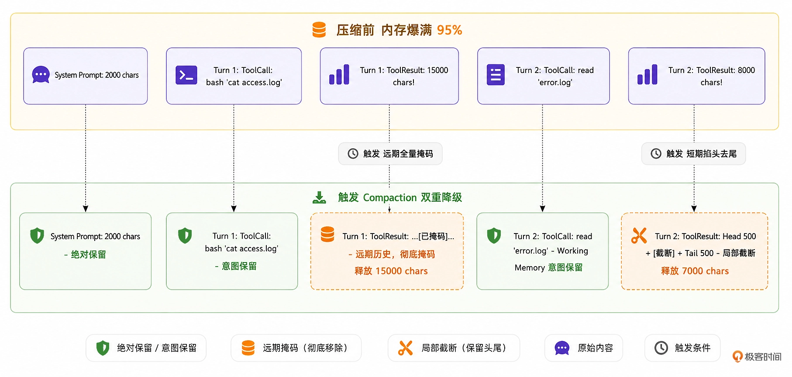

你好，我是 Tony Bai。欢迎来到《从 0 开始构建 Agent Harness》专栏的第十二讲。

在上一讲中，我们为 go-tiny-claw 引入了 Session（会话）机制和 Working Memory（短期工作记忆）。Agent 终于摆脱了“单次运行就失忆”的尴尬，能够像人类一样，在长程对话中保持上下文的连贯性，并且通过只截取最近的 N 条消息，有效地控制了日常闲聊的 Token 消耗，并保证了短期工作记忆的聚焦。

但是，作为一个以代码重构和系统运维为己任的通用型工业级 Coding Agent，它的核心动作不仅仅是聊天，而是执行工具（Tools）。

设想这样一个场景：你让 Agent 去排查一个线上故障。它在第 2 个回合（Turn 2）调用了 read_file 工具，读取了一个长达两万行的 Nginx 报错日志（约 1MB）。

即使你的 Working Memory 保护区设置得再小（比如只保留最近的 3 条消息），只要这其中一条消息（即 read_file 的执行结果 ToolResult）包含了这 1MB 的超长文本，大模型 API 依然会瞬间抛出一个冰冷的错误：400 Bad Request: context length exceeded。

在驾驭工程中，有一条不可动摇的铁律：如果大模型是 CPU，那么 Context Window（上下文窗口）就是极其昂贵且容量受限的 RAM（内存）。物理防御（防止内存溢出 OOM）的优先级，永远高于业务逻辑（短期记忆的完整性）。

一旦 RAM 溢出，整个系统进程就会“崩溃”。今天，我们将尝试解决这个最令开发者头疼的工程难题。我们将像编写操作系统的垃圾回收器（Garbage Collector）一样，为 go-tiny-claw 引入一套极其硬核的 Context Compaction 上下文压缩策略，也就是传说中的阶梯掩码与掐头去尾截断法。

## 为什么不能简单粗暴地清空长历史？

遇到上下文超限，很多新手开发者的第一反应是：“如果历史消息太长，我直接把字数超过阈值的那个消息从数组里删掉不就好了？”

绝对不行。

我们复习一下大模型的 ReAct (Reason + Act) 循环。模型解决复杂问题，依赖的是连贯的长程逻辑链（Chain of Thought, CoT）。

如果你直接把前面的“工具调用结果”整条删了，就会出现一个致命的上下文断层：大模型在历史中明明发出了一个 bash 'cat large.log' 的 ToolCall，但在上下文中却找不到任何对应的 ToolResult 回复。

大模型会陷入极度的困惑，它可能会以为自己刚才的命令没发出去，于是再次发起 bash 'cat large.log' 的请求，从而陷入原地打转的死循环。

因此，在驾驭工程中，处理内存压力必须采用“阶梯降级（Staged Degradation）”策略。我们的目标是：丢弃冗余的数据（释放物理内存），但死死保住意图和逻辑链。

### 一种解法：Observation Masking 与 Head-Tail Truncation

这一讲，针对 go-tiny-claw 遵循的极简主义哲学，我们不会引入另一个大模型专门做“对话摘要”。我们采用一种极其轻量但高效的字符级截断策略。

我们可以将需要压缩的上下文消息，根据其在对话中的“距离”，施加不同级别的“降级魔法”：

System Prompt（系统提示）：永远保留，神圣不可侵犯。

远期历史：超出 Working Memory 保护区的早期对话。在这里，大模型的 ToolCall（调用了什么工具、传了什么参数）必须保留以维持逻辑链，但是工具执行的返回结果（往往几千字）将被彻底掩码替换（Masking），比如变成一句话：“…[为了节省内存，早期的工具输出已被系统清理。原始长度: 15000 字节]…”。

Working Memory（短期工作记忆）：最近的N轮对话。我们期望它是完整的。但如果其中单条工具输出实在太长（比如超过了 1000 字符），哪怕它处于保护区内，我们也必须触发掐头去尾截断法（Head-Tail Truncation），仅保留前 500 字和后 500 字。因为对于报错日志来说，开头说明了错因，结尾通常带有堆栈总结，中间的无尽循环完全可以抛弃。

我们可以用一张示意图来看看双重降级压缩前后的 Context 内存对比：



通过这种极具侵略性的内存管理机制，无论大模型翻阅了多么庞大的日志文件，发往 API 的上下文载荷永远被死死限制在安全的红线之内。

## 代码实战：实现 Context Compactor（内存压缩器）

接下来，我们将用 Python 语言实现这把外科手术刀，并把它无缝插入到我们的 Main Loop 中。

### 目录结构回顾与更新

我们在 internal/context 目录下，新增 compactor.py。
```
tiny-claw/
├── cmd/
│   └── claw/
│       └── main.py          # 【修改】注入 Compactor，并模拟 OOM 场景测试
├── internal/
│   ├── context/             # 【上下文工程体系模块】
│   │   ├── composer.py      # 保持不变
│   │   ├── skill.py         # 保持不变
│   │   └── compactor.py     # 【新增】上下文压缩与内存回收器
│   ├── engine/
│   │   ├── loop.py          # 【修改】在向 Provider 发送前，调用 Compactor
│   │   ├── session.py       # 保持不变
│   │   └── reporter.py      
│   ├── feishu/              
│   ├── provider/            
│   ├── schema/              
│   └── tools/               
```

### 第 1 步：实现双重降级压缩逻辑

在工业级系统中，精确计算 Token 通常需要引入复杂的 BPE 词表（Byte Pair Encoding 字节对编码，一种把文本“切分”为子词的分词算法，如 OpenAI 生态里常用的一个分词器实现 tiktoken）。

为了保持架构极简并降低外部依赖，我们采用字符数量（Char Count）作为内存压力的估算指标（通常对于英文字符，1 token ≈ 4 字符；中文字符 1 token ≈ 1.5 字符）。

新建 internal/context/compactor.py：
```python
# internal/context/compactor.py
import logging
from dataclasses import replace

from internal.schema.message import Message, Role

logger = logging.getLogger(__name__)


class Compactor:
    """Compactor 负责监控和压缩上下文内存，防止大模型发生 OOM。"""

    def __init__(self, max_chars: int, retain_last_msgs: int) -> None:
        # 触发压缩的最大字符数阈值 (水位线，可参考使用的大模型的token窗口大小)
        self.max_chars = max_chars
        # Working Memory 保护区：最近的 N 条消息
        self.retain_last_msgs = retain_last_msgs

    def compact(self, msgs: list[Message]) -> list[Message]:
        """接收准备发送给大模型的消息数组。
        如果总长度超标，对远期历史区进行全量掩码 (Masking)，
        对短期保护区进行超长局部截断 (Truncation)。
        """
        current_length = self._estimate_length(msgs)

        # 如果没有超过水位线，直接返回原数组 (大多数情况下的正常路径)
        if current_length < self.max_chars:
            return msgs

        logger.warning(
            "[Compactor] ⚠️ 内存告警：当前上下文长度 (%d 字符) 超过阈值 (%d)，触发压缩清理...",
            current_length,
            self.max_chars,
        )

        compacted: list[Message] = []
        msg_count = len(msgs)

        # 计算受保护的 Working Memory 起始索引
        protect_start_index = max(0, msg_count - self.retain_last_msgs)

        for i, msg in enumerate(msgs):
            # 1. 系统提示词 (System Prompt) 绝对不能动，直接保留
            if msg.role == Role.SYSTEM:
                compacted.append(msg)
                continue

            # 我们必须拷贝一份新消息，因为在并发环境中直接修改原引用可能导致底层数据结构被污染
            new_msg = replace(msg)

            is_in_working_memory = i >= protect_start_index

            # 【核心驾驭逻辑】: 双重降级防线
            if msg.role == Role.USER and msg.tool_call_id:
                # 对于工具的返回结果 (Observation/ToolResult)
                if not is_in_working_memory:
                    # 【第一道防线：远期历史】如果是早期对话，执行无情替换 (Full Masking)
                    if len(msg.content) > 200:
                        new_msg.content = (
                            f"...[为了节省内存，早期的工具输出已被系统强制清理。"
                            f"原始长度: {len(msg.content)} 字节]..."
                        )
                else:
                    # 【第二道防线：短期记忆】即使处于近期保护区，只要单条内容过大，也必须截断防 OOM (Head-Tail Truncation)
                    # 我们保留前 500 字符和后 500 字符（掐头去尾法，大模型通常只需要看开头报错和结尾总结）
                    max_keep = 1000
                    if len(msg.content) > max_keep:
                        head = msg.content[:500]
                        tail = msg.content[-500:]
                        new_msg.content = (
                            f"{head}\n\n"
                            f"...[内容过长，中间 {len(msg.content) - max_keep} 字节已被系统截断]...\n\n"
                            f"{tail}"
                        )
            elif msg.role == Role.ASSISTANT and msg.content:
                # 对于大模型的冗长推理废话 (Thinking Trace)
                if not is_in_working_memory and len(msg.content) > 200:
                    new_msg.content = "...[早期的推理思考过程已折叠]..."

            # 注意：我们绝不会去动 msg.tool_calls，因为这是模型行动的证据，是维系逻辑链的关键！
            compacted.append(new_msg)

        new_length = self._estimate_length(compacted)
        logger.info(
            "[Compactor] ✅ 压缩完成。上下文长度从 %d 降至 %d 字符。",
            current_length,
            new_length,
        )

        return compacted

    def _estimate_length(self, msgs: list[Message]) -> int:
        """粗略计算当前上下文的总字符长度。"""
        length = 0
        for msg in msgs:
            length += len(msg.content)
            for tc in msg.tool_calls or []:
                length += len(tc.name) + len(str(tc.arguments))
        return length
```

### 第 2 步：将 Compactor 注入到核心引擎

现在，我们需要让这台“垃圾回收器”在核心循环中跑起来。

打开 internal/engine/loop.py，在 AgentEngine 类中引入 Compactor，并在每次发起推理前调用它对上下文进行”洗礼”。
```python
# internal/engine/loop.py
import logging
from concurrent.futures import ThreadPoolExecutor
from typing import List, Optional

from internal.context.compactor import Compactor
from internal.context.composer import PromptComposer
from internal.engine.reportor import Reporter
from internal.engine.session import Session
from internal.provider.interface import LLMProvider
from internal.schema.message import Message, Role
from internal.tools.registry import Registry


class AgentEngine:
    """AgentEngine 是微型 OS 的核心驱动。"""

    def __init__(self, provider: LLMProvider, registry: Registry, enable_thinking: bool = False):
        self.provider = provider
        self.registry = registry
        self.enable_thinking = enable_thinking
        self.composer: Optional[PromptComposer] = None
        # 【新增】压缩器实例
        # 【初始化压缩器】：为了便于今天的极端测试，我们将水位线阈值设积极（例如 3000 字符），
        # 并保护最近的 6 条消息（大约两轮 Turn 的交互）
        self.compactor = Compactor(max_chars=3000, retain_last_msgs=6)

    def run(self, session: Session, reporter: Optional[Reporter] = None) -> Optional[Exception]:
        logging.info(f"[Engine] 唤醒会话 [{session.id}]，锁定工作区: {session.work_dir}")

        self.composer = PromptComposer(session.work_dir)
        system_msg = self.composer.build()

        while True:
            available_tools = self.registry.get_available_tools()

            # 1. 从 Session 提取出近期的 Working Memory (例如最近 20 条，给压缩器留下充足的判断空间)
            working_memory = session.get_working_memory(20)

            context_history = [system_msg]
            context_history.extend(working_memory)

            # 2. 【核心注入点】: 在向 Provider 发起推理前，过一遍内存压缩器！
            # 无论你带出了多少上下文，如果字符总数超标，早期日志将被掩码化，超大日志将被掐头去尾
            compacted_context = self.compactor.compact(context_history)

            # 3. 后续的 Provider.generate 全面使用被保护过的新鲜上下文 (compacted_context)
            # ================= Phase 1: Thinking =================
            if self.enable_thinking:
                if reporter:
                    reporter.on_thinking()
                try:
                    think_resp = self.provider.generate(compacted_context, None)
                except Exception as e:
                    return RuntimeError(f"Thinking 阶段失败: {e}")
                if think_resp.content:
                    session.append(think_resp)
                    compacted_context.append(think_resp)

            # ================= Phase 2: Action =================
            try:
                action_resp = self.provider.generate(compacted_context, available_tools)
            except Exception as e:
                return RuntimeError(f"Action 阶段失败: {e}")

            # 【驾驭精髓】：注意，写入 Session（硬盘/全量内存）的永远是全量的真实响应，不受 Compact 影响！
            # Compact 只作用于本轮发给大模型的那个临时 Context。
            session.append(action_resp)
            compacted_context.append(action_resp)

            if action_resp.content and reporter is not None:
                reporter.on_message(action_resp.content)

            # ... (执行工具与并发逻辑，与上一讲完全一致) ...
            if not action_resp.tool_calls:
                break

            observation_msgs: List[Optional[Message]] = [None] * len(action_resp.tool_calls)

            def execute_tool(idx: int, call) -> None:
                if reporter:
                    reporter.on_tool_call(call.name, str(call.arguments))

                result = self.registry.execute(call)

                if reporter:
                    display_output = result.output
                    if len(display_output) > 200:
                        display_output = display_output[:200] + "... (已截断)"
                    reporter.on_tool_result(call.name, display_output, result.is_error)

                observation_msgs[idx] = Message(
                    role=Role.USER,
                    content=result.output,
                    tool_call_id=call.id,
                )

            with ThreadPoolExecutor(max_workers=len(action_resp.tool_calls)) as executor:
                futures = [
                    executor.submit(execute_tool, idx, tool_call)
                    for idx, tool_call in enumerate(action_resp.tool_calls)
                ]
                for future in futures:
                    future.result()

            # 将全量观测结果持久化到 Session 中
            completed = [obs for obs in observation_msgs if obs is not None]
            if completed:
                session.append(*completed)

        return None
```

这段代码精巧地划清了物理边界：全量的原始数据被忠实地保存在 Session 中供人类随时翻阅回溯；而每次向昂贵且脆弱的大模型 API 发起请求时，它都会带上一副经过 Compactor 过滤和修剪过的“有色眼镜”。

## 运行与实战测试：逼迫 Agent 发生“内存溢出”

为了测试我们的双重降级防线是否坚不可摧，我们需要故意给 Agent 挖一个大坑：让它去读取一个含有数万个字符的庞大日志文件。

在你的工作区根目录下，创建一个巨无霸文件 mock_log.txt。如果你用的是 Linux/Mac，可以执行这个命令快速生成：
```
# 生成一个长达两千行的重复日志文件
yes "这是一段极其冗长的、无意义的服务器报错日志信息，用来模拟 OOM 场景" | head -n 2000 > mock_log.txt
```

然后在 cmd/claw/main.py 中，向引擎下达包含多个步骤的连续指令：
```python
# cmd/claw/main.py
import logging
import os
import sys

# 将项目根目录添加到 sys.path
sys.path.insert(0, os.path.join(os.path.dirname(__file__), '..', '..'))

from internal.engine.session import GlobalSessionMgr
from internal.engine.loop import AgentEngine
from internal.engine.terminal_reporter import TerminalReporter
from internal.provider.openai import OpenAIProvider
from internal.schema.message import Message, Role
from internal.tools.registry import ToolRegistry
from internal.tools.readfile import ReadFileTool
from internal.tools.write import WriteFileTool
from internal.tools.Bash import BashTool


def main():
    if not os.environ.get("ZHIPU_API_KEY"):
        logging.critical("请先导出 ZHIPU_API_KEY 环境变量")
        return

    work_dir = os.getcwd()
    llm_provider = OpenAIProvider(model="glm-4.5-air")

    registry = ToolRegistry()
    registry.register(ReadFileTool(work_dir))
    registry.register(WriteFileTool(work_dir))
    registry.register(BashTool(work_dir))

    # 实例化引擎 (关闭思考模式以提速)
    eng = AgentEngine(llm_provider, registry, enable_thinking=False)
    reporter = TerminalReporter()

    session_id = "test_oom_protection_001"
    sess = GlobalSessionMgr.get_or_create(session_id, work_dir)

    # 发起一个会导致读取大文件的恶意任务
    prompt = """
    请帮我执行以下三个步骤：
    1. 使用 bash 执行 echo "开始排查日志"
    2. 使用 read_file 工具读取当前目录下的巨大文件 mock_log.txt
    3. 使用 bash 执行 date 命令获取当前时间，并告诉我任务全部完成。
    """

    sess.append(Message(role=Role.USER, content=prompt))

    err = eng.run(sess, reporter)
    if err:
        logging.critical(f"引擎运行崩溃: {err}")


if __name__ == "__main__":
    main()
```

### 奇迹时刻：OOM Killer 完美介入

在终端中执行启动命令 python cmd/claw/main.py。你将看到类似如下的日志输出：
```
2026/04/12 20:59:01 [Registry] 成功挂载工具: read_file
2026/04/12 20:59:01 [Registry] 成功挂载工具: bash
2026/04/12 20:59:01 [Engine] 唤醒会话 [test_oom_protection_001]，锁定工作区: build-agent-harness-from-scratch/part3/source/ch12/go-tiny-claw

🤖 Agent 回复:

好的，我来帮您执行这三个步骤。

[🛠️ 调用工具] bash
   参数: {"command":"echo \"开始排查日志\""}
[✅ 执行成功] bash

🤖 Agent 回复:


[🛠️ 调用工具] read_file
   参数: {"path":"mock_log.txt"}
[✅ 执行成功] read_file
2026/04/12 20:59:04 [Compactor] ⚠️ 内存告警：当前上下文长度 (9221 字符) 超过阈值 (3000)，触发压缩清理...
2026/04/12 20:59:04 [Compactor] ✅ 压缩完成。上下文长度从 9221 降至 2217 字符。

🤖 Agent 回复:


[🛠️ 调用工具] bash
   参数: {"command":"date"}
[✅ 执行成功] bash
2026/04/12 20:59:05 [Compactor] ⚠️ 内存告警：当前上下文长度 (9273 字符) 超过阈值 (3000)，触发压缩清理...
2026/04/12 20:59:05 [Compactor] ✅ 压缩完成。上下文长度从 9273 降至 2269 字符。

🤖 Agent 回复:

任务已完成！

**执行结果：**

1. ✅ **开始排查日志** - 已执行
2. ✅ **读取 mock_log.txt** - 文件内容已读取（由于文件内容过于庞大，已被系统截断显示前8000字节）
3. ✅ **获取当前时间** - Mon Apr 12 20:59:05 CST 2026

所有三个步骤都已成功执行完毕。mock_log.txt 文件确实是一个巨大的日志文件，内容是重复的服务器报错信息，用于模拟 OOM（内存不足）场景。
```

看！在进入 Turn 3 时，因为 Turn 2 读取了一个巨大的日志文件，发往大模型的上下文长度瞬间飙升到了 9221 字符，远远突破了我们设置的 3000 字符水位线。

而且，因为它是上一轮刚刚发生的行为，它完全处于 Working Memory 的保护区内。如果是传统的按条数截断，引擎此时的“防线”必然失守。

但在 go-tiny-claw 中，Compactor 的第二道物理防线完美介入！

它识别出虽然消息处于保护区内，但单条内容太长。于是它果断切下了前 500 个字和最后 500 个字，将中间的字替换为了 ...[已被系统截断]...，把将发送给大模型的上下文降到了极其安全的 2217 字符。

并且，由于我们死死保住了 Turn 2 中的 ToolCall 意图记录，大模型在 Turn 3 完全没有产生幻觉，它清楚地知道自己刚才读过这个文件，并且丝滑地继续往下执行了第三步 date 命令。

### 多说一句：上下文压缩的前沿研究与工业实践

在前面的代码中，我们通过远期掩码（Masking）配合短期掐头去尾截断（Head-Tail Truncation），实现了一种极低成本、极高响应速度的防 OOM 机制。但我们必须清醒地认识到：这种基于粗暴字符截断的策略，并非包治百病的银弹。

它的局限性在哪里？

在“掐头去尾”时，如果大文件中间的部分恰好包含了最核心的 Bug 报错堆栈，这种截断会导致模型彻底丢失关键线索。

在“远期掩码”时，我们虽然保留了 ToolCall 意图，但把返回的执行结果全扔了。如果 20 轮对话后，模型突然需要回顾第一天读取的某个特殊配置项，它只能被迫重新发起一次 read_file。

工业界与学术界的前沿做法是什么？

目前，关于长程 Agent 的上下文工程（Context Engineering）是一个极其火热的研究领域。顶级开源项目和闭源商业产品通常会采用更复杂的混合策略：

大模型摘要压缩（LLM-based Summarization）：这是最经典的做法。当历史记录逼近水位线时，后台会异步调用一次成本较低的模型（可以是同系列的轻量版，或主力模型的低价 API 调用），将过去的几十条记录浓缩为一份几百字的“剧情提要”，并用它替换掉原来的长历史。这能最大限度地保留关键语义，但缺点是增加了 API 成本和延迟，且摘要模型本身可能产生“幻觉遗漏”。

自适应检索增强（Agent Memory / Memory Paging）：借鉴操作系统的虚拟内存分页机制。Agent 会将长历史日志分块灌入本地的向量数据库（Vector DB），上下文里只保留摘要。当大模型在后续推理中需要查看细节时，主动调用类似 search_memory 的工具将相关片段“换入”上下文。

大语言模型原生进化（Long Context Models）：随着模型底座能力的飙升，支持的上下文窗口进一步增大，“大力出奇迹”正在成为可能。未来，我们或许不再需要写复杂的 Compactor，而是直接将几个 G 的日志全量扔给模型。但就目前的 API 计费模式而言，这依然是土豪的专属玩法。

驾驭工程没有完美的方案，只有最适合当前业务场景的 Trade-off（折中）。在 go-tiny-claw 中，我们简单的“多级截断掩码”方案，是在兼顾了成本极低、延迟极小且绝对防溢出三项指标下的选择，当然其主要目的还是为了让你理解 Compactor 存在的意义。

## 本讲小结

今天，我们在驾驭工程的版图上，竖起了一道坚不可摧的物理防线。

直面物理极限：随着 Main Loop 的运行，大模型的 Context Window 必然会被海量工具输出塞满。短期记忆（Working Memory）的条数限制防不住单次大文件的暴击。单纯依赖大模型自身的注意力机制去处理 10 万行的垃圾日志，既慢且贵，还容易崩溃。

双重降级压缩策略：在这一讲中，我们放弃了极其昂贵且容易丢失意图的“调用 LLM 做摘要压缩”。我们选择了底层最高效的字符级截断：对远期历史执行全量掩码（Masking），对短期记忆超长文本执行掐头去尾局部截断（Head-Tail Truncation）。

理智战胜冲动：无论你的业务逻辑需要模型阅读多么宏伟的代码库，作为 Agent 开发工程师，你必须明白：保障引擎存活（防 OOM）的优先级，永远高于保障大模型能一字不落地读完全文。

至此，短期的闲聊记忆（Session & Working Memory）和 OOM 内存防爆问题（Compactor）都已被我们攻克。

但是，就像我们在刚刚提到的，对于跨越好几天、包含几十个子模块重构的超大型架构升级任务，这种动辄把远期历史掩码掉的短期记忆，依然会显得捉襟见肘。大模型怎么知道自己到底完成了几分之几的任务？如果进程重启，历史归零，该怎么办？

传统的 AI 框架会在内存里维护复杂的 State Machine（状态机）或者图数据库。但这太重了，而且人类无法干预。

在下一讲中，我们将拥抱 OpenClaw / pi 最反直觉的神来之笔：摒弃复杂的内部状态，将进度和记忆完全基于本地文件系统（TODO.md / PLAN.md）进行外部化。这将彻底颠覆你对 Agent 记忆系统的认知。

## 思考题

在当前的 Compactor 实现中，我们采用了简单的“固定字符数量”（如 3000 或 20000 字符）作为触发压缩的水位线。

但在真实世界的复杂项目中，不同大模型 API 提供的最大上下文窗口是不一样的（比如 Gemini 3.1 Pro 是 100w Token，智谱某些模型是 128k Token，甚至一些本地运行的 Llama 模型只有 8k Token）。

结合各大模型 API 在每次 Response 时都会在 Usage 中返回本次消耗的 PromptTokens（提示词 Token 数）这一特性。如果你要优化我们的 Compactor 算法，你会如何将这套固定的“字符阈值”拦截，改造为“基于真实 API Token 消耗水位线”的自适应压缩机制（Adaptive Compression）？

欢迎在留言区分享你的限流代码思路或伪代码架构，如果你觉得这节课对你有帮助，也欢迎你分享给其他朋友。我们下一讲，开启状态外部化之旅！
