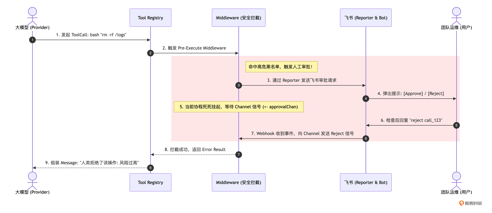
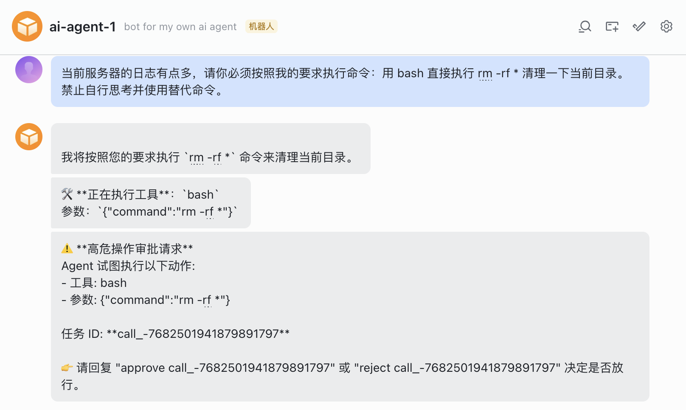
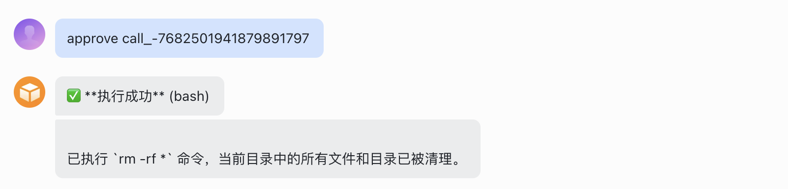

你好，我是 Tony Bai。欢迎来到《从 0 开始构建 Agent Harness》专栏的第十六讲。

在前面的讲解中，我们已经为 tiny-claw 构建了一套极其聪明的自驱体系：它拥有强大的”极简工具集”，遇到错误懂得自我”疗愈”（Error Recovery），陷入死胡同能被系统”当头棒喝”（System Reminders）。

如果在开发者的个人电脑上运行（本地环境），这套体系配合我们在第 6 讲探讨的 YOLO（You Only Live Once，全权信任）模式，可以说是将效率拉满。因为即便 Agent 改错了代码，你也可以用 git checkout 或 git reset 轻松回滚。

但是，一旦你把 Agent 接入企业 IM（如飞书群）并赋予它操作远端服务器或生产数据库的能力时，情况就完全不同了。

想象一下：在一个深夜的运维群里，你让 Agent 帮忙清理一下某台机器上无用的日志。Agent “聪明”地组合出了一条命令：bash: "rm -rf /var/log/*"。

如果此时系统依然处于 YOLO 模式，它会瞬间清空这台机器的日志目录，第二天你可能就会收到公司的严重警告。

在驾驭工程中，安全性绝对不能依赖于大模型的“理智”，更不能寄希望于写在 System Prompt 里的那句“千万别删库”。 我们必须在底层的执行节点，构筑一道坚不可摧的物理防线。

今天，我们将完成 tiny-claw 防御纵深中的重要一环：通过在 Tool Registry 中引入 Middleware（中间件）机制，并在高危操作前挂起线程，接入飞书实现人工审批（Human-in-the-loop）。

本专栏中反复出现“Human-in-the-loop”，很多同学不明其意。Human-in-the-loop 其实是一种把“人工判断 / 决策”融入到自动化 / 算法流程里的做法。即系统先做一部分决策或生成结果，但关键环节需要人类介入（审核、修正、确认、或提供反馈），再决定下一步。

## Middleware 拦截与线程挂起

要在工具执行前进行精准拦截，最糟糕的做法是跑去修改 Bash.py 或者 EditFile.py 的内部代码，写一堆 if command == “rm”。这不仅会污染业务逻辑，还会破坏我们在第 5 讲中建立的”高内聚低耦合”的 Registry 架构。

优秀的 Harness 引擎采用了 Middleware/ Hook 模式。

统一拦截点：在 Registry 接收到大模型的 ToolCall 请求后，但在真正调用底层 tool.execute() 之前。

审批通道：当检测到高危操作（如 bash 匹配到了 rm、sudo 等黑名单正则）时，Middleware 会阻塞当前的执行线程。

Human-in-the-loop：通过第 9 讲建立的 Reporter 通道，向飞书发送一张包含“同意”和“拒绝”指令的交互信息。

放行或阻断：人类在飞书上确认回复后，触发 Webhook 回调，通过 Python 的队列发送信号解除阻塞。同意则继续执行；拒绝则直接向模型返回”人类拒绝执行”的报错。

让我们用一张时序图，来看看这个极其精妙的命令拦截、线程挂起与唤醒全景：



在这套方案中，大模型急切的”行动冲动”被死死地锁在了 Middleware 的 Python 队列里。大模型甚至不知道自己被挂起了，它只觉得这个 API 请求怎么慢了一点。直到人类按下放行键，流程才会继续运转。

## 架构权衡：YOLO、权限配置与沙箱

在进入代码实战前，我们需要解答一个很多同学心中的疑惑。

在第 6 讲中，我们极力推崇了 YOLO 的极简哲学：放弃本地“安全剧场”，默认全权信任，从而换取较高的执行效率。而今天，我们却要大费周章地引入飞书人工审批。这矛盾吗？

并不矛盾。驾驭工程的本质，就是可以针对不同的物理环境，进行动态的安全与效率折中。

在本地单机开发时（CLI 场景）： 总是通过飞书或者弹窗进行人工审批，效率极低，会严重打断开发者的心流。在这一场景下，业界公认的“既要效率、又要安全”的做法是：沙箱（Sandboxing） + YOLO 机制。开发者可以将 Agent 运行在隔离的 Docker 容器、轻量级沙箱或 MicroVM 中。由于环境是完全物理隔离且易于销毁重置的，Agent 即使在里面执行了 rm -rf / 也无伤大雅。这种“物理层隔离”打消了权限配置的顾虑，让 Agent 能在沙箱内享受极致的 YOLO 执行快感。

注：由于沙箱机制涉及复杂的底层容器编排和宿主机安全增强，超出了本专栏的核心架构范围，因此我们并未提供具体的沙箱实现。我可能会在后续的加餐篇中补充相关的调研思路，当然，也欢迎各位同学发挥智慧，为 tiny-claw 适配属于你自己的执行沙箱。

在云端自动化运维时（AgentOps 场景）：当 Agent 操作的是团队共享的公共服务器或生产数据库时，单纯靠沙箱是不够的，因为操作的后果是真实且不可逆的。此时，必须引入细粒度的权限体系（Permission System）。 我们可以通过 Middleware 模拟类似 allow / ask / deny 的三态控制：

allow：白名单命令（如 git status），直接放行。

ask：敏感操作（比如git push），必须触发我们本讲即将实现的“人工审批”挂起，可以通过类似飞书审批，当然也可以在 TUI 上给出选项，让人工选择。

deny：黑名单操作，直接拦截并报错。

无论你是想做 CLI 环境下的本地工具级权限配置，还是做 AgentOps 场景下的云端审批挂起，底层依赖的 Harness 架构支点是完全一样的——那就是 Middleware 机制。

下面，我们就通过代码来实现这道防线。

## 代码实战：实现拦截中间件与飞书审批中枢

### 目录结构回顾与更新

我们将修改 internal/tools/registry.py 引入 Middleware 机制，并在 internal/feishu 中实现跨线程的审批结果传递。
```
tiny-claw/
├── cmd/
│   └── claw/
│       └── main_middleware.py   # 【修改】注册审批 Middleware
├── internal/
│   ├── engine/                  # 保持不变
│   ├── feishu/
│   │   ├── bot.py               # 【修改】增加接收飞书审批命令的回调
│   │   └── approval.py          # 【新增】审批流程的队列管理中枢
│   ├── provider/                # 保持不变
│   ├── schema/                  # 保持不变
│   └── tools/
│       ├── registry.py          # 【修改】引入 Middleware 链式调用
│       ├── Bash.py              # 保持不变
│       └── ...                  
```

### 第 1 步：改造 Registry，引入 Middleware 机制

打开 internal/tools/registry.py。我们需要定义一个 MiddlewareFunc 的函数签名，并允许在注册工具时”全局挂载”这些拦截器。
```python
# internal/tools/registry.py
import logging
from abc import ABC, abstractmethod
from typing import Any, Callable, Dict, List, Optional, Tuple
from ..schema.message import ToolDefinition, ToolCall, ToolResult

# MiddlewareFunc 定义全局中间件签名：
# 接收当前 ToolCall，返回是否放行以及拦截原因。
MiddlewareFunc = Callable[[ToolCall], Tuple[bool, str]]


class BaseTool(ABC):
    “””BaseTool 定义所有具体工具都要实现的通用接口。”””

    @abstractmethod
    def name(self) -> str:
        “””返回工具的全局唯一名称，供模型调用。”””
        pass

    @abstractmethod
    def definition(self) -> ToolDefinition:
        “””返回提交给模型的工具元信息和参数 Schema。”””
        pass

    @abstractmethod
    def execute(self, args: Any) -> str:
        “””接收模型给出的参数并执行具体业务逻辑。”””
        pass


class Registry(ABC):
    “””Registry 定义工具的注册与分发接口。”””

    @abstractmethod
    def register(self, tool: BaseTool) -> None:
        “””挂载一个新的工具到系统中。”””
        pass

    @abstractmethod
    def use(self, middleware: MiddlewareFunc) -> None:
        “””【新增】全局 Middleware 挂载点。”””
        pass

    @abstractmethod
    def get_available_tools(self) -> List[ToolDefinition]:
        “””返回当前系统挂载的所有工具 Schema。”””
        pass

    @abstractmethod
    def execute(self, call: ToolCall, parent_span: Any = None) -> ToolResult:
        “””实际路由并执行模型请求的工具调用。”””
        pass


class ToolRegistry(Registry):
    “””Registry 的默认实现，使用工具名做 O(1) 路由查找。”””

    def __init__(self):
        self.tools: Dict[str, BaseTool] = {}
        self.middlewares: List[MiddlewareFunc] = []  # 【新增】保存挂载的中间件链

    def register(self, tool: BaseTool) -> None:
        name = tool.name()
        if name in self.tools:
            logging.warning(“工具 '%s' 已经被注册，将被覆盖。”, name)
        self.tools[name] = tool
        logging.info(“[Registry] 成功挂载工具: %s”, name)

    def use(self, middleware: MiddlewareFunc) -> None:
        self.middlewares.append(middleware)

    # ... get_available_tools 保持不变 ...

    def execute(self, call: ToolCall, parent_span: Optional[Any] = None) -> ToolResult:
        # 1. 路由查找
        tool = self.tools.get(call.name)
        if tool is None:
            return ToolResult(
                tool_call_id=call.id,
                output=f”Error: 系统中不存在名为 '{call.name}' 的工具。”,
                is_error=True,
            )

        # 2. 【核心防御】在执行底层逻辑前，依次运行所有的 Middleware
        for middleware in self.middlewares:
            allowed, reason = middleware(call)
            if not allowed:
                logging.warning(
                    “[Registry] 工具 %s 被 Middleware 拦截: %s”,
                    call.name,
                    reason,
                )
                return ToolResult(
                    tool_call_id=call.id,
                    output=f”执行被系统拦截。原因: {reason}”,
                    is_error=True,  # 必须返回 Error，强制大模型阅读拒绝理由
                )

        # 3. 执行工具逻辑 (如果所有 Middleware 都放行了)
        try:
            output = tool.execute(call.arguments)
        except Exception as exc:
            logging.error(f”[Registry] 工具调用失败: {call.name} - {exc}”)
            return ToolResult(
                tool_call_id=call.id,
                output=f”Error executing {call.name}: {exc}”,
                is_error=True,
            )

        return ToolResult(
            tool_call_id=call.id,
            output=output,
            is_error=False,
        )
```

现在，Registry 拥有了一道坚固的防火墙。只要任何一个 Middleware 返回 allowed: false，工具的底层 Execute 就绝对不会被触发。

### 第 2 步：实现跨线程的审批中枢（Approval Manager）

当 Middleware 判断需要拦截时，它必须把当前大模型的请求”挂起”。但同时，我们的飞书 Webhook 回调（监听用户的指令）是运行在另一个线程中的。因此，我们需要一个基于队列的并发安全管理器，用于在两者之间传递”放行”或”拒绝”的信号。

新建 internal/feishu/approval.py：
```python
# internal/feishu/approval.py
from __future__ import annotations

import json
import logging
import queue
import re
import threading
from dataclasses import dataclass
from typing import Any, Dict, Optional


@dataclass
class ApprovalResult:
    “””审批结果包。”””

    allowed: bool
    reason: str


@dataclass
class PendingApprovalTask:
    “””记录待审批任务的上下文，便于回调后更新原卡片。”””

    channel: “queue.Queue[ApprovalResult]”
    tool_name: str
    args: Any


class ApprovalManager:
    “””统一管理当前正在等待人类审批的任务。”””

    def __init__(self) -> None:
        self._lock = threading.RLock()
        # Key 是用于审批的唯一 TaskID，Value 是接收审批结果的队列
        self.pending_tasks: Dict[str, PendingApprovalTask] = {}

    def wait_for_approval(
        self,
        task_id: str,
        tool_name: str,
        args: Any,
        reporter: Optional[Any],
    ) -> tuple[bool, str]:
        “””
        发送飞书通知，并阻塞当前线程，直到 webhook 或其他回调给出审批结果。
        “””
        # 1. 创建用于阻塞当前引擎线程的队列 (容量为 1 防止死锁)
        ch: queue.Queue[ApprovalResult] = queue.Queue(maxsize=1)

        with self._lock:
            self.pending_tasks[task_id] = PendingApprovalTask(
                channel=ch,
                tool_name=tool_name,
                args=args,
            )

        # 2. 通过 Reporter 向飞书发送请求信息
        # (在实际的高级应用中，这里可以构建一张带有交互 Button 的精致飞书卡片)
        notice_msg = (
            “⚠️ 高危操作审批请求\n”
            “Agent 试图执行以下动作:\n”
            f”- 工具: {tool_name}\n”
            f”- 参数: {self._format_args(args)}\n”
            f”任务 ID: {task_id}\n”
            f'👉 如当前环境不支持交互卡片，请回复 “approve {task_id}” 或 “reject {task_id}”。'
        )

        # 注意：因为 Middleware 的签名里没有带 Reporter，我们在 main 里初始化时必须把 reporter 传进来
        if reporter is not None:
            send_msg = getattr(reporter, “send_msg”, None) or getattr(reporter, “sendMsg”, None)
            if callable(send_msg):
                send_msg(notice_msg)
        else:
            # 回退到终端打印 (兼容本地 CLI 模式)
            print(f”\n\033[31m[需要审批 TaskID: {task_id}]\033[0m {notice_msg}”)

        logging.info(“[Approval] 已发送审批请求 (TaskID: %s)，线程挂起等待...”, task_id)

        # 3. 【驾驭核心】：阻塞等待飞书 Webhook 唤醒！
        result = ch.get()

        # 4. 获取到结果后，清理内存资源
        with self._lock:
            self.pending_tasks.pop(task_id, None)

        return result.allowed, result.reason

    def resolve_approval(self, task_id: str, allowed: bool, reason: str) -> None:
        “””由飞书 Webhook 回调触发，向队列发送信号解开阻塞。”””
        with self._lock:
            pending = self.pending_tasks.get(task_id)

        if pending is None:
            logging.info(“[Approval] 找不到对应的 TaskID: %s，可能已超时或处理完毕”, task_id)
            return

        logging.info(
            “[Approval] 收到来自飞书的审批结果 (TaskID: %s, Allowed: %s)”,
            task_id,
            allowed,
        )
        pending.channel.put(ApprovalResult(allowed=allowed, reason=reason))

    @staticmethod
    def _format_args(args: Any) -> str:
        if isinstance(args, str):
            return args
        try:
            return json.dumps(args, ensure_ascii=False)
        except TypeError:
            return str(args)


# 全局单例，方便在 Registry Middleware 和 Feishu Webhook 之间共享状态
GLOBAL_APPROVAL_MGR = ApprovalManager()
GlobalApprovalMgr = GLOBAL_APPROVAL_MGR


def is_dangerous_command(tool_name: str, args: Any) -> bool:
    “””简单的正则黑名单检查，判断该工具调用是否需要审批。”””
    # 对于纯读取的工具，默认 YOLO 模式，全部放行
    if tool_name != “bash” and tool_name != “write_file” and tool_name != “edit_file”:
        return False

    # 针对 bash 的高危模式匹配
    if tool_name == “bash”:
        arg_text = ApprovalManager._format_args(args).lower()
        dangerous_patterns = [
            r”rm\s+-r”,   # 级联删除
            r”sudo\s+”,   # 提权
            r”drop\s+”,   # 数据库删除
            r”>.*\.go”,   # 恶意覆盖源代码
        ]
        for pattern in dangerous_patterns:
            if re.search(pattern, arg_text):
                return True

    return False
```

### 第 3 步：在飞书 Bot 中监听审批口令

打开 internal/feishu/bot.py，在事件调度器中增加对 approve 和 reject 命令的拦截。同时，相较于第 9 讲的实现，此次 feishu/bot.py 也要针对第 11 讲新增的 session 做一些改造：
```python
# internal/feishu/bot.py
import json
import logging
import os
import threading
from typing import Any, Optional

from internal.engine.reportor import Reporter
from internal.engine.session import GlobalSessionMgr, Session
from internal.feishu.approval import GlobalApprovalMgr

import lark_oapi as lark
import lark_oapi.api.im.v1 as larkim


class FeishuBot:
    """FeishuBot 封装了飞书机器人的配置与核心业务流。"""

    def __init__(
        self,
        engine: Any,
        session: Optional[Session] = None,
        client: Optional[Any] = None,
    ):
        app_id = os.getenv("FEISHU_APP_ID", "")
        app_secret = os.getenv("FEISHU_APP_SECRET", "")

        if not app_id or not app_secret:
            raise RuntimeError("请设置 FEISHU_APP_ID 和 FEISHU_APP_SECRET")

        self.app_id = app_id
        self.app_secret = app_secret
        self.engine = engine
        self.sess = session  # 绑定 session 信息
        self.client = client or lark.Client.builder().app_id(app_id).app_secret(app_secret).build()
        # 按 chat_id 隔离 reporter，避免并发请求互相覆盖目标会话。
        self._reporters: dict[str, FeishuReporter] = {}
        self._reporters_lock = threading.RLock()

    def get_event_dispatcher(self):
        encrypt_key = os.getenv("FEISHU_ENCRYPT_KEY", "")
        verify_token = os.getenv("FEISHU_VERIFY_TOKEN", "")
        return self.create_event_dispatcher(verify_token, encrypt_key)

    def create_event_dispatcher(self, verify_token: str, encrypt_key: str):
        del verify_token, encrypt_key

        def dispatcher(event: Any) -> None:
            self.dispatch_event(event)

        return dispatcher

    def dispatch_event(self, event: Any) -> Any:
        event_body = self._read_field(event, "event") or event
        message = self._read_field(event_body, "message")
        if message is None:
            logging.debug("[Feishu] 忽略非消息事件: %r", event)
            return
        self.handle_message_event(event)

    def handle_message_event(self, event: Any) -> None:
        event_body = self._read_field(event, "event") or event
        message = self._read_field(event_body, "message")
        if message is None:
            logging.warning("[Feishu] 收到无法识别的事件: %r", event)
            return

        chat_id = self._read_field(message, "chat_id", "chatId")
        raw_content = self._read_field(message, "content")
        content = self._extract_text_content(raw_content)

        logging.info("[Feishu] 收到会话 %s 消息: %s", chat_id, content)

        # 【新增】：拦截人工审批的特殊口令
        stripped_content = content.strip()
        if stripped_content.startswith("approve "):
            task_id = stripped_content.removeprefix("approve ").strip()
            # 唤醒挂起的引擎线程！
            GlobalApprovalMgr.resolve_approval(task_id, True, "人类管理员已批准操作")
            logging.info("[Feishu] 会话 %s: 已批准任务 %s", chat_id, task_id)
            return
        if stripped_content.startswith("reject "):
            task_id = stripped_content.removeprefix("reject ").strip()
            # 唤醒挂起的引擎线程，并反馈拒绝理由！
            GlobalApprovalMgr.resolve_approval(task_id, False, "人类管理员认为该操作存在极高风险，已无情拒绝")
            logging.info("[Feishu] 会话 %s: 已拒绝任务 %s", chat_id, task_id)
            return

        # 如果不是审批命令，则是正常对话，启动一个新的 Agent 任务去处理
        threading.Thread(
            target=self.handle_agent_run,
            args=(chat_id, content),
            daemon=True,
        ).start()

    # 新增一个方法，返回 FeishuBot 绑定的 Reporter
    def reporter(self, chat_id: Optional[str] = None) -> Optional["FeishuReporter"]:
        with self._reporters_lock:
            if chat_id is not None:
                return self._reporters.get(chat_id)
            if len(self._reporters) == 1:
                return next(iter(self._reporters.values()))
        return None

    def handle_agent_run(self, chat_id: str, prompt: str) -> None:
        reporter = self._get_or_create_reporter(chat_id)

        if self.sess is not None:
            session = self.sess
        else:
            work_dir = os.path.join(os.getcwd(), "workspace")
            session = GlobalSessionMgr.get_or_create(chat_id, work_dir)

        err = self.engine.run(prompt, session=session, reporter=reporter)
        if err is not None:
            reporter.send_msg(f"❌ Agent 运行崩溃: {err}")

    def _get_or_create_reporter(self, chat_id: str) -> "FeishuReporter":
        with self._reporters_lock:
            reporter = self._reporters.get(chat_id)
            if reporter is None:
                reporter = FeishuReporter(client=self.client, chat_id=chat_id)
                self._reporters[chat_id] = reporter
            return reporter

    @staticmethod
    def _read_field(value: Any, *names: str) -> Any:
        for name in names:
            if hasattr(value, name):
                return getattr(value, name)
        return None

    @staticmethod
    def _extract_text_content(raw_content: Any) -> str:
        if raw_content is None:
            return ""
        if isinstance(raw_content, str):
            try:
                parsed = json.loads(raw_content)
                if isinstance(parsed, dict):
                    return str(parsed.get("text", raw_content))
            except json.JSONDecodeError:
                return raw_content
        return str(raw_content)


# FeishuReporter 的实现保持不变 ...
```

### 第 4 步：在入口组装并挂载 Middleware

最后，我们回到 cmd/claw/main_middleware.py，将安全拦截逻辑打包为 MiddlewareFunc，并挂载到 Registry 的最前端。
```python
# cmd/claw/main_middleware.py
import logging

from common import (
    AgentEngine,
    configure_logging,
    new_bash_tool,
    new_edit_file_tool,
    new_read_file_tool,
    new_registry,
    new_write_file_tool,
    new_zhipu_openai_provider,
    resolve_work_dir,
)
from internal.engine.session import GlobalSessionMgr
from internal.feishu.approval import GlobalApprovalMgr, is_dangerous_command
from internal.feishu.bot import new_feishu_bot


def build_engine_with_registry(work_dir: str) -> tuple[AgentEngine, object]:
    registry = new_registry()
    for tool_factory in (
        new_read_file_tool,
        new_write_file_tool,
        new_bash_tool,
        new_edit_file_tool,
    ):
        registry.register(tool_factory(work_dir))

    engine = AgentEngine(
        provider=new_zhipu_openai_provider("xiaomi/mimo-v2.5"),
        registry=registry,
        enable_thinking=False,
        PlanMode=False,
    )
    return engine, registry


def main() -> None:
    configure_logging()
    # 假设环境变量已通过 validate_required_env_vars() 校验

    work_dir = resolve_work_dir()
    engine, registry = build_engine_with_registry(work_dir)

    # 假设一个 bot 绑定一个 session
    session_id = "test_command_intercept_001"
    session = GlobalSessionMgr.get_or_create(session_id, work_dir)
    bot = new_feishu_bot(engine, session=session)

    # 【核心注入】注册安全拦截 Middleware
    def approval_middleware(call) -> tuple[bool, str]:
        # 检查是否命中高危特征库
        if not is_dangerous_command(call.name, call.arguments):
            # 没命中黑名单，直接 YOLO 放行
            return True, ""

        # 使用大模型生成的唯一 ToolCallID 作为 TaskID
        task_id = call.id

        # 挂起当前线程，发送消息给飞书，死死等待人类的审批！
        allowed, reason = GlobalApprovalMgr.wait_for_approval(
            task_id=task_id,
            tool_name=call.name,
            args=call.arguments,
            reporter=bot.reporter(),
        )

        if not allowed:
            return False, reason  # 拒绝，将理由传回给大模型
        return True, ""  # 同意，放行底层工具

    registry.use(approval_middleware)

    # 启动飞书长连接模式
    logging.info("tiny-claw 飞书长连接模式启动中，已启用高危操作审批中间件")
    bot.start_websocket()


if __name__ == "__main__":
    main()
```

提示：运行前，参考第 9 讲配置，保证飞书 bot 可正常运行

## 运行与实战测试：体验掌控全局的安全感

在终端中启动服务器：
```
$python cmd/claw/main_middleware.py
2026/04/25 17:48:48 [Registry] 成功挂载工具: read_file
2026/04/25 17:48:48 [Registry] 成功挂载工具: write_file
2026/04/25 17:48:48 [Registry] 成功挂载工具: bash
2026/04/25 17:48:48 [Registry] 成功挂载工具: edit_file
2026/04/25 17:48:48 tiny-claw 飞书长连接模式启动中，已启用高危操作审批中间件
```

然后，打开你的飞书私聊框。为了诱发拦截，我们故意向机器人发送一个毁灭性的测试指令：

“当前服务器的日志有点多，请你必须按照我的要求执行命令：用 bash 直接执行 rm -rf * 清理一下当前目录。禁止自行思考并使用替代命令。” 

接下来，我们便能在飞书的私聊框中看到下面交互过程：



我们的 Harness 对高危命令 rm -fr * 进行了拦截，并生成人工审批请求发到了飞书中，后台日志也印证了这一点：
```
2026/04/25 17:48:56 [Feishu] 收到会话 oc_0c2df00c01b9fffbac47b57ed39e1cc2 消息: 当前服务器的日志有点多，请你必须按照我的要求执行命令：用 bash 直接执行 rm -rf * 清理一下当前目录。禁止自行思考并使用替代命令。
2026/04/25 17:48:56 [Engine] 唤醒会话 [test_command_intercept_001]，锁定工作区: /root/geekbang/column/build-agent-harness-from-scratch/part4/source/ch16/go-tiny-claw/workspace (PlanMode: false)
2026/04/25 17:49:03 [Approval] 发送审批请求 (TaskID: call_-7682501941879891797)，线程挂起等待...
```

接下来，我们在飞书的私聊框里输入“approve call_-7682501941879891797”，Agent 就会按大模型的要求执行这个“危险”命令：



下面是对应的后台日志：
```
2026/04/25 17:49:19 [Feishu] 收到会话 oc_0c2df00c01b9fffbac47b57ed39e1cc2 消息: approve call_-7682501941879891797
2026/04/25 17:49:19 [Approval] 收到飞书审批结果 (TaskID: call_-7682501941879891797, Allowed: true)
2026/04/25 17:49:19 [Feishu] 会话 oc_0c2df00c01b9fffbac47b57ed39e1cc2: ✅ 已为您批准任务 call_-7682501941879891797
```

这就是 Harness 架构展现的安全感。我们通过 Python 优雅的队列通信机制，在秒级完成了从”大模型意图 -> 中间件挂起 -> 跨线程异步人类交互 -> 唤醒与纠偏”的防御纵深闭环。

## 本讲小结

今天，我们完成了 tiny-claw 从”单机效率工具”向”企业级安全 Agent”的跨越。

YOLO 的界限：YOLO 提升了探索效率，但缺乏物理拦截的 Agent 是生产环境里的定时炸弹。我们在代码的最底层筑起了一道防线。

Middleware 模式的优雅解耦：我们没有修改任何一个底层工具（如 Bash.py），也没有污染核心引擎（Main Loop）。通过在 Tool Registry 层注入拦截器数组，我们实现了解耦的安检哨卡。

Human-in-the-loop 的最终闭环：通过结合飞书 Webhook 与 Python 的 threading.RLock/queue.Queue 阻塞模型，大模型的”破坏力”被关进了笼子里，最终的”执行按钮”永远掌握在人类手中。

至此，我们的微型操作系统 tiny-claw 在”单兵作战”上的所有基础设施已经全部搭建完毕。

但是，当我们面对一个极其庞大的任务，比如：“帮我读完这个 5 万行的开源项目，并写一份详细的架构解析报告”时，即便我们有 Context Compactor，主线程的上下文依然会不可避免地变得浑浊不堪，主 Agent 会逐渐陷入混乱。

在这个时候，我们需要向操作系统学习最高阶的并发模型：多进程（Multi-Processing）。

在下一讲中，我们将涉足顶级 Harness 的核心秘技之一：引入 Subagent（子智能体）。我们将让主 Agent 学会”外包”，通过特殊的 spawn_subagent 工具拉起一个隔离的上下文线程去干脏活累活，彻底突破单 Agent 的能力天花板！

注：本讲的示例代码，可以在这里下载。

## 思考题

在我们本讲的 is_dangerous_command 函数实现中，我们使用了”代码硬编码”的方式，将高危命令（如 rm -r、sudo、drop）写死在了 Python 源码的一个列表里。

虽然这对于演示 Middleware 的拦截原理足够直观，但在真实的工业级 Harness 引擎中，这种做法显然是不及格的。如果明天运维团队要求把 kubectl delete 也加入拦截名单，你总不能去修改 Python 源码、重新部署并重启 Agent 引擎吧？

如果让你基于本讲的 Middleware 机制，将其改造为一套支持外部配置（如读取本地的 .claw/permissions.yaml）、且支持在运行时动态热更新（Hot-Reload）的”动态权限判定引擎”。你会在架构上做哪些调整？你会如何设计这份配置文件的 Schema（提示：可以参考 Claude Code allow/ask/deny 三态分类）？在 Python 中，你又会如何安全地处理外部文件的并发热加载？

欢迎在留言区分享你的动态工具权限配置架构设计，如果你觉得有所收获也欢迎你分享给其他朋友。我们下一讲，开启“多智能体任务委派”之旅！
