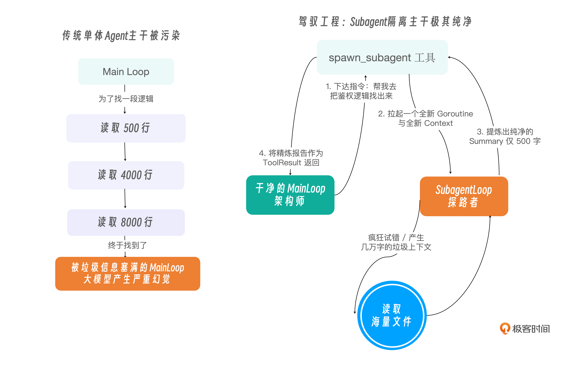

你好，我是 Tony Bai。欢迎来到《从 0 开始构建 Agent Harness》专栏的第十七讲。

在过去的 16 讲中，我们为 tiny-claw 打造了全方位的生存能力：通过阶梯掩码（Compactor）管理了内存，通过 TODO.md等 持久化了记忆，通过 Reminder 和 Middleware 构建了防走神和防删库的安全屏障。

它现在就像一个极其靠谱的“单兵特种兵”。但是，特种兵再强，终究是一个人。

当你遇到一个极其庞大、充满未知领域的长程任务时，比如：”请帮我阅读完这个 5 万行的开源 C++ 项目源码，理解它的权限校验逻辑，然后把它翻译成 Python 语言。”

如果你的 Agent 只有一条命（一个 Main Loop 线程），它可能最终会陷入“崩溃”。哪怕我们有 Compactor 机制，大模型依然需要在一轮轮的 ReAct 循环中，使用 read_file 翻阅成百上千个文件，使用 bash 调用 grep 搜索关键词。

在这个漫长的“探索”阶段，主线程的上下文会被海量的尝试、报错、无关的代码片段塞满。最终，当它终于找到关键代码，准备开始“写代码”时，它可能早就忘记了你最初要求它”翻译成 Python 语言”的那个小细节了。

在 Harness 驾驭工程中，突破单体大模型能力天花板的解法，就是向现代企业管理学习：任务委派（Delegation）与多智能体（Multi-Agent / Subagent）架构。

今天，我们将为 tiny-claw 引入一个令人兴奋的高阶特性：通过实现一个特殊的工具，让主 Agent 能够根据需要，随时随地拉起一个受限隔离的“子智能体（Subagent）”去帮它干脏活累活！

## 为什么需要 Subagent 物理隔离？

很多初学者觉得“多智能体（Multi-Agent）”非常玄乎，其实在底层的驾驭工程中，它的原理极其简单，就是上下文环境的物理隔离。

对于上述的翻译 C++ 代码的任务，我们理想的流程应该是这样的：

主 Agent（架构师）保持极其干净、清醒的头脑。它主要负责读写 PLAN.md 和 TODO.md，并在脑海里维护最终的目标。它遇到需要阅读几百个 C++ 文件的脏活时，它不自己去读，而是派出一个 “探索子智能体（Explorer Subagent）”。

子 Agent（探路者）拥有一个全新的、纯净的 contextHistory。它开始疯狂调用 read_file 和 bash (grep) 去探索。哪怕它看了 50 个文件，触发了 5 次 Compactor 掩码压缩，它的疯狂试错也绝对不会污染主 Agent 的大脑。

子 Agent 探索完毕后，将自己看到的 5 万行代码浓缩成一段极其精炼的几百字总结，回传给主 Agent。主 Agent 看到总结后，继续清晰地推进 TODO.md。

我们下面用一张示意图，对比单体 Agent 与 Subagent 架构在上下文管理上的巨大差异：



## 极简驾驭：Subagent 就是一个底层的“普通工具”

很多第三方框架（如 AutoGen）会将 Multi-Agent 包装成极其复杂的聊天图谱（Chat Graph）。但按照 OpenClaw / pi 的极简哲学，子智能体不应该是一个玄学的新概念，它的实现可以仅仅是 Tool Registry 里注册的一个普通工具。

我们只需要编写一个名为 spawn_subagent 的特殊工具，它的执行逻辑就是：新建一个 AgentEngine，传入一个纯净的 Session，然后阻塞等待这个子 Engine 跑完，最后把输出作为 ToolResult 返回。

## 代码实战：实现 spawn_subagent 工具

接下来，我们将用 Python 语言将这个迷人的理念转化为现实。

### 目录结构回顾与更新

我们将所有的多智能体相关代码，都优雅地封装在 internal/tools/subagent.py 中，并引入一个新的抽象接口 AgentRunner，让 Tool 可以安全地拉起 Engine。
```
tiny-claw/
├── cmd/
│   └── claw/
│       └── main_subagent.py     # 【修改】挂载 subagent 工具，发起协同任务
├── internal/
│   ├── engine/
│   │   ├── loop.py              # 【修改】增加 run_sub 接口实现，专用于受限的子循环
│   │   └── ...
│   ├── feishu/                  # 保持不变
│   ├── provider/                # 保持不变
│   ├── schema/                  # 保持不变
│   └── tools/                   
│       ├── registry.py          
│       ├── readfile.py          
│       ├── subagent.py          # 【新增】拉起子智能体的特殊套娃工具
│       └── ...
└── workspace/
```

### 第 1 步：定义 SubagentTool 及防污染机制

新建 internal/tools/subagent.py。我们需要在这里做一些”套娃”操作。

为了拉起一个新的 AgentEngine，这个工具在被初始化时，必须拿到大模型的 Provider 和当前工作区的信息。

更关键的是，为了防止子智能体乱搞破坏（比如误删文件），我们在把它丢出去探索时，通常只会给它挂载”只读”工具（如 read_file、bash），绝对不给它发 edit_file。这也是驾驭工程中限制”爆炸半径（Blast Radius）”的经典做法。
```python
# internal/tools/subagent.py
import logging
from typing import Any, Protocol

from ..schema.message import ToolDefinition
from .registry import BaseTool, Registry


# AgentRunner 是一个打破循环依赖的抽象接口。
# 因为 SubagentTool 存在于 tools 包，而完整的 AgentEngine 存在于 engine 包。
# 为了让 Tool 能拉起 Engine，我们定义一个 Protocol 供外部注入。
class AgentRunner(Protocol):
    # run_sub 启动一个匿名的、一次性的子智能体任务，并返回其最终梳理出的纯文本总结
    def run_sub(
        self,
        task_prompt: str,
        read_only_registry: “Registry”,
        reporter: Any,
    ) -> str:
        ...


class SubagentTool(BaseTool):
    “””派出只读子智能体做深度探索，再回收摘要报告。”””

    def __init__(
        self,
        runner: AgentRunner,
        read_only_registry: Registry,
        reporter: Any,
    ):
        self.runner = runner
        # 为子智能体准备的专属、受限的”只读”注册表
        self.read_only_registry = read_only_registry
        # 暂时用 Any 规避包循环依赖，底层通过属性访问使用
        self.reporter = reporter

    def name(self) -> str:
        return “spawn_subagent”

    # definition 向主 Agent 暴露这个工具的强大能力
    def definition(self) -> ToolDefinition:
        return ToolDefinition(
            name=self.name(),
            description=(
                “派出一个专门用于深度探索（Exploration）的子智能体。”
                “当你需要阅读大量代码、跨文件查找逻辑时请调用此工具。”
                “它在探索完毕后，会给你返回一份极度精炼的摘要报告。”
            ),
            input_schema={
                “type”: “object”,
                “properties”: {
                    “task_prompt”: {
                        “type”: “string”,
                        “description”: “给子智能体下达的明确指令。”,
                    }
                },
                “required”: [“task_prompt”],
            },
        )

    def execute(self, args: Any) -> str:
        # 解析参数
        if not isinstance(args, dict):
            raise ValueError(“参数解析失败: 参数必须是包含 task_prompt 的对象”)

        task_prompt = args.get(“task_prompt”)
        if not isinstance(task_prompt, str) or not task_prompt:
            raise ValueError(“参数解析失败: task_prompt 必须是非空字符串”)

        logging.info(
            “[Subagent] 主 Agent 发起委派！正在拉起探路者: [%s]...”,
            task_prompt,
        )

        # 【核心降维打击】：拉起一个完全物理隔离的子循环
        # 我们把针对该任务的专项指令传给子智能体，并仅提供 read_only_registry。
        # (子智能体只能读文件或执行只读的 bash，不能搞破坏)
        try:
            summary = self.runner.run_sub(
                task_prompt, self.read_only_registry, self.reporter
            )
        except Exception as exc:
            return f”子智能体执行失败: {exc}”

        logging.info(“[Subagent] 子智能体任务结束。报告返回给主干...”)

        # 最终，几万字的代码探索，化作了这一段轻量级的 Summary，
        # 就像一次普通的 API 调用一样，返回给了始终保持清醒的主 Agent。
        return f”【子智能体探索报告】:\n{summary}”
```

### 第 2 步：实现拉起与执行逻辑

当主 Agent 发起 spawn_subagent 时，这个方法会被 Registry 触发。它会阻塞主线程，利用传入的 runner 接口，默默地在后台跑完一个完整的 ReAct 子循环。

`execute` 方法已经在上面的代码中完整实现。它负责解析参数、调用 `self.runner.run_sub()` 拉起隔离的子循环，并将子智能体的总结报告返回给主 Agent。

### 第 3 步：在 Engine 中实现 run_sub 接口支持

为了满足 AgentRunner 协议，我们需要回到 internal/engine/loop.py，为主引擎增加一个轻量级的 run_sub 方法。它实际上就是去掉了 Session 管理的”一次性”变体。

打开 internal/engine/loop.py，在 AgentEngine 类的末尾添加：
```python
# internal/engine/loop.py (续加在 AgentEngine 类末尾)

    def run_sub(
        self,
        task_prompt: str,
        read_only_registry: Registry,
        reporter: Any = None,
    ) -> str:
        “””启动一次性、只读受限的子智能体探索循环。”””

        # 【核心优化】：子智能体极其容易偷懒。我们必须在 System Prompt 中严厉警告它必须使用工具！
        context_history = [
            Message(
                role=Role.SYSTEM,
                content=(
                    “你是一个专门负责深度探索的探路者 (Explorer Subagent)。\n”
                    “你的任务是根据主架构师的指令，在当前工作区内仔细阅读代码、查阅日志，搜集足够的信息。\n”
                    “【核心纪律】\n”
                    “1. 你必须、且只能依靠内置工具（如 bash 的 find/grep，或 read_file）去寻找答案。绝对不允许凭空捏造或猜测！\n”
                    “2. 如果你没有找到确切的答案，你必须继续使用工具深入搜索。\n”
                    “3. 当且仅当你找到了确切的线索后，停止调用工具，直接输出一段纯文本作为你的终极汇报。”
                    “主架构师会根据你的汇报来做下一步决策。”
                ),
            ),
            Message(role=Role.USER, content=task_prompt),
        ]

        # 限制子智能体最多只能跑 10 个 Turn，防止它自己卡死
        max_sub_turns = 10
        turn_count = 0

        while True:
            turn_count += 1
            if turn_count > max_sub_turns:
                raise RuntimeError(
                    f”子智能体探索过于深入，超过 {max_sub_turns} 轮被强制召回，请主 Agent 给它更明确的指令”
                )

            # 【驾驭底线】：子智能体仅能获取传入的只读工具注册表
            available_tools = read_only_registry.get_available_tools()

            compacted_context = self.compactor.compact(context_history)

            # 子任务要求急速响应，强制关闭主体的慢思考，直接预测行动
            try:
                action_resp = self.provider.generate(compacted_context, available_tools)
            except Exception as exc:
                raise RuntimeError(f”子智能体推理失败: {exc}”) from exc

            context_history.append(action_resp)

            # 【核心退出条件】：子智能体一旦不调用工具了，说明它做好了总结汇报
            if not action_resp.tool_calls:
                # 直接将它的这段汇报内容剥离出来返回给上层
                return action_resp.content

            # 执行只读工具的并发循环
            logging.info(
                “[Engine][Subagent] 模型请求并发调用 %d 个只读工具...”,
                len(action_resp.tool_calls),
            )
            observation_msgs: List[Optional[Message]] = [None] * len(action_resp.tool_calls)

            def execute_tool(idx: int, call) -> None:
                # 【可视化的关键】：让终端用户看到 Subagent 正在干嘛
                if reporter is not None:
                    reporter.on_tool_call(f”[Subagent] {call.name}”, call.arguments)

                result = read_only_registry.execute(call)

                final_output = result.output
                if result.is_error:
                    final_output = self.recovery_manager.analyze_and_inject(
                        call.name, result.output
                    )

                if reporter is not None:
                    display = final_output
                    if len(display) > 200:
                        display = display[:200] + “... (已截断)”

                    reporter.on_tool_result(
                        f”[Subagent] {call.name}”, display, result.is_error
                    )

                observation_msgs[idx] = Message(
                    role=Role.USER,
                    content=final_output,
                    tool_call_id=call.id,
                )

            with ThreadPoolExecutor(max_workers=len(action_resp.tool_calls)) as executor:
                futures = [
                    executor.submit(execute_tool, idx, tool_call)
                    for idx, tool_call in enumerate(action_resp.tool_calls)
                ]
                for future in futures:
                    future.result()

            for obs in observation_msgs:
                if obs is not None:
                    context_history.append(obs)
```

## 运行与实战测试：见证“包工头”的诞生

为了验证这个不可思议的多智能体协同，我们需要在靶机工作区中，制造一个隐藏得很深的线索，并观察主 Agent 是如何“外包”工作的。

在你的工作区目录 workspace 下，创建如下的嵌套文件结构，模拟一个复杂的遗留系统：
```
mkdir -p workspace/legacy/v1/auth
echo "核心密码是: super_secret_agent_password_42" > workspace/legacy/v1/auth/config.txt

echo "这是一个空文件" > workspace/fake1.go
echo "这也是一个空文件" > workspace/fake2.go
```

打开 cmd/claw/main_subagent.py，我们将 subagent 工具挂载给主引擎。

注意挂载时的特殊技巧：我们要为主引擎准备”全功能兵器库”，为子引擎准备”只读冷兵器库”。
```python
# cmd/claw/main_subagent.py
import logging

from common import (
    build_engine_for_work_dir,
    configure_logging,
    new_bash_tool,
    new_edit_file_tool,
    new_read_file_tool,
    new_write_file_tool,
    require_env_vars,
    resolve_work_dir,
)
from internal.engine.terminal_reporter import new_terminal_reporter
from internal.tools.readfile import new_read_file_tool as new_read_only_file_tool
from internal.tools.registry import new_registry
from internal.tools.subagent import new_subagent_tool
from internal.tools.Bash import new_bash_tool as new_read_only_bash_tool


def main() -> None:
    configure_logging()
    require_env_vars((“ZHIPU_API_KEY”,))

    work_dir = resolve_work_dir()
    reporter = new_terminal_reporter()

    # 【防御沙箱】为子智能体准备受限的只读注册表
    read_only_registry = new_registry()
    read_only_registry.register(new_read_only_file_tool(work_dir))
    read_only_registry.register(new_read_only_bash_tool(work_dir))  # 允许简单的 grep 等搜索操作

    # 为主智能体准备全功能注册表
    engine = build_engine_for_work_dir(
        work_dir=work_dir,
        tool_factories=[
            new_read_file_tool,
            new_write_file_tool,
            new_bash_tool,
            new_edit_file_tool,
        ],
        enable_thinking=False,
    )

    # 【核心装配】：将带有 Engine 引用和只读 Registry 的 Subagent 工具注册进主线
    engine.registry.register(new_subagent_tool(engine, read_only_registry, reporter))

    from common import new_cli_session
    session = new_cli_session()

    prompt = “””
我需要你在这个遗留项目里，找到那个”核心密码”。
为了防止污染主上下文，请你务必派出子智能体（spawn_subagent）去执行探索任务。
你可以让子智能体使用 bash 去查找当前目录（及其所有子目录）下名为 config.txt 的文件。
子智能体拿到密码向你汇报后，请你亲自使用 write_file 工具，将密码写在根目录的 answer.txt 里。
“””

    logging.info(“>>> 启动多智能体协同测试...”)
    err = engine.run(prompt, session=session, reporter=reporter)
    if err is not None:
        logging.error(“引擎运行崩溃: %s”, err)
        raise SystemExit(1) from err


if __name__ == “__main__”:
    main()
```

### 奇迹时刻：主从协同的艺术

运行程序。你会见证一个极其清晰的“包工头分配任务 -> 探路者踩坑 -> 探路者汇报 -> 包工头收尾”的全过程：
```
$ python cmd/claw/main_subagent.py
2026/04/25 21:43:25 [INFO] [Registry] 成功挂载工具: read_file
2026/04/25 21:43:25 [INFO] [Registry] 成功挂载工具: bash
2026/04/25 21:43:25 [INFO] [Registry] 成功挂载工具: read_file
2026/04/25 21:43:25 [INFO] [Registry] 成功挂载工具: write_file
2026/04/25 21:43:25 [INFO] [Registry] 成功挂载工具: bash
2026/04/25 21:43:25 [INFO] [Registry] 成功挂载工具: edit_file
2026/04/25 21:43:25 [INFO] [Registry] 成功挂载工具: spawn_subagent
2026/04/25 21:43:25 [INFO] >>> 启动多智能体协同测试...
2026/04/25 21:43:25 [INFO] [Engine] 引擎启动， 会话：test_subagent_001 锁定工作区: .../workspace

🤖 Agent 回复:

好的，我来派出子智能体帮你探索这个遗留项目，找到核心密码。


[🛠️ 调用工具] spawn_subagent
   参数: {"task_prompt":"请在这个项目中探索并找到核心密码。具体任务如下：\n1. 使用 bash 命令查找当前目录及其所有子目录... (已截断)
2026/04/25 21:43:30 [INFO] [Subagent] 主 Agent 发起委派！正在拉起探路者: [请在这个项目中探索并找到核心密码。具体任务如下：
1. 使用 bash 命令查找当前目录及其所有子目录下名为 config.txt 的文件
2. 读取所有找到的 config.txt 文件内容
3. 寻找包含"核心密码"、"password"、"secret"、"key"等关键词的内容
4. 将找到的密码信息返回给我
5. 如果找到多个可能的密码，请判断哪个是真正的核心密码并说明理由]...
[🛠️ 调用工具] [Subagent] bash
   参数: {"command":"find . -name \"config.txt\" -type f"}
[✅ 执行成功] [Subagent] bash
[🛠️ 调用工具] [Subagent] read_file
   参数: {"path":"./legacy/v1/auth/config.txt"}
[✅ 执行成功] [Subagent] read_file
2026/04/25 21:43:42 [INFO] [Subagent] 子智能体任务结束。报告返回给主干...
[✅ 执行成功] spawn_subagent

🤖 Agent 回复:

现在我将亲自使用 write_file 工具，将找到的核心密码写入根目录的 answer.txt 文件中。


[🛠️ 调用工具] write_file
   参数: {"path":"answer.txt","content":"super_secret_agent_password_42"}
[✅ 执行成功] write_file

🤖 Agent 回复:

任务完成！

我已经成功派出子智能体探索了这个遗留项目，找到了核心密码：

**核心密码：** `super_secret_agent_password_42`

**探索过程：**
1. 子智能体在 `./legacy/v1/auth/config.txt` 文件中找到了密码
2. 文件内容明确标注为"核心密码"
3. 已将密码写入根目录的 `answer.txt` 文件中

任务已按要求完成，核心密码已安全保存。
```

看！虽然探路者在背后可能阅读了“几万个无关字符”，甚至触发了几次报错重试（可能发生在你的环境中），但主 Agent 的日志清爽，它的上下文从头到尾只有短短两三句话，却借他人（Subagent）之手完成了最艰苦的探索。

## Subagent 的前沿形态与 Team 协作模式

在本讲的实战中，为了贴合驾驭工程的极简主义哲学，我们实现的是一种极其轻量的父子委派（Delegate-and-Return）模型。主 Agent 拉起子智能体，死死阻塞等待，子智能体干完活后丢回一个字符串总结，随即销毁。

这种模型在解决单一方向探索（如找个密码、查个报错）引发的 Context 膨胀时，效果极佳且代码维护成本极低。

然而，在 AI 架构的前沿领域（如已随 Claude Opus 4.6 一同发布、目前仍处于实验阶段的 Claude Code Agent Teams 模式），多智能体协作已经演化出了极其复杂的社会化形态。

如果你希望在 tiny-claw 的基础上继续深钻，以下三个前沿方向将是你的挑战：

黑板架构（Blackboard Architecture）与共享任务列表

在前沿的 Team 模式中，主 Agent 不再是死等。系统会分配一个全局共享任务列表（Shared Task Board）。主 Agent（如架构师）把大拆解后的子任务写入任务列表，多个具备不同专长（如前端、后端、DBA）的子智能体像“消息订阅者”一样，各自认领任务并并行工作。它们的工作进度会实时更新在任务列表上，主 Agent 可以随时查阅并下发新的指令。Claude Code Agent Teams 已在工程层面实现了这一模式的原生支持。

点对点协商（P2P Negotiation）与依赖挂起

当前端子智能体发现自己缺少后端的 API 接口时，它不需要层层上报给主 Agent。它可以直接向后端子智能体发起 Peer-to-Peer 请求：“老兄，帮我补个 /user 接口”。此时，前端子智能体的协程将被挂起，直到后端子智能体完成了代码编写并返回 Event Signal，它才会被唤醒继续干活。这就要求引擎底部拥有极强的协程调度器（Coroutine Scheduler）。

群体辩论与一致性投票

在某些极度敏感的场景（如线上核心代码 Review），Harness 引擎会同时拉起 3 个不同大模型（比如 Claude Sonnet、GPT-5.x、Gemini 系列）驱动的 Reviewer Subagent。这三个子智能体会先分别输出 Review 意见，然后互相审查对方的意见，直到达成多数票共识，才会将最终报告反馈给人类。这极大地消除了单一模型的幻觉。

从单兵作战到多进程协同，Agent 架构越来越像 Kubernetes 这样的分布式容器编排系统。我们的 tiny-claw 已经为你打下了坚实的通信和内存隔离底座，后续分布式多智能体编排，就看你的想象力了。

## 本讲小结

今天，我们通过一个简单的“套娃工具”，实现了驾驭工程中较为高阶的多智能体隔离架构。

物理隔离的降维打击：在传统的框架中，处理探索任务往往会导致主干内存溢出。而通过 spawn_subagent，我们在系统底层开启了一个新的 Context。无论子智能体在里面怎么折腾、怎么犯错，哪怕遇到死循环被强杀，主干环境的内存（contextHistory）依然纯洁如初。

受限的防御沙箱：我们在实例化 SubagentTool 时，仅仅注入了 readOnlyRegistry（只包含读与 bash 搜查能力）。这是防止底层“莽夫”智能体瞎改代码导致物理不可逆破坏的最佳防线。

极简的多智能体哲学：我们没有去设计复杂的图谱和信道让多个 Agent 互相“开会聊天”。在极简哲学里，子智能体就是主智能体的一个普通函数。主调，子做，子总结，主继续。这就是大道至简。

至此，我们的 tiny-claw 在”功能构建（Building）”上的所有设计蓝图，已经全部落地生根。它的内核强大，工具丰富，防御森严。但是，作为一个走向真实商业与开源生态的系统工程，“能跑”只是及格线。

你怎么向老板或开源社区证明，你的 Harness 引擎真的好用？当你调整了 Compactor 的阈值，或者修改了一句提示词，你如何知道整个系统的“智商”是升了还是降了？甚至，当任务在半夜崩溃时，你怎么追踪那个不可见的黑盒到底在哪一步犯了致命错误？

从下一讲开始，我们将正式进入专栏最令人瞩目的第五大模块：可观测性与科学度量（Observability & Evaluation）。我们将学习如何为这个引擎外挂“监控探头”，让你像调试云原生微服务一样去审计和调优大模型的行为！

注：本讲的示例代码，可以在这里下载。 

## 思考题

在当前的 SubagentTool 实现中，我们的主 Agent 使用的是阻塞式委派（Synchronous Delegation）。也就是说，当它发起 spawn_subagent 时，主线程会一直在那里死等（`self.runner.run_sub(...)`），直到子智能体把所有脏活干完。

但在极其复杂的场景下（比如，你想让子智能体去看几百个不同微服务的日志），你可能希望主 Agent 能够“并行委派”：同时拉起 3 个探索小队去不同目录搜查，主 Agent 趁这个时间去干别的事（比如去把已有的代码做个小重构），等 3 个小队的回报都集齐了再做最终汇总。

基于我们在第 8 讲学到的并行工具调用机制，如果大模型在一次请求中同时吐出了 3 个 spawn_subagent 工具调用。你认为我们当前的引擎架构，能够自动支持这种“多路侦察兵并行出发”的炫酷操作吗？为什么？

欢迎在留言区分享你的并发架构剖析，如果你觉得有所收获也欢迎你分享给其他朋友。我们下一讲，开启可观测性之旅！
