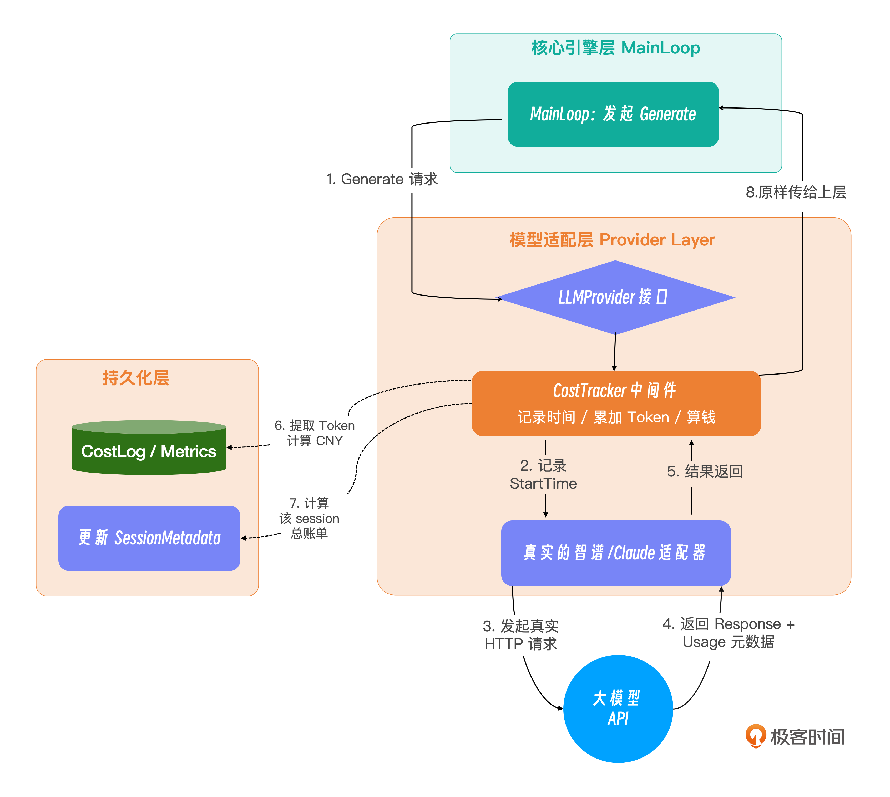
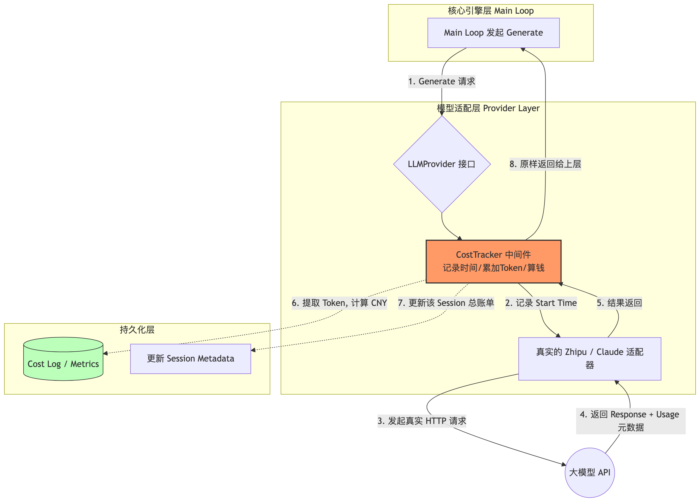

你好，我是 Tony Bai。欢迎来到《从 0 开始构建 Agent Harness》专栏的第十八讲。

在过去的几个模块中，我们如同打造一辆超级跑车般，为 tiny-claw 组装了强大的 V8 引擎（Main Loop）、防抱死刹车（Safety Middleware）、甚至是能自动寻路的”副驾驶”（Subagent）。但是，如果这辆跑车没有”仪表盘（Dashboard）”，你敢把它开上真实的赛道吗？

想象一下，你把 tiny-claw 部署到了公司的生产环境中，团队的 10 个开发人员每天都在飞书里唤醒它去做代码 Review 和 Bug 排查。月底结算时，老板拿着一张高达几万元的 API 账单质问你：

为什么这个月的大模型费用这么高？

到底是哪一个任务、调了哪个工具消耗了最多的 Token？

Agent 每次回复都要等 30 秒，到底是网络慢、还是它在本地执行 pytest 慢、还是大模型推理慢？

如果你无法回答这些问题，你的 Agent 依然只能是一个“玩具”，老板不会批准你将其投入到日常生产，也无法成为企业级的数字资产。

这就是我们今天要讲的核心：可观测性与科学度量（Observability & Evaluation）。今天，我们将正式开启本专栏的第五大模块。我们将通过极简的代码，在 Harness 层（而非业务层）拦截大模型的返回包，精确记录 Token 消耗、金钱成本和执行耗时。

## 算明“经济账”，才能做好驾驭工程

在调用大模型 API 时，成本主要由两部分构成：

Prompt Tokens（输入 Token）：这是大模型阅读系统提示词、对话历史和文件内容的成本。在 tiny-claw 中，由于上下文是在不断累加的，输入 Token 会随着对话轮数呈现出近似 O(n²) 的增长趋势。

Completion Tokens（输出 Token）：这是大模型生成回答、思考过程（Thinking Trace）和工具调用参数（JSON）的成本。通常比输入 Token 贵 3-5 倍。

除了金钱成本，时间成本也是决定 Agent 体验的关键。

一个 Turn 的耗时 = 大模型推理耗时 + 工具在本地的物理执行耗时（如 python build）。

### 为什么必须在 Harness 层拦截？

传统的应用开发者往往会在每次发起 API 请求的前后，手动写几行代码去计算时间和读取返回值。比如：
```python
# 伪代码
start = time.perf_counter()
resp = llm.generate(...)
cost = calculate(resp.usage)
logging.info(f"耗时: {time.perf_counter() - start:.3f}s, 花费: {cost:.6f}")
```

这种写法的致命缺陷在于代码侵入性太强。如果系统里有 10 个地方调用了 generate（比如我们上一讲加的 Subagent），你就得复制 10 次这段代码。

在驾驭工程中，我们追求的是对上层业务的绝对透明。我们必须在模型适配器（Provider Adapter）的极低层进行拦截。我们用一张示意图来展示这种基于“拦截器模式”的无侵入式成本追踪架构：





通过这种装饰器模式（Decorator），Main Loop 根本不知道自己被“监控”了，它依然像以前一样发起调用。而所有的 Token 和耗时数据，都在 Tracker 中被截获并记录。

## 代码实战：构建 Cost Tracker 中间件

接下来，我们将用 Python 语言将这个优雅的架构变现。

### 目录结构回顾与更新

我们将新增 internal/observability 目录用于存放所有的监控指标代码。同时，我们需要修改之前写好的 provider/openai.py 和 provider/claude.py，让它们能将 API 原生的 Usage 字段透传出来。
```
tiny-claw/
├── cmd/
│   └── claw/
│       └── main_cost.py         # 【修改】将 Provider 包装进 Tracker 再注入 Engine
├── internal/
│   ├── engine/                  
│   │   ├── loop.py              # 保持不变 (完全无侵入)
│   │   └── session.py           # 【修改】增加累计 Token 和花费的字段
│   ├── observability/           # 【新增】可观测性模块
│   │   └── tracker.py           # 【新增】成本与耗时追踪装饰器
│   ├── provider/
│   │   ├── interface.py         # 保持不变
│   │   ├── claude.py            # 【修改】解析返回的 Token 数量
│   │   └── openai.py            # 【修改】解析返回的 Token 数量
│   ├── schema/
│   │   └── message.py           # 【修改】Message 数据类增加 Usage 字段
│   └── tools/                   # 保持不变
└── requirements.txt
```

### 第 1 步：扩展基础数据结构

大模型 API 会在返回结果中附带 Token 消耗的元数据（Metadata）。我们需要在 schema 中找个地方接住它们。

打开 internal/schema/message.py：
```python
# internal/schema/message.py
from dataclasses import dataclass
from enum import Enum
from typing import Any, List, Optional


# Role 定义消息的角色，这是与大模型沟通的基石
class Role(str, Enum):
    SYSTEM = "system"       # 系统提示词：确立 Agent 的性格与红线
    USER = "user"           # 用户输入 / 工具执行的返回结果 (Observation)
    ASSISTANT = "assistant" # 模型的输出：包含推理(Reasoning)或工具调用(ToolCall)


@dataclass
class ToolCall:
    """ToolCall 代表模型请求调用某个具体的工具"""
    id: str             # 工具调用的唯一 ID
    name: str           # 想要调用的工具名称 (例如 "bash")
    arguments: Any      # 存放 JSON 参数


@dataclass
class Usage:
    """记录了单次大模型 API 调用的 Token 消耗"""
    prompt_tokens: int      # 输入的 Token 数量
    completion_tokens: int  # 产生的 Token 数量


@dataclass
class Message:
    """Message 代表上下文中传递的单条消息"""
    role: Role
    content: str = ""
    tool_calls: Optional[List[ToolCall]] = None
    tool_call_id: Optional[str] = None
    # 【新增】如果这是大模型 (Assistant) 的回复，此字段存放本次调用的 Token 消耗
    usage: Optional[Usage] = None

# ... 其余定义保持不变 ...
```

接着，我们需要让 Session 能够记住自己“这辈子”一共花了多少钱。

打开 internal/engine/session.py，修改 Session 数据类：
```python
# internal/engine/session.py
from __future__ import annotations

from dataclasses import dataclass, field
from datetime import datetime
from threading import RLock
from typing import List

from ..schema.message import Message, Role


@dataclass
class Session:
    """Session 代表一次持续的人机交互过程，负责维护完整历史。"""

    id: str
    work_dir: str
    created_at: datetime = field(default_factory=datetime.now)
    updated_at: datetime = field(default_factory=datetime.now)
    history: List[Message] = field(default_factory=list)
    _lock: RLock = field(default_factory=RLock, init=False, repr=False)

    # 【新增】用于统计该 Session 累计消耗的资源
    total_prompt_tokens: int = 0
    total_completion_tokens: int = 0
    total_cost_cny: float = 0.0

    def record_usage(self, prompt: int, completion: int, cost: float) -> None:
        """给外部 Tracker 调用的辅助方法，用于累加账单。"""
        with self._lock:
            self.total_prompt_tokens += prompt
            self.total_completion_tokens += completion
            self.total_cost_cny += cost

    # ... 其余方法保持不变 ...
```

### 第 2 步：在 Provider 适配层提取 Token

我们需要修改之前写好的两个大模型适配器，让它们在解析结果时，顺手把 Usage 数据捞出来填进 schema.Message 里。

以 internal/provider/openai.py（兼容 openai 大模型接口的适配器）为例：
```python
# internal/provider/openai.py
from typing import Any, List, Optional

from ..schema.message import Message, Role, ToolCall, ToolDefinition, Usage
from .interface import LLMProvider


class OpenAIProvider(LLMProvider):
    """使用 OpenAI Python SDK 访问智谱兼容接口的 Provider。"""

    def __init__(self, model: str, client: Any = None, ...) -> None:
        self.model = model
        self.client = client or self._build_client(...)

    # ... _build_client 等保持不变 ...

    def generate(
        self,
        messages: List[Message],
        available_tools: Optional[List[ToolDefinition]],
    ) -> Message:
        # ... 前面组装请求的代码完全保持不变 ...

        try:
            response = self.client.chat.completions.create(**params)
        except Exception as exc:
            raise RuntimeError(f"OpenAI/Zhipu API 请求失败: {exc}") from exc

        result_message = self._message_from_openai(
            _get_attr(response, "choices", [])[0].message
        )

        # 【新增】提取 Usage 信息
        usage = _get_attr(response, "usage")
        prompt_tokens = int(_get_attr(usage, "prompt_tokens", 0) or 0)
        completion_tokens = int(_get_attr(usage, "completion_tokens", 0) or 0)
        if prompt_tokens > 0 or completion_tokens > 0:
            result_message.usage = Usage(
                prompt_tokens=prompt_tokens,
                completion_tokens=completion_tokens,
            )

        # ... 后面解析 ToolCalls 的代码完全保持不变 ...

        return result_message
```

注意：针对 claude.py 的修改也是同理，在返回体中提取 `resp.usage.input_tokens` 和 `resp.usage.output_tokens` 即可，详见本讲的完整示例代码仓库。

### 第 3 步：编写优雅的 Cost Tracker 装饰器

这是本讲最核心的代码。我们要新建 internal/observability/tracker.py。

我们将在这个文件里运用经典的装饰器模式。实现一个”假”的 LLMProvider，它内部包裹着”真”的 Provider。
```python
# internal/observability/tracker.py
from __future__ import annotations

import logging
import time
from dataclasses import dataclass
from typing import Dict, List, Optional

from ..engine.session import Session
from ..provider.interface import LLMProvider
from ..schema.message import Message, ToolDefinition


@dataclass(frozen=True)
class Pricing:
    input_price: float
    output_price: float


# PricingModel 定义了不同大模型的计费标准 (单位: 美元/1M Tokens)
# 为了演示，这里硬编码了当前市面上几个主流模型的官方大致定价。
PRICING_MODEL: Dict[str, Pricing] = {
    “xiaomi/mimo-v2.5”: Pricing(input_price=0.15, output_price=0.15),
}


class CostTracker(LLMProvider):
    “””包装真实 LLMProvider 的装饰器中间件，用于统计耗时和账单。”””

    def __init__(
        self,
        next_provider: LLMProvider,
        model_name: str,
        session: Optional[Session] = None,
    ) -> None:
        self.next_provider = next_provider
        self.model_name = model_name
        self.session = session  # 当前所属的会话 (用于累加总成本)

    def generate(
        self,
        messages: List[Message],
        available_tools: Optional[List[ToolDefinition]],
    ) -> Message:
        # 1. 记录请求发起的时刻
        start_time = time.perf_counter()

        # 2. 调用真实的底层大模型去执行耗时的网络请求
        try:
            response_message = self.next_provider.generate(messages, available_tools)
        except Exception:
            # 如果报错了，只打印报错时间，不计费
            latency = time.perf_counter() - start_time
            logging.exception(“[Tracker] API 调用失败，耗时: %.3fs”, latency)
            raise

        # 3. 计算耗时
        latency = time.perf_counter() - start_time

        # 4. 解析 Token 并计算成本
        usage = response_message.usage
        if usage is None:
            logging.warning(
                “[Tracker] API 调用完成，但未返回 Usage 数据 | 耗时: %.3fs”, latency
            )
            return response_message

        prompt_tokens = usage.prompt_tokens
        completion_tokens = usage.completion_tokens
        cost = self._calculate_cost(prompt_tokens, completion_tokens)

        # 5. 打印精美的仪表盘日志
        logging.info(
            “[Tracker] API 调用完成 | 耗时: %.3fs | 输入: %d tk | 输出: %d tk | 花费: %.6f”,
            latency, prompt_tokens, completion_tokens, cost,
        )

        # 6. 将账单累加到当前的 Session 中，供人类后续随时查询
        if self.session is not None:
            self.session.record_usage(prompt_tokens, completion_tokens, cost)
            logging.info(
                “[Tracker] 当前会话 (%s) 累计花费: %.6f”,
                self.session.id, self.session.total_cost_cny,
            )

        return response_message

    def _calculate_cost(self, prompt_tokens: int, completion_tokens: int) -> float:
        “””计算美元花费 = (输入Tokens * 输入单价 + 输出Tokens * 输出单价) / 1000000”””
        pricing = PRICING_MODEL.get(self.model_name)
        if pricing is None:
            return 0.0
        return (
            prompt_tokens * pricing.input_price
            + completion_tokens * pricing.output_price
        ) / 1_000_000.0


def new_cost_tracker(
    next_provider: LLMProvider,
    model_name: str,
    session: Optional[Session] = None,
) -> CostTracker:
    “””构造函数：接收一个现有的 Provider，返回一个被监控的 Provider。”””
    return CostTracker(
        next_provider=next_provider,
        model_name=model_name,
        session=session,
    )


NewCostTracker = new_cost_tracker
```

这段代码写得很具工程美感。CostTracker 本身继承了 LLMProvider 抽象基类并实现了 generate 方法，这使得它对于调用方（AgentEngine）来说，完全是透明的。

你可以把它想象成一个安检门：数据必须先经过它，它在数据上盖了个“时间戳”，然后再原封不动地还给你。

### 第 4 步：在 Main 函数中像组装乐高一样串联它们

最后，我们回到 cmd/claw/main_cost.py。我们将把这个拦截器”套”在真实的 Provider 外面。
```python
# cmd/claw/main_cost.py
import logging

from common import (
    build_engine_with_provider_for_work_dir,
    configure_logging,
    new_bash_tool,
    require_env_vars,
    resolve_work_dir,
)
from internal.engine.session import GlobalSessionMgr
from internal.engine.terminal_reporter import new_terminal_reporter
from internal.observability.tracker import new_cost_tracker
from internal.provider.openai import new_zhipu_openai_provider


def main() -> None:
    configure_logging()
    require_env_vars((“ZHIPU_API_KEY”,))

    work_dir = resolve_work_dir()
    model_name = “xiaomi/mimo-v2.5”

    # 1. 初始化真实的底层大脑
    real_provider = new_zhipu_openai_provider(model_name)

    session_id = “test_observability_001”
    session = GlobalSessionMgr.get_or_create(session_id, work_dir)

    # 2. 核心拼装：用 Tracker 将真实的大脑包裹起来
    tracked_provider = new_cost_tracker(real_provider, model_name, session)

    # 3. 将被包裹的 Provider 注入给 Engine (Engine 毫不知情)
    engine = build_engine_with_provider_for_work_dir(
        provider=tracked_provider,
        work_dir=work_dir,
        tool_factories=[new_bash_tool],
        enable_thinking=False,
        plan_mode=False,
    )
    reporter = new_terminal_reporter()

    prompt = “请用 bash 帮我用 date 命令查一下现在的时间。”

    logging.info(“\n>>> 启动带仪表盘的可观测性测试...”)
    err = engine.run(prompt, session=session, reporter=reporter)
    if err is not None:
        logging.error(“引擎运行崩溃: %s”, err)
        raise SystemExit(1)

    logging.info(“\n================ 财务报表 ================”)
    logging.info(“会话 ID: %s”, session.id)
    logging.info(“总消耗 Input Tokens: %d”, session.total_prompt_tokens)
    logging.info(“总消耗 Output Tokens: %d”, session.total_completion_tokens)
    logging.info(“总计费用 (CNY): ¥%.6f”, session.total_cost_cny)
    logging.info(“==========================================”)


if __name__ == “__main__”:
    main()
```

## 运行与实战测试：看着钱在燃烧

执行命令：
```bash
python cmd/claw/main_cost.py
```

紧盯终端的输出，你将感受到一种作为一个“项目经理”而非底层码农的快感。大模型在每一次呼吸时的耗时和金钱，都被你记录得明明白白：
```
$ python cmd/claw/main_cost.py
2026/05/01 12:30:51 [INFO] 成功挂载工具: bash
2026/05/01 12:30:51 [INFO]
>>> 启动带仪表盘的可观测性测试...
2026/05/01 12:30:51 [INFO] [Engine] 唤醒会话 [test_observability_001]，锁定工作区: tiny-claw/workspace (PlanMode: false)
2026/05/01 12:30:53 [INFO] [Tracker] API 调用完成 | 耗时: 1.895s | 输入: 396 tk | 输出: 43 tk | 花费: 0.000066
2026/05/01 12:30:53 [INFO] [Tracker] 当前会话 (test_observability_001) 累计花费: 0.000066

🤖 Agent 回复:


[🛠️ 调用工具] bash
   参数: {"command":"date"}
[✅ 执行成功] bash
2026/05/01 12:30:55 [INFO] [Tracker] API 调用完成 | 耗时: 1.385s | 输入: 433 tk | 输出: 76 tk | 花费: 0.000076
2026/05/01 12:30:55 [INFO] [Tracker] 当前会话 (test_observability_001) 累计花费: 0.000142

🤖 Agent 回复:

当前时间是：**2026年5月1日 12:30:53 CST**

2026/05/01 12:30:55 [INFO]
================ 财务报表 ================
2026/05/01 12:30:55 [INFO] 会话 ID: test_observability_001
2026/05/01 12:30:55 [INFO] 总消耗 Input Tokens: 829
2026/05/01 12:30:55 [INFO] 总消耗 Output Tokens: 119
2026/05/01 12:30:55 [INFO] 总计费用 (CNY): ¥0.000142
2026/05/01 12:30:55 [INFO] ==========================================
```

在上面的日志中，随着对话轮数的增加（Turn 2 比 Turn 1 多携带了刚才执行 bash 的上下文日志），你可以清晰地看到输入 Token 从 396 增长到了 433。而大模型真正的推理耗时稳定在 2 秒以内。

试想一下，如果没有这套机制，当你在生产环境运行一个包含几十次 read_file 调用的长程任务，最终花费了 10 多元人民币时，你根本不知道这钱是在哪一个 Turn 里被消耗掉的。

现在，你对 Agent 的每一个微小动作，都有了“上帝视角”的掌控。

## 本讲小结

今天，我们通过一个极简的拦截器，为 tiny-claw 铺设了通往工业级应用的第一条监控管线：可观测性。

算明经济账是落地的关键：在驾驭工程中，衡量一个 Agent 是否优秀，除了看它能不能把代码跑通，更要看它的 Token 效率。如果不把成本监控落到代码实处，就无法优化 System Prompt 的长度，也无从判断上下文压缩是否真的起到了省钱的作用。

装饰器模式的优雅应用：为了保持核心引擎（Main Loop）的纯粹性，我们没有在里面混入任何一行记录时间或计费的代码。我们通过实现一个包装了真实 LLMProvider 的 CostTracker，实现了功能的无缝外挂（运用了类似 AOP 面向切面编程的思想）。

长期价值的沉淀：通过将会话总账单挂载到 Session 对象上，如果结合我们在上一讲学到的“持久化外部记忆”，你完全可以在每天下班时，让飞书机器人给你发一份《今日大模型运维账单财报》。

有了这块仪表盘，我们对大模型的性能瓶颈就有了清晰的认知。但是，这仅仅监控了“果”，我们依然不知道“因”。

如果大模型在一个长程任务里跑崩了（比如写了一段完全逻辑不通的代码），虽然我们现在知道了它在哪一秒花了多少钱，但我们却无法追溯它当时脑子里到底在想什么？它看了哪些文件才做出了这个极其愚蠢的决定？

在下一讲中，我们将探索可观测性体系的最深处：洞察黑盒（Tracing）。 我们将引入一套类似于云原生微服务链路追踪的机制，让你能像回放比赛录像一样，逐帧复盘 Agent 失败时的全量决策路径。

注：本讲的示例代码，可以在这里下载。

## 思考题

在我们今天的 CostTracker 中，我们记录的仅仅是向大模型发起 HTTP 请求的那部分耗时（generate 方法的执行时间）。但你在第 8 讲中学过，我们的 tiny-claw 是支持在本地利用线程池（ThreadPoolExecutor）并发执行多个物理工具（如 bash 命令或 read_file）的。

如果一个 bash 命令执行了一个需要编译 5 分钟的大型项目，这 5 分钟的物理世界耗时，目前的 CostTracker 是捕获不到的。结合我们本讲中使用的”装饰器拦截（Decorator/Middleware）”模式，如果让你在不修改 internal/tools/bash.py 源码的前提下，编写一个能记录”工具在本地物理执行真正耗费了多少毫秒”的拦截器，并且把它挂载到 Engine 中，你会怎么写这段代码？

提示：回忆一下我们在第 16 讲学过的，在 Registry 中使用 Use 挂载 MiddlewareFunc 的逻辑。

欢迎在留言区分享你的监控探头设计。我们下一讲，开启链路追踪！
