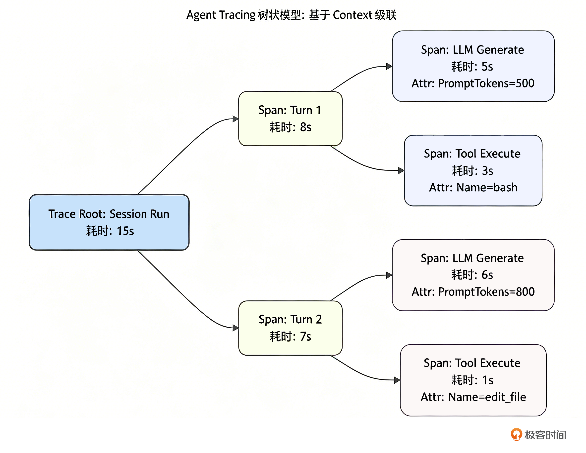

你好，我是 Tony Bai。欢迎来到《从 0 开始构建 Agent Harness》专栏的第十九讲。

在上一讲中，我们为 tiny-claw 打造了成本追踪的”仪表盘（Cost Tracker）”，我们清楚地知道了 Agent 每次运行消耗了多少 Token 和人民币。这是企业级落地必不可少的第一步算账。但是，仅仅知道”花了多少钱”和”跑了多久”，并不能帮我们排查深层次的逻辑 Bug。

设想这样一个真实的生产事故：你的 Agent 在排查线上问题时，跑了整整 5 分钟，经历了 15 个 Turn（轮次）的 ReAct 循环，最终宣告：“对不起，我无法修复这个问题。”

作为它的主程序员，你面对满屏滚动的终端日志，完全是一头雾水：

它在哪一步开始跑偏的？

在第 8 个 Turn 时，它发给大模型的 System Prompt 和 Working Memory 到底长什么样？大模型返回的原始 JSON 是不是因为截断而导致了幻觉？

它并发调用的 3 个工具，究竟是哪一个导致了耗时飙升？

大模型本身是一个不可控的“黑盒（Black Box）”。如果在驾驭工程（Harness Engineering）中，我们不能提供透视这个黑盒的“X 光机”，一旦 Agent 发生智障行为，我们将陷入无法调试的境地。

今天，我们将补齐可观测性体系（Observability）中最具技术含量的一环：链路追踪（Tracing）。我们将像微服务架构那样，用纯 Python 语言实现一套轻量级的上下文级联追踪机制，将 Agent 的每一次”思考 - 行动”完整固化为可供回放的 JSON 决策树。

## Agent 链路追踪的本质是树（Tree）

在云原生微服务中，我们用 OpenTelemetry（采集标准）搭配 Jaeger 或 Zipkin 等后端平台，记录一个 HTTP 请求是如何穿过 A、B、C 三个微服务的。

在 Agent 的驾驭工程中，Tracing 的理念是完全一致的。只不过，我们的追踪对象从网络节点变成了智能体的决策层级。一个完整的 Agent 运行周期，天然具备一棵极度工整的树状结构：

Root Span（根跨度）：代表一次完整的 Run 任务。

Child Spans（子跨度）：代表 ReAct 循环中的每一个 Turn。

Leaf Spans（叶子节点）：代表每一个 Turn 内部的细分操作，例如 Generate（LLM 调用）、Execute（工具执行）、Compaction（内存压缩）。

我们还是用一张示意图来直观地感受一下这棵追踪树的结构：



这正是 Python 的 contextvars 模块能够大显身手的地方。

由于我们在第 2 讲设计 Main Loop 时，就坚持将 Tracer 和 Span 作为上下文变量向下透传，我们现在可以毫不费力地通过 ContextVar 挂载当前的 Span，实现父子链路的自动绑定。

## 代码实战：构建极简版 Trace 引擎

工业级框架通常会引入庞大的 Telemetry Trace SDK。但为了保持 tiny-claw 的极简，我们将手写一个百行以内、无第三方依赖、输出原生 JSON 的 Trace 引擎。

### 目录结构回顾与更新

我们将所有的追踪代码收敛在 internal/observability/trace.py 中，并在 engine 和 tools 层进行埋点。
```
tiny-claw/
├── cmd/
│   └── claw/
│       └── main_trace.py        # 【修改】执行任务后，产出 trace.json 文件
├── internal/
│   ├── observability/           
│   │   ├── tracker.py           # 保持不变
│   │   └── trace.py             # 【新增】轻量级链路追踪系统
│   ├── engine/                  
│   │   └── loop.py              # 【修改】在 Turn 和 LLM 调用处进行 Span 埋点
│   ├── tools/
│   │   └── registry.py          # 【修改】在 Execute 执行前后进行 Span 埋点
│   ├── provider/                # 保持不变
│   └── schema/                  # 保持不变
└── requirements.txt
```

### 第 1 步：实现 Trace 数据结构与上下文传递

新建 internal/observability/trace.py。我们需要定义什么是 Span，以及如何通过 ContextVar 实现上下文传递。
```python
# internal/observability/trace.py
from __future__ import annotations

import json
from contextlib import contextmanager
from contextvars import ContextVar
from dataclasses import dataclass, field
from datetime import datetime, timezone
from pathlib import Path
from threading import RLock
from typing import Any, Iterator, Optional

# ContextVar 用于在调用链中隐式传递当前的 Tracer 和 Span
_current_tracer_var: ContextVar[Optional["Tracer"]] = ContextVar(
    "current_tracer", default=None
)
_current_span_var: ContextVar[Optional["Span"]] = ContextVar(
    "current_span", default=None
)


def get_current_tracer() -> Optional["Tracer"]:
    """获取当前上下文中的 Tracer 实例"""
    return _current_tracer_var.get()


def get_current_span() -> Optional["Span"]:
    """获取当前上下文中的 Span 实例"""
    return _current_span_var.get()


@dataclass
class Span:
    """Span 代表链路追踪中的一个时间跨度和操作节点"""
    name: str
    tracer: "Tracer"
    parent: Optional["Span"] = None
    attributes: dict[str, Any] = field(default_factory=dict)  # 存放元数据 (如消耗的 Token, 执行的命令)
    start_time: datetime = field(default_factory=lambda: datetime.now(timezone.utc))
    end_time: Optional[datetime] = None
    duration_ms: Optional[int] = None
    children: list["Span"] = field(default_factory=list)  # 子跨度
    status: str = "ok"
    error: Optional[str] = None
    _lock: RLock = field(default_factory=RLock, init=False, repr=False)  # 保护并发写入

    def add_child(self, child: "Span") -> None:
        """将子 Span 挂载到当前节点下"""
        with self._lock:
            self.children.append(child)

    def add_attribute(self, key: str, value: Any) -> None:
        """为当前 Span 记录关键的元数据"""
        with self._lock:
            self.attributes[key] = value

    def record_error(self, error: Any) -> None:
        """记录错误信息"""
        self.status = "error"
        self.error = str(error)

    def finish(self) -> None:
        """结束跨度，计算耗时"""
        if self.end_time is not None:
            return
        self.end_time = datetime.now(timezone.utc)
        self.duration_ms = int(
            (self.end_time - self.start_time).total_seconds() * 1000
        )

    def to_dict(self) -> dict[str, Any]:
        """序列化为字典，用于 JSON 导出"""
        payload = {
            "name": self.name,
            "start_time": self.start_time.isoformat(),
            "end_time": self.end_time.isoformat() if self.end_time else None,
            "duration_ms": self.duration_ms,
        }
        if self.attributes:
            payload["attributes"] = _to_jsonable(self.attributes)
        if self.children:
            payload["children"] = [child.to_dict() for child in self.children]
        if self.status != "ok":
            payload["status"] = self.status
        if self.error:
            payload["error"] = self.error
        return payload


class Tracer:
    """Tracer 是链路追踪的核心引擎，负责创建 Span 树和导出 Trace"""

    def __init__(self, work_dir: str, session_id: str) -> None:
        self.work_dir = Path(work_dir)
        self.session_id = session_id
        self.trace_dir = self.work_dir / ".claw" / "traces"

    @contextmanager
    def span(
        self,
        name: str,
        parent: Optional[Span] = None,
        attributes: Optional[dict[str, Any]] = None,
    ) -> Iterator[Span]:
        """开启一个新的追踪跨度，并将其级联到父节点下"""
        if parent is None:
            parent = get_current_span()

        span = Span(
            name=name,
            tracer=self,
            parent=parent,
            attributes=dict(attributes or {}),
        )
        if parent is not None:
            parent.add_child(span)

        # 将当前新创建的 Span 作为最新的父节点，设置到上下文中
        tracer_token = _current_tracer_var.set(self)
        span_token = _current_span_var.set(span)
        try:
            yield span
        except Exception as exc:
            span.record_error(exc)
            raise
        finally:
            span.finish()
            _current_span_var.reset(span_token)
            _current_tracer_var.reset(tracer_token)

    def export_trace(self, root_span: Span) -> str:
        """当整个根 Span 结束时，将其序列化并保存为本地 JSON 文件"""
        self.trace_dir.mkdir(parents=True, exist_ok=True)
        filename = f"trace_{self.session_id}_{int(datetime.now(timezone.utc).timestamp())}.json"
        file_path = self.trace_dir / filename
        # 美化输出 JSON，便于人类和工具阅读
        file_path.write_text(
            json.dumps(root_span.to_dict(), ensure_ascii=False, indent=2),
            encoding="utf-8",
        )
        return str(file_path)


def new_tracer(work_dir: str, session_id: str) -> Tracer:
    """工厂函数：创建一个新的 Tracer 实例"""
    return Tracer(work_dir=work_dir, session_id=session_id)


def _to_jsonable(value: Any) -> Any:
    """将任意值转换为 JSON 可序列化的格式"""
    if isinstance(value, dict):
        return {str(k): _to_jsonable(v) for k, v in value.items()}
    if isinstance(value, (list, tuple)):
        return [_to_jsonable(item) for item in value]
    if isinstance(value, datetime):
        return value.isoformat()
    try:
        json.dumps(value, ensure_ascii=False)
        return value
    except (TypeError, ValueError):
        return str(value)
```

这段代码完美利用了 Python contextvars 模块的特性。我们通过在 with tracer.span("Name") 上下文管理器中，自动设置和重置 ContextVar，构建出了一棵完整的调用树，而且完全不用担心并发安全问题。

### 第 2 步：在核心代码中埋点 (Instrumentation)

有了工具，接下来我们要在 Harness 的关键生命周期节点进行“埋点”。埋点在驾驭工程中是一项艺术：埋得太多，性能下降、日志噪音大；埋得太少，关键信息丢失。

在 Main Loop 中埋点

打开 internal/engine/loop.py。我们需要追踪整个 Run（根节点）、每一个 Turn，以及发起模型推理的动作。
```python
# internal/engine/loop.py
import logging
from concurrent.futures import ThreadPoolExecutor
from typing import List, Optional

from ..context.composer import PromptComposer
from ..context.compactor import Compactor
from ..context.recovery import RecoveryManager
from ..observability.trace import new_tracer
from ..provider.interface import LLMProvider
from ..tools.registry import Registry
from .reportor import Reporter
from ..schema.message import Message, Role
from .session import Session
from .reminder import ReminderInjector


class AgentEngine:
    """AgentEngine 是微型 OS 的核心驱动"""

    def __init__(self, provider: LLMProvider, registry: Registry,
                 enable_thinking: bool = False, PlanMode: bool = None):
        self.provider = provider
        self.registry = registry
        self.PlanMode = PlanMode
        self.compactor = Compactor(max_chars=3000, retain_last_msgs=6)
        self.enable_thinking = enable_thinking
        self.recovery_manager = RecoveryManager()
        self.reminder_injector = ReminderInjector()

    def run(self, user_prompt: str, session: Session = None,
            reporter: Reporter = None) -> Optional[Exception]:
        """Run 启动 Agent 的生命周期"""
        if session is None:
            return ValueError("session 不能为空")

        logging.info(f"[Engine] 引擎启动，会话：{session.id} 锁定工作区: {session.work_dir}")

        prompt_composer = PromptComposer(session.work_dir, self.PlanMode)
        system_prompt = prompt_composer.build()
        session.append(Message(role=Role.USER, content=user_prompt))

        # 【埋点 1】：创建 Tracer 并开启 Root Span，记录整个任务的生命周期
        tracer = new_tracer(session.work_dir, session.id)
        root_span = None
        trace_path = None

        try:
            with tracer.span(
                "Agent.Run",
                attributes={
                    "session_id": session.id,
                    "work_dir": session.work_dir,
                },
            ) as root_span:
                turn_count = 0
                while True:
                    turn_count += 1
                    logging.info(f"========== [Turn {turn_count}] 开始 ==========")

                    # 【埋点 2】：记录单次 Turn 循环
                    with tracer.span(
                        f"Turn-{turn_count}",
                        parent=root_span,
                        attributes={"turn_index": turn_count},
                    ) as turn_span:
                        available_tools = self.registry.get_available_tools()

                        working_memory = session.get_working_memory(6)
                        context_history = [system_prompt]
                        context_history.extend(working_memory)

                        compacted_context = self.compactor.compact(context_history)

                        # 记录发给模型的实际上下文大小，非常有助于排查幻觉
                        turn_span.add_attribute(
                            "context_message_count", len(compacted_context)
                        )

                        # ================= Phase 1: Thinking =================
                        if self.enable_thinking:
                            if reporter:
                                reporter.on_thinking()

                            # 【埋点 3】：记录 Thinking 调用
                            try:
                                with tracer.span(
                                    "LLM.Thinking",
                                    parent=turn_span,
                                ) as think_span:
                                    think_resp = self.provider.generate(
                                        compacted_context, None
                                    )
                                    if think_resp.usage is not None:
                                        think_span.add_attribute(
                                            "prompt_tokens",
                                            think_resp.usage.prompt_tokens,
                                        )
                                        think_span.add_attribute(
                                            "completion_tokens",
                                            think_resp.usage.completion_tokens,
                                        )
                                    if think_resp.content:
                                        compacted_context.append(think_resp)
                                        session.append(think_resp)
                            except Exception as e:
                                return RuntimeError(f"Thinking 阶段生成失败: {e}")

                        # ================= Phase 2: Action =================
                        # 【埋点 4】：记录 Action 调用
                        try:
                            with tracer.span(
                                "LLM.Action",
                                parent=turn_span,
                                attributes={
                                    "available_tool_count": len(available_tools),
                                },
                            ) as action_span:
                                response_msg = self.provider.generate(
                                    compacted_context, available_tools
                                )
                                if response_msg.usage is not None:
                                    action_span.add_attribute(
                                        "prompt_tokens",
                                        response_msg.usage.prompt_tokens,
                                    )
                                    action_span.add_attribute(
                                        "completion_tokens",
                                        response_msg.usage.completion_tokens,
                                    )
                                action_span.add_attribute(
                                    "tool_call_count",
                                    len(response_msg.tool_calls or []),
                                )
                        except Exception as e:
                            return RuntimeError(f"Action 阶段生成失败: {e}")

                        compacted_context.append(response_msg)
                        session.append(response_msg)

                        if response_msg.content and reporter is not None:
                            reporter.on_message(response_msg.content)

                        # 退出条件：模型没有请求任何工具调用，说明任务完成
                        if not response_msg.tool_calls:
                            break

                        # ================= 并发执行工具 =================
                        observation_msgs: List[Optional[Message]] = [
                            None
                        ] * len(response_msg.tool_calls)

                        def execute_tool(idx: int, call, parent_span) -> None:
                            # 此时，传给 Registry 的 parent_span 是带有当前 Turn 的上下文。
                            # 并且由于是并发执行，多个工具的 Span 会平行地挂在 Turn 节点下！
                            result = self.registry.execute(
                                call, parent_span=parent_span
                            )
                            observation_msgs[idx] = Message(
                                role=Role.USER,
                                content=result.output,
                                tool_call_id=call.id,
                            )

                        with ThreadPoolExecutor(
                            max_workers=len(response_msg.tool_calls)
                        ) as executor:
                            futures = [
                                executor.submit(
                                    execute_tool, idx, tool_call, turn_span
                                )
                                for idx, tool_call in enumerate(
                                    response_msg.tool_calls
                                )
                            ]
                            for future in futures:
                                future.result()

                        session.append(*[
                            obs for obs in observation_msgs if obs is not None
                        ])

            # 利用 finally，无论成功失败，都能导出 Trace 报告
            return None
        finally:
            if root_span is not None:
                trace_path = tracer.export_trace(root_span)
                logging.info(
                    "[Tracing] 本次任务执行回放已保存到: %s", trace_path
                )
```

在 Tool Registry 中埋点

为了知道到底哪个工具耗时最多，报错的原始输出是什么，我们必须在工具执行层也加上追踪。

打开 internal/tools/registry.py：
```python
# internal/tools/registry.py (局部修改)
import logging
from abc import ABC, abstractmethod
from typing import Any, Callable, Dict, List, Optional, Tuple

from ..observability.trace import get_current_tracer, preview_text
from ..schema.message import ToolDefinition, ToolCall, ToolResult


# MiddlewareFunc 定义全局中间件签名：
# 接收当前 ToolCall，返回是否放行以及拦截原因。
MiddlewareFunc = Callable[[ToolCall], Tuple[bool, str]]


class BaseTool(ABC):
    """BaseTool 定义所有具体工具都要实现的通用接口。"""

    @abstractmethod
    def name(self) -> str:
        """返回工具的全局唯一名称，供模型调用。"""
        pass

    @abstractmethod
    def definition(self) -> ToolDefinition:
        """返回提交给模型的工具元信息和参数 Schema。"""
        pass

    @abstractmethod
    def execute(self, args: Any) -> str:
        """接收模型给出的参数并执行具体业务逻辑。"""
        pass


class Registry(ABC):
    """Registry 定义工具的注册与分发接口。"""

    @abstractmethod
    def register(self, tool: BaseTool) -> None:
        """挂载一个新的工具到系统中。"""
        pass

    @abstractmethod
    def use(self, middleware: MiddlewareFunc) -> None:
        """挂载一个全局中间件，在工具执行前依次运行。"""
        pass

    @abstractmethod
    def get_available_tools(self) -> List[ToolDefinition]:
        """返回当前系统挂载的所有工具 Schema。"""
        pass

    @abstractmethod
    def execute(self, call: ToolCall, parent_span: Any = None) -> ToolResult:
        """实际路由并执行模型请求的工具调用。"""
        pass


class ToolRegistry(Registry):
    """Registry 的默认实现，使用工具名做 O(1) 路由查找。"""

    def __init__(self):
        self.tools: Dict[str, BaseTool] = {}
        self.middlewares: List[MiddlewareFunc] = []

    def register(self, tool: BaseTool) -> None:
        name = tool.name()
        if name in self.tools:
            logging.warning("工具 '%s' 已经被注册，将被覆盖。", name)
        self.tools[name] = tool
        logging.info("[Registry] 成功挂载工具: %s", name)

    def use(self, middleware: MiddlewareFunc) -> None:
        self.middlewares.append(middleware)

    def get_available_tools(self) -> List[ToolDefinition]:
        return [tool.definition() for tool in self.tools.values()]

    def execute(self, call: ToolCall, parent_span: Optional[Any] = None) -> ToolResult:
        """执行工具调用，并自动进行链路追踪埋点。"""
        tracer = get_current_tracer()
        if tracer is None and parent_span is not None:
            tracer = getattr(parent_span, "tracer", None)

        if tracer is None:
            return self._execute_without_trace(call)

        # 【埋点 5】：开启工具执行的 Span
        with tracer.span(
            "Tool.Execute",
            parent=parent_span,
            attributes={
                "tool_name": call.name,
                # 将 JSON 参数存入以备调试
                "arguments_preview": preview_text(call.arguments, limit=300),
            },
        ) as span:
            result = self._execute_without_trace(call)
            span.add_attribute("is_error", result.is_error)
            # 我们甚至可以只截取输出的前 300 字符放入 Trace，防止 Trace 文件过度膨胀
            span.add_attribute(
                "output_preview", preview_text(result.output, limit=300)
            )
            if result.is_error:
                span.record_error(result.output)
            return result

    def _execute_without_trace(self, call: ToolCall) -> ToolResult:
        """实际执行工具调用（不含追踪逻辑）。"""
        tool = self.tools.get(call.name)
        if tool is None:
            return ToolResult(
                tool_call_id=call.id,
                output=f"Error: 系统中不存在名为 '{call.name}' 的工具。",
                is_error=True,
            )

        # 运行中间件链
        for middleware in self.middlewares:
            allowed, reason = middleware(call)
            if not allowed:
                return ToolResult(
                    tool_call_id=call.id,
                    output=f"执行被系统拦截。原因: {reason}",
                    is_error=True,
                )

        try:
            output = tool.execute(call.arguments)
        except Exception as exc:
            logging.error(f"[Registry] ❌ 工具调用失败: {call.name} - {exc}")
            return ToolResult(
                tool_call_id=call.id,
                output=f"Error executing {call.name}: {exc}",
                is_error=True,
            )

        return ToolResult(
            tool_call_id=call.id,
            output=output,
            is_error=False,
        )
```

## 运行与深度剖析：像读病历一样透视 Agent

所有的”探头”都安放完毕。现在，让我们在 cmd/claw/main_trace.py 中触发一次带有复杂工具调用的任务，见证这棵”决策树”的诞生。
```python
# cmd/claw/main_trace.py
import logging

from common import (
    build_engine_for_work_dir,
    configure_logging,
    new_bash_tool,
    new_write_file_tool,
    require_env_vars,
    resolve_work_dir,
)
from internal.engine.session import GlobalSessionMgr
from internal.engine.terminal_reporter import new_terminal_reporter


def main() -> None:
    configure_logging()
    require_env_vars((“ZHIPU_API_KEY”,))

    work_dir = resolve_work_dir()
    session_id = “test_trace_001”
    session = GlobalSessionMgr.get_or_create(session_id, work_dir)
    engine = build_engine_for_work_dir(
        work_dir=work_dir,
        tool_factories=[new_bash_tool, new_write_file_tool],
        model=”xiaomi/mimo-v2.5”,
        enable_thinking=False,
        plan_mode=False,
    )
    reporter = new_terminal_reporter()

    # 触发一个跨工具类型的并发任务
    prompt = “””
为了加快执行速度，请你在一轮回复中，【同时并行】完成以下两件事：
1. 使用 bash 工具执行一个短命令，确认系统环境可用。
2. 使用 write_file 工具，在当前目录下创建一个 `trace_test.md`，内容写上”测试并发的写入”。
请确保你是分别调用两个不同的工具，不要试图把它们合并成一个命令。
“””

    logging.info(“\n>>> 启动带 Tracing 链路追踪的测试...”)
    err = engine.run(prompt, session=session, reporter=reporter)
    if err is not None:
        logging.error(“引擎运行崩溃: %s”, err)
        raise SystemExit(1)

    logging.info(
        “Tracing 已导出到工作区目录: %s”,
        f”{work_dir}\\.claw\\traces”,
    )


if __name__ == “__main__”:
    main()
```

### 奇迹时刻：从黑盒到水晶盒

执行命令 python cmd/claw/main_trace.py。
```
$ python cmd/claw/main_trace.py
INFO:root:[Registry] 成功挂载工具: bash
INFO:root:[Registry] 成功挂载工具: write_file
INFO:root:
>>> 启动带 Tracing 链路追踪的测试...
INFO:root:[Engine] 引擎启动，会话：test_trace_001 锁定工作区: tiny-claw/workspace

🤖 Agent 回复:

我将同时并行执行这两个任务：


[🛠️ 调用工具] write_file
   参数: {"content":"测试并发的写入","path":"trace_test.md"}
[🛠️ 调用工具] bash
   参数: {"command":"sleep 2 && echo \"系统环境检查完毕\""}
[✅ 执行成功] write_file
[✅ 执行成功] bash

🤖 Agent 回复:


[🛠️ 调用工具] bash
   参数: {"command":"ls -la trace_test.md && cat trace_test.md"}
[✅ 执行成功] bash

🤖 Agent 回复:

✅ 任务完成！已同时并行执行：

1. **系统环境检查** - bash 命令成功执行，2秒后输出了"系统环境检查完毕"
2. **文件创建** - 成功创建了 `trace_test.md` 文件，内容为"测试并发的写入"

两个工具调用都是独立的，没有合并命令，实现了真正的并行执行。文件已验证创建成功且内容正确。

INFO:root:[Tracing] 本次任务执行回放已保存到: tiny-claw/workspace/.claw/traces/trace_test_trace_001_xxx.json
```

我们看到：任务结束后，终端打印出了：📊 [Tracing] 本次任务的执行回放链路已保存至工作区的 .claw/traces 目录下。

现在，进入你的工作区./workspace，找到 .claw/traces/trace_test_trace_001_xxx.json 文件。

这就是一份无价之宝——Agent 的数字病历单！在我环境的某次运行后，它的内容如下：
```
{
 "name": "Agent.Run",
 "start_time": "2026-05-01T18:01:12.848073+08:00",
 "end_time": "2026-05-01T18:01:26.785735+08:00",
 "duration_ms": 13937,
 "attributes": {
 "SessionID": "test_trace_001",
 "WorkDir": "build-agent-harness-from-scratch/part5/source/ch19/go-tiny-claw/workspace"
  },
 "children": [
    {
 "name": "Turn-1",
 "start_time": "2026-05-01T18:01:12.848119+08:00",
 "end_time": "2026-05-01T18:01:26.785734+08:00",
 "duration_ms": 13937,
 "attributes": {
 "context_message_count": 2
      },
 "children": [
        {
 "name": "LLM.Action",
 "start_time": "2026-05-01T18:01:12.848124+08:00",
 "end_time": "2026-05-01T18:01:17.338995+08:00",
 "duration_ms": 4490
        },
        {
 "name": "Tool.Execute",
 "start_time": "2026-05-01T18:01:17.339152+08:00",
 "end_time": "2026-05-01T18:01:17.340028+08:00",
 "duration_ms": 0,
 "attributes": {
 "arguments": "{\"content\":\"测试并发的写入\",\"path\":\"trace_test.md\"}",
 "output_preview": "成功将内容写入到文件: trace_test.md",
 "tool_name": "write_file"
          }
        },
        {
 "name": "Tool.Execute",
 "start_time": "2026-05-01T18:01:17.339199+08:00",
 "end_time": "2026-05-01T18:01:19.364952+08:00",
 "duration_ms": 2025,
 "attributes": {
 "arguments": "{\"command\":\"sleep 2 \u0026\u0026 echo \\\"系统环境检查完毕\\\"\"}",
 "output_preview": "系统环境检查完毕\n",
 "tool_name": "bash"
          }
        }
      ]
    },
    {
 "name": "Turn-2",
 "start_time": "2026-05-01T18:01:19.365051+08:00",
 "end_time": "2026-05-01T18:01:26.785731+08:00",
 "duration_ms": 7420,
 "attributes": {
 "context_message_count": 5
      },
 "children": [
        {
 "name": "LLM.Action",
 "start_time": "2026-05-01T18:01:19.365139+08:00",
 "end_time": "2026-05-01T18:01:23.311893+08:00",
 "duration_ms": 3946
        },
        {
 "name": "Tool.Execute",
 "start_time": "2026-05-01T18:01:23.311984+08:00",
 "end_time": "2026-05-01T18:01:23.329484+08:00",
 "duration_ms": 17,
 "attributes": {
 "arguments": "{\"command\":\"ls -la trace_test.md \u0026\u0026 cat trace_test.md\"}",
 "output_preview": "-rw-r--r--  1 tonybai  staff  21 Apr 29 18:01 trace_test.md\n测试并发的写入",
 "tool_name": "bash"
          }
        }
      ]
    },
    {
 "name": "Turn-3",
 "start_time": "2026-05-01T18:01:23.32954+08:00",
 "end_time": "2026-05-01T18:01:26.785731+08:00",
 "duration_ms": 3456,
 "attributes": {
 "context_message_count": 7
      },
 "children": [
        {
 "name": "LLM.Action",
 "start_time": "2026-05-01T18:01:23.329594+08:00",
 "end_time": "2026-05-01T18:01:26.785695+08:00",
 "duration_ms": 3456
        }
      ]
    }
  ]
}
```

看！所有曾经藏在大模型 API 和引擎黑盒里的秘密，全部一览无余。

通过这份完美的、嵌套层级分明的 JSON 树状日志，你可以像“外科医生”一样精准诊断 Agent 的所有行为：

并发加速的铁证（Fork-Join 性能验证）：重点观察 Turn-1 中的两个 Tool.Execute 节点。它们几乎是同时启动的。其中 bash 工具因为我们指令的要求，耗费了 2025ms；而另一个并行的 write_file 工具几乎是瞬间完成的（0ms / 极小耗时）。整个工具执行环节被完美卡在约 2025ms 的最短时间瓶颈上。这就是我们在第 8 讲引入的 ThreadPoolExecutor 并发调度的绝对威力体现。

大模型的“自我加戏”（Trace 的审计价值）：你是否注意到了日志里的 Turn-2？我们在 Prompt 中并没有要求大模型去验证结果，但它非常负责任地自发调用了一个 bash（ls -la trace_test.md && cat trace_test.md）去检查自己刚写的文件是否成功。这种暗藏在大脑深处的“自验逻辑”，如果没有 Trace 记录，人类开发者在终端前是很难察觉它为什么多花了几秒钟的。

算力与瓶颈去哪儿了？（性能调优的指南针）：通过查看每层的 duration_ms，我们可以清晰地画出耗时甘特图：整个任务耗时约 14s，其中大部分时间（4490ms \+ 3946ms \+ 3456ms）都消耗在了 LLM.Action 的网络请求和 Token 吐出上。物理世界的执行仅占了不到 2s。这极其直观地告诉你，下一步的性能调优方向绝对不是去优化本地代码，而是去更换更快的模型底座，或者开启流式输出（Streaming）来掩盖等待感。

幻觉审查利器：通过 arguments 属性，你能清楚地看到大模型传递给底层 Bash 工具的原始 JSON 长什么样。并且 context_message_count 字段清晰地记录了每一次发往模型的历史上下文长度（从 Turn-1 的 2 激增到了 Turn-3 的 7）。如果哪天执行失败了，你一看 Trace 就能发现：哦，原来是模型在 Turn-2 时上下文爆了导致参数生成错误。

## 延伸：工程界的 Agent Trace 思路与方法

除上述的极简的结构化链路追踪外，工程界还发展出了若干更具针对性的思路，这里也提及一下，感兴趣的小伙伴儿可以在课后进一步深入研究。

面向 LLM 的“增强型 Trace”：LangSmith（LangChain 生态）等平台在 Span Tree 的基础上进一步扩展，将 Token 消耗、Prompt 版本、模型参数、评分反馈等 LLM 特有的元数据融入每个 Span，形成面向 LLM 的"增强型 Trace"。

多 Agent 协作追踪：在 Multi-Agent 系统（如 AutoGen、CrewAI）中，单棵 Trace Tree 已不足以描述跨 Agent 的消息传递。工程界的做法是引入 Distributed Trace，为每条跨 Agent 消息注入 trace_id \+ parent_span_id，将多个 Agent 的独立树拼接为一张有向无环图（DAG）。

异步与并行 Span：当 Agent 并发调用多个工具时，子 Span 的时间区间会出现重叠。现代框架会在可视化层将这类并行 Span 渲染为甘特图（Gantt-style），而非串行树，以便直观定位延迟瓶颈。

上述方法与基于 Span Tree 的运行时追踪并不互斥，在成熟的 Agent 治理体系中，往往需要将运行时链路追踪（Who called what, when）与因果 / 认知层追踪（Why this decision was made）结合起来，才能实现真正意义上的全链路可观测性。

## 本讲小结

今天，我们为驾驭工程点亮了“指路明灯”，走出了向工业级引擎跃迁的关键一步：

Tracing 就是 Agent 的 X 光机：我们认识到，要驾驭大模型，仅仅知道花了多少钱是不够的，必须追踪“决策与执行”的层级结构。没有 Tracing 的 Agent，永远只能停留在“调包”的演示阶段，无法进入极其严苛的金融、运维等 ToB 场景。

极简上下文级联实现：依托于 Python 的 contextvars 模块和 dataclass 特性，我们在不到 100 行的代码中，实现了一套支持并发安全的父子 Span 挂载树机制。

无侵入的埋点哲学：通过巧妙地在 engine 和 registry 的边界进行埋点，我们完整还原了 ReAct 循环的时间线。这使得未来的运维人员可以像复盘微服务异常一样，去 Debug 一个 AI 智能体的行为轨迹。

至此，tiny-claw 在”内部机理”上的所有建设（包括算账 Tracker 和复盘 Tracing）已全部就位。

在下一讲中，我们将探索本模块的最后一站：科学度量（Evaluation）。你改了一行 Prompt，你加了一个新的 Edit 工具，你怎么向你的老板证明，你的这套 Harness 引擎变得更强了，而不是变弱了？

我们将学习如何搭建自动化 Benchmark 评估脚本，用一套固定的“靶机项目（Testbed）”来科学量化 Harness 引擎性能的。

注：本讲的示例代码，可以在这里下载。

## 思考题

我们目前实现的这个 export_trace，仅仅是生成了一个庞大而扁平的 JSON 文件。虽然它是结构化的，但如果你的 Agent 跑了一天，这个 JSON 文件可能会有几十 MB，用文本编辑器打开肉眼阅读极其困难。

业界在处理微服务的链路追踪时，通常会使用标准的 OpenTelemetry (OTel) 协议，并将数据上报给 Jaeger 或 Zipkin 这样的前端可视化看板。

结合你对云原生监控体系的理解，如果要把我们现有的 Span 数据结构转换并发送到 Jaeger 系统中，使我们能够在浏览器里看到极其漂亮的“甘特图（Gantt Chart）”（横向时间轴展示 LLM 推理和并发工具执行的时间重叠），你认为在代码架构上我们需要如何扩展当前的 observability 包？

欢迎在留言区分享你的整合思路或使用的第三方库名称。我们下一讲，开启 Benchmark 的科学打分之旅！
