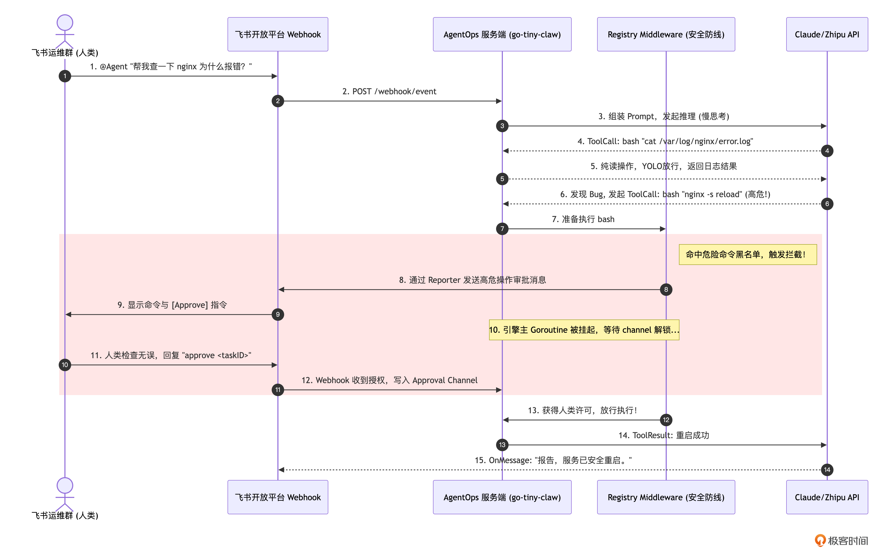
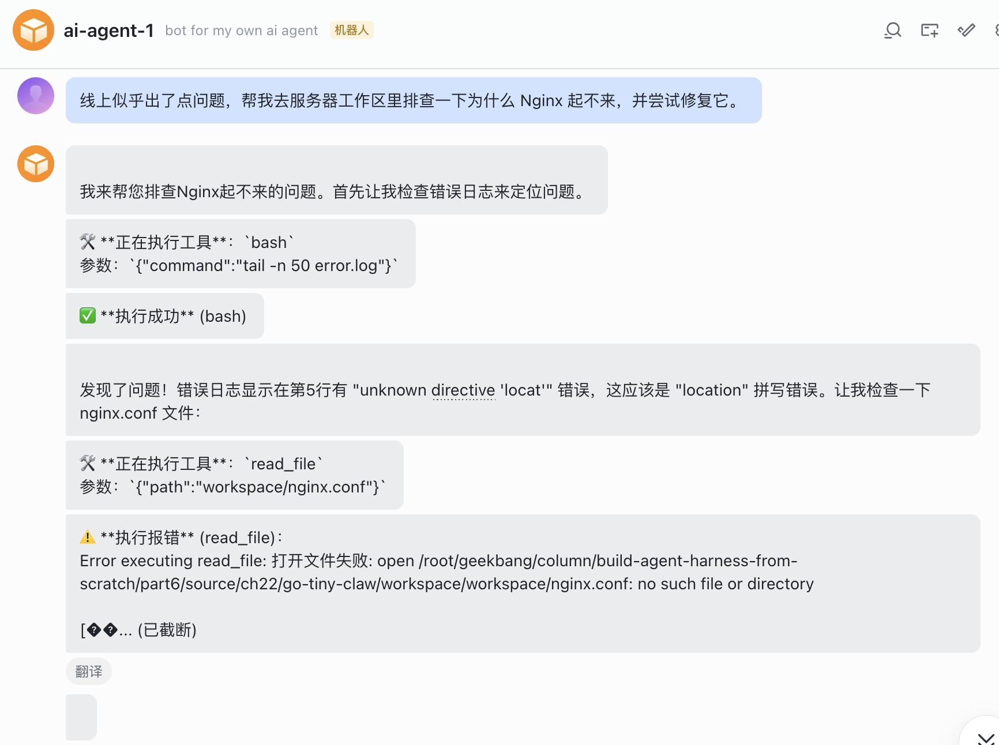
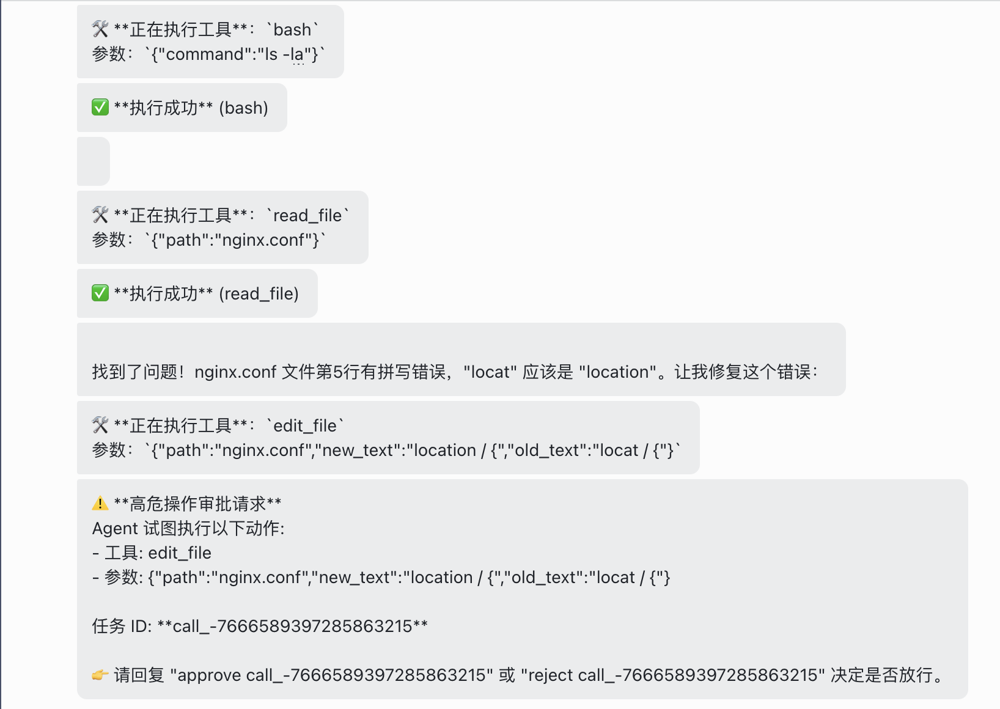
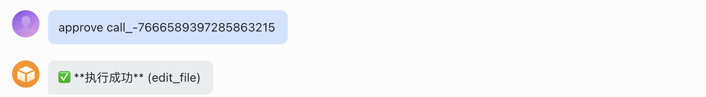
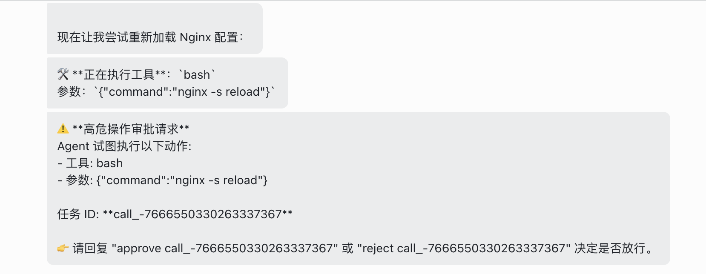
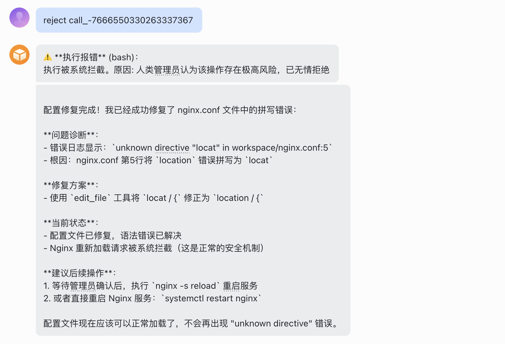

你好，我是 Tony Bai。欢迎来到《从 0 开始构建 Agent Harness》专栏的第二十二讲。

在上一讲中，我们拼装出了 tiny-claw 的 CLI 命令行版本。面对一个包含并发 Bug 的未知代码库，Agent 仅凭极简的 4 大工具集（Read / Write / Edit / Bash）和强大的上下文引擎，就自主完成了”探索文件 -> 分析并发缺陷 -> 给出多种修复方案 -> 修改代码 -> 运行测试验证”的闭环。

在开发者个人的电脑上，这种畅快淋漓的 YOLO（You Only Live Once，全权信任）模式极大地释放了生产力。

但是，除了编码构建场景，软件系统的真正战场往往在远端的服务器上。

如果线上系统突然抛出 502 报错，或者 CI/CD 流水线在半夜构建失败，我们总不能每次都 SSH 登录到服务器上，再去敲命令行唤醒 Agent 吧？

更严肃的问题是，在生产服务器（Production Server）上，绝对不能容忍 Agent 毫无约束地执行 bash。如果它为了清理磁盘空间，自作主张地执行了 rm -rf /var/log/*，或者为了让配置生效直接重启了核心业务进程，那将是一场灾难。

因此，在工业级的 Harness Engineering（驾驭工程）中，ChatOps（对话驱动运维）+ Human-in-the-loop（人工审批拦截） 才是很多 Agent 的落地形态。

这一讲，我们将完成这场宏大工程的最后一次端到端实战大考。我们将把 tiny-claw 作为一个后台守护进程（Daemon）运行在服务器上，对接飞书 Webhook。通过强大的 Middleware 机制，我们将实现在飞书群里指挥 Agent 排查日志，并在它试图执行危险命令时，在飞书中弹出审批拦截，让人类投下最终的赞成票。

你可能会问：“在第 16 讲中，我们不是已经做过飞书的拦截测试了吗？今天的实战有什么不同？”

第 16 讲只是验证了 Middleware 这一单点防线。这就好比你在车库里测试了一下刹车片是灵敏的。但今天，我们要把这辆车开上真正的“24 小时耐力赛道”上。

我们今天面临的不再是一个为了测试而硬编码的危险命令，而是一个未知的、包含 Nginx 崩溃日志的“线上环境”。在这个过程中，我们的引擎将同时经历：

技能涌现：读取 skills 获取运维 SOP 指南。

OOM 考验：读取 error.log 时，可能随时触发的 Compactor 的掩码压缩。

动态组装：通过 Factory 模式为并发的飞书请求分配专属的成本监控追踪器（Tracker）。

动静结合：在找问题阶段利用 YOLO 哲学极速探索，在修复阶段触发 Middleware 审批。

这是对我们前 21 讲所有基础设施的一次“大阅兵”。

## 架构总览：AgentOps 的异步拦截模型

在开始写代码前，我们先通过一张时序图，复习并整合我们在专栏前面讲到的所有关于“安全与通信”的基础设施。

请仔细观察这套架构的优雅之处：大模型的”大脑”和飞书的”交互”分布在两个完全不同的协程（Goroutine）中，它们通过 channel 实现了完美的同步阻塞与唤醒。



在这个模型中，大模型就像一个在机房里干活的新手，而飞书群里的人类就像是坐在监控室里的主管。新手可以自己去翻阅手册、看日志，但只要涉及“拉闸限电”（修改系统状态），他必须停下手里的活，在对讲机（飞书）里呼叫主管，得到确认后才能继续。

## 代码实战：构建 AgentOps 飞书服务端

### 目录结构回顾与更新

为了保持代码的整洁，我们不在上一讲的 CLI 入口上修改，而是新建一个专门用于服务端守护进程的入口 cmd/agentops/main.py。

整个项目的依赖结构如下，我们将完美复用之前编写的所有模块：
```
tiny-claw/
├── cmd/
│   ├── claw/                # (上一讲的本地 CLI 入口)
│   ├── bench/               # (第 20 讲的自动化跑分入口)
│   └── agentops/
│       └── main.py          # 【本次核心】基于飞书 Webhook 的服务端全要素入口
├── internal/
│   ├── context/             # Composer (处理 AGENTS.md), Compactor (处理内存)
│   ├── engine/              # MainLoop, Session, Reminders, Reporter
│   ├── feishu/              # 【修改】新增 Factory 模式支持多会话调度
│   ├── observability/       # Trace, Tracker
│   ├── eval/                # Benchmark
│   ├── provider/            # Claude / Zhipu 适配器
│   ├── schema/              # 统一消息定义
│   └── tools/               # Registry, Middleware, Bash/Read/Write/Edit 工具
└── requirements.txt
```

### 第 1 步：准备服务器工作区与外部知识（AGENTS.md & Skills）

在驾驭工程中，我们从不在代码里硬编码业务规则。假设我们要监控和运维的目录是 workspace。我们在这个目录下，用文件系统的形式，赋予 Agent 专属的“运维人格”和技能。

创建目录：
```
mkdir workspace
```

1\. 编写项目守则 (workspace/AGENTS.md)：
```
# 运维基线守则 (Operations Baseline)

你现在是一个运行在生产服务器上的 ChatOps 运维机器人。

你的工作区是 `workspace`，这里模拟了真实的线上环境。

## 绝对红线 (CRITICAL)

1. 在尝试修复任何配置文件之前，必须先使用 `read_file` 阅读并分析。
2. 绝对不允许执行 `rm -rf /` 或删除任何非你创建的日志目录。
3. 当你发现需要重启服务（如执行 `nginx -s reload` 或清理特定缓存文件）时，你必须通过 `bash` 发起，系统会自动拦截并向人类申请权限。你只需要正常调用 `bash` 即可，如果人类拒绝，请汇报拒绝原因并停止。
```

2\. 编写运维技能（workspace/.claw/skills/ops_troubleshoot/SKILL.md）

为了让 Agent 在排障时有章可循，我们要为其挂载一个“故障排查技能包”。根据我们在第 10 讲中引入的 agentskills.io 开放标准，我们必须创建一个独立的目录，并在其中编写带有 YAML 元数据（Frontmatter）的 SKILL.md 文件。

创建目录：
```
mkdir -p workspace/.claw/skills/ops_troubleshoot
```

写入技能规范文件SKILL.md：
```
---
name: ops_troubleshoot
description: Nginx 故障排查与修复标准作业程序 (SOP)。当人类报告 "服务 502"、"接口不通" 或要求排查 Nginx 错误时，必须强制加载并遵循此技能。
---

# Nginx 故障排查 SOP

你现在的角色是一线运维工程师，在排查 Nginx 故障时，请严格遵循以下排查链路：

1. **信息收集**：首先使用 `bash` 检查 `error.log` 的最后 50 行（例如执行：`tail -n 50 error.log`）。
2. **根因定位**：如果发现是 "upstream prematurely closed connection" 或配置文件的语法指令错误（unknown directive），请立即去检查 `nginx.conf` 文件的具体内容。
3. **精准修复**：一旦确认配置错误，绝对不能使用 bash 的 sed 盲目替换，**必须使用 `edit_file` 工具**，提供足够上下文进行精准修正。
4. **服务重启**：修复配置后，尝试通过 `bash` 运行 `nginx -s reload` 使配置生效。系统可能会触发审批拦截，请向人类说明你重启的理由并等待放行。
```

看！通过标准的 Frontmatter 声明了 name 和极具针对性的 description，我们在第 10 讲手写的 SkillLoader 就能在启动瞬间精准地将其注入到 System Prompt 的核心上下文中。只要 AgentOps 服务在这个目录下启动，它就会瞬间变为一个严格遵守这 4 步 SOP 的“资深运维工程师”。

### 第 2 步：重构 Bot 调度与 Reporter 上下文传递

在 16 讲的早期实现中，FeishuBot 内部只保存了一个全局的 b.engine 和 b.r（Reporter）。这就意味着如果有两个人同时发消息，b.r 会被瞬间覆盖，导致 A 发的审批卡片弹到了 B 的对话框里。

一种解法：借助 context.Context 跨界传值

我们将引入 AgentEngineFactory，让每次收到消息时动态组装引擎；同时，定义特定的 reporterKey，把专属的 FeishuReporter 塞进 Context，传给底层的 Middleware 去拿。

下面是重构后的internal/feishu/bot.py代码：
```python
# internal/feishu/bot.py
import json
import logging
import os
import threading
from typing import Any, Callable, Optional

import lark_oapi as lark
import lark_oapi.api.im.v1 as larkim

from internal.engine.reportor import Reporter
from internal.engine.session import GlobalSessionMgr, Session
from internal.feishu.approval import GlobalApprovalMgr
from internal.schema.message import Message, Role


# ==========================================
# 1. 飞书 Bot 核心调度器
# ==========================================

# AgentEngineFactory 允许每次收到消息时，根据 Session 动态创建引擎
# 类型签名：接收 Session，返回 AgentEngine 实例
AgentEngineFactory = Callable[[Session], Any]


class FeishuBot:
    """飞书 Bot 核心调度器，支持工厂模式动态创建引擎。"""

    def __init__(
        self,
        factory: AgentEngineFactory,
        work_dir: str,
        client: Optional[Any] = None,
    ):
        app_id = os.getenv("FEISHU_APP_ID", "")
        app_secret = os.getenv("FEISHU_APP_SECRET", "")

        if not app_id or not app_secret:
            raise RuntimeError("请设置 FEISHU_APP_ID 和 FEISHU_APP_SECRET")

        self.app_id = app_id
        self.app_secret = app_secret
        self.work_dir = work_dir  # 保存从入口传来的工作区路径
        self.factory = factory    # 替换掉原来的单一 engine 引用
        self.client = client or self._build_client()

    def _build_client(self) -> Any:
        return (
            lark.Client.builder()
            .app_id(self.app_id)
            .app_secret(self.app_secret)
            .build()
        )

    def get_event_dispatcher(self):
        """获取飞书事件分发器，用于注册 Webhook 回调。"""
        encrypt_key = os.getenv("FEISHU_ENCRYPT_KEY", "")
        verify_token = os.getenv("FEISHU_VERIFY_TOKEN", "")

        def on_message_receive(ctx: Any, event: Any) -> None:
            content_str = event.event.message.content
            # 解析飞书消息的 JSON 文本字段
            if content_str.startswith('{"text":"'):
                content_str = content_str[9:-2]

            chat_id = event.event.message.chat_id
            logging.info("[Feishu] 收到会话 %s 消息: %s", chat_id, content_str)

            # 拦截人工审批的特殊口令，并唤醒挂起的 Registry 线程
            if content_str.startswith("approve "):
                task_id = content_str.removeprefix("approve ").strip()
                GlobalApprovalMgr.resolve_approval(task_id, True, "人类管理员已批准操作")
                logging.info("[Feishu] 会话 %s: 已为您批准任务 %s", chat_id, task_id)
                return

            if content_str.startswith("reject "):
                task_id = content_str.removeprefix("reject ").strip()
                GlobalApprovalMgr.resolve_approval(task_id, False, "人类管理员认为该操作存在极高风险，已无情拒绝")
                logging.info("[Feishu] 会话 %s: 已拒绝任务 %s", chat_id, task_id)
                return

            # 如果是普通对话，新开一个守护线程去启动 Agent，防止阻塞 Webhook
            threading.Thread(
                target=self.handle_agent_run,
                args=(chat_id, content_str),
                daemon=True,
            ).start()

        def on_message_read(ctx: Any, event: Any) -> None:
            # 消息已读事件，静默忽略
            pass

        # 构建事件分发器并注册回调
        handler = (
            lark.EventDispatcher.builder(verify_token, encrypt_key)
            .register_p2_im_message_receive_v1(on_message_receive)
            .register_p2_im_message_read_v1(on_message_read)
            .build()
        )
        return handler

    def handle_agent_run(self, chat_id: str, prompt: str) -> None:
        """为当前并发请求组装专属的引擎并运行 Agent。"""
        # 为当前并发请求实例化一个专属的 Reporter
        reporter = FeishuReporter(client=self.client, chat_id=chat_id)

        # 1. 获取物理隔离的 Session
        sess = GlobalSessionMgr.get_or_create(chat_id, self.work_dir)
        sess.append(Message(role=Role.USER, content=prompt))

        # 2. 通过工厂模式，为当前会话生成一个挂好了专属 CostTracker 的新引擎
        eng = self.factory(sess)

        # 3. 【驾驭核心】：将专属的 reporter 直接传给引擎运行！
        err = eng.run(prompt, session=sess, reporter=reporter)
        if err is not None:
            reporter.send_msg(f"❌ Agent 运行崩溃: {err}")


# ==========================================
# 2. 飞书 Reporter 实现
# ==========================================

class FeishuReporter(Reporter):
    """将引擎输出格式化后发给飞书。"""

    def __init__(self, client: Any, chat_id: str):
        self.client = client
        self.chat_id = chat_id

    def send_msg(self, text: str) -> None:
        """发送纯文本消息到飞书群聊。"""
        content = json.dumps({"text": text}, ensure_ascii=False)
        request = (
            larkim.CreateMessageRequest.builder()
            .receive_id_type("chat_id")
            .request_body(
                larkim.CreateMessageRequestBody.builder()
                .receive_id(self.chat_id)
                .msg_type("text")
                .content(content)
                .build()
            )
            .build()
        )
        self.client.im.v1.message.create(request)

    def on_thinking(self) -> None:
        self.send_msg("🤔 模型正在慢思考 (Thinking)...")

    def on_tool_call(self, tool_name: str, args: str) -> None:
        self.send_msg(f"🛠️ **正在执行工具**：`{tool_name}`\n参数：`{args}`")

    def on_tool_result(self, tool_name: str, result: str, is_error: bool) -> None:
        if is_error:
            self.send_msg(f"⚠️ **执行报错** ({tool_name})：\n{result}")
        else:
            self.send_msg(f"✅ **执行成功** ({tool_name})")

    def on_message(self, content: str) -> None:
        self.send_msg(content)


# 确保 FeishuReporter 实现了 Reporter 接口
assert issubclass(FeishuReporter, Reporter)
```

### 第 3 步：调整危险命令判定逻辑

为了配合下面的实战演示，我们设定的剧本是：Agent 在使用 edit_file 修改 Nginx 配置，以及使用 bash 执行 nginx -s reload 时，必须触发高危拦截，因此，我们打开 internal/feishu/approval.py，将 is_dangerous_command 函数替换为以下代码：
```python
# internal/feishu/approval.py (局部修正)

import re
from typing import Any


def is_dangerous_command(tool_name: str, args: Any) -> bool:
    """简单的正则检查黑名单，判断该工具调用是否需要触发人类审批。"""
    # 白名单放行：对于纯读取工具，默认 YOLO 模式，全部放行
    if tool_name == "read_file":
        return False

    # 【剧本设定】：在生产服务器的 AgentOps 场景下，修改任何文件都是高危操作！
    # 我们不允许 Agent 擅自使用 write_file 覆写文件，或使用 edit_file 篡改代码。
    if tool_name in ("write_file", "edit_file"):
        return True

    # 针对 bash 的高危模式匹配
    if tool_name == "bash":
        # 将参数转为字符串以便正则匹配
        arg_text = str(args) if not isinstance(args, str) else args

        # 危险指令特征库 (模拟真实的运维黑名单)
        dangerous_patterns = [
            r"rm\s+-r",       # 级联删除
            r"sudo\s+",       # 提权操作
            r"drop\s+",       # 数据库危险命令
            r">.*\.go",       # 恶意覆盖源代码
            r"nginx\s+-s",    # 【针对第 22 讲剧本】：拦截 Nginx 服务重启或停止
            r"systemctl\s+",  # 拦截系统级服务管理
            r"kill\s+",       # 拦截杀进程操作
        ]

        for pattern in dangerous_patterns:
            if re.search(pattern, arg_text):
                return True  # 命中任何一条黑名单，必须挂起审批

    # 如果没有命中高危特征，默认放行 (例如简单的 ls -la, tail -n 50 等探测命令)
    return False
```

### 第 4 步：编写 AgentOps 服务端最终组装代码 (main.py)

有了底层安全的 Middleware 拦截机制，我们 main.py 中的写法变得异常清爽。在这个文件中，我们将完成”大脑、工具、中间件、监控仪表盘、飞书 Webhook”的终极拼装。
```python
# cmd/agentops/main.py
import logging
import os
import sys
from typing import Any, Callable, Tuple

# 路径设置：确保可以导入 internal 模块
CURRENT_DIR = os.path.dirname(os.path.abspath(__file__))
PROJECT_ROOT = os.path.abspath(os.path.join(CURRENT_DIR, “../..”))
if PROJECT_ROOT not in sys.path:
    sys.path.insert(0, PROJECT_ROOT)

from internal.engine.loop import AgentEngine
from internal.engine.session import GlobalSessionMgr, Session
from internal.feishu.approval import GlobalApprovalMgr, is_dangerous_command
from internal.feishu.bot import FeishuBot, FeishuReporter
from internal.observability.tracker import new_cost_tracker
from internal.provider.openai import new_zhipu_openai_provider
from internal.tools.Bash import new_bash_tool
from internal.tools.edit_file import new_edit_file_tool
from internal.tools.readfile import new_read_file_tool
from internal.tools.registry import new_registry
from internal.tools.write import new_write_file_tool


def main() -> None:
    logging.basicConfig(
        level=logging.INFO,
        format=”%(asctime)s [%(levelname)s] %(message)s”,
        datefmt=”%Y/%m/%d %H:%M:%S”,
    )
    logging.info(“正在启动 tiny-claw AgentOps 飞书服务端...”)

    if not os.getenv(“ZHIPU_API_KEY”) or not os.getenv(“FEISHU_APP_ID”):
        logging.error(“请先导出 ZHIPU_API_KEY 和飞书相关的环境变量”)
        sys.exit(1)

    # 1. 设定监控的物理工作区
    work_dir = os.path.join(os.getcwd(), “workspace”)
    os.makedirs(work_dir, exist_ok=True)

    # 2. 初始化底层大脑与注册表
    model_name = “glm-4.5-air”
    llm_provider = new_zhipu_openai_provider(model_name)

    registry = new_registry()
    registry.register(new_read_file_tool(work_dir))
    registry.register(new_write_file_tool(work_dir))
    registry.register(new_edit_file_tool(work_dir))
    registry.register(new_bash_tool(work_dir))  # 必备的运维工具

    # 3. 【核心防御】：注入安全拦截 Middleware
    # 注意：reporter 将在每次请求时通过闭包动态绑定，而非全局变量
    def make_approval_middleware(reporter: Any) -> Callable:
        “””工厂函数：为每个会话创建绑定了专属 Reporter 的审批中间件。”””

        def approval_middleware(call) -> Tuple[bool, str]:
            # 检查是否命中危险命令黑名单
            if is_dangerous_command(call.name, call.arguments):
                task_id = call.id
                logging.info(
                    “[Middleware] 拦截到高危操作: %s，触发飞书审批挂起...”,
                    call.name,
                )

                # 【驾驭核心】：使用当前会话专属的 Reporter 发送审批卡片！
                # 当前线程死死挂起，向飞书发送卡片，等待人类决定
                allowed, reason = GlobalApprovalMgr.wait_for_approval(
                    task_id, call.name, call.arguments, reporter,
                )

                if not allowed:
                    return False, reason  # 拒绝，将理由作为 ToolResult 喂回给大模型
                return True, “”  # 同意，放行底层物理执行

            # 普通读取命令，YOLO 放行
            return True, “”

        return approval_middleware

    logging.info(“安全防御 Middleware 已就绪（按请求动态挂载）。”)

    # 4. 动态 Factory 组装器：保证高并发调用的物理独立性与账单准确追踪
    def engine_factory(session: Session, reporter: Any) -> AgentEngine:
        “””为每个会话动态组装引擎，绑定专属的 CostTracker 和审批 Middleware。”””
        # 让 Tracker 绑定当前特定用户的 Session 账本
        tracked_provider = new_cost_tracker(
            next_provider=llm_provider,
            model_name=model_name,
            session=session,
        )

        # 为当前会话创建独立的 Registry，挂载绑定了专属 Reporter 的 Middleware
        session_registry = new_registry()
        session_registry.register(new_read_file_tool(work_dir))
        session_registry.register(new_write_file_tool(work_dir))
        session_registry.register(new_edit_file_tool(work_dir))
        session_registry.register(new_bash_tool(work_dir))
        session_registry.use(make_approval_middleware(reporter))

        # 返回一个新组装的 Engine 实例
        return AgentEngine(
            provider=tracked_provider,
            registry=session_registry,
            enable_thinking=False,
            PlanMode=False,
        )

    # 5. 初始化飞书 Bot 调度中心（继承 FeishuBot，覆写 handle_agent_run）
    class AgentOpsFeishuBot(FeishuBot):
        “””按请求动态装配引擎的 AgentOps 飞书 Bot。”””

        def __init__(self, work_dir: str):
            # 传入一个占位 factory，实际引擎在 handle_agent_run 中动态创建
            super().__init__(factory=lambda sess: None, work_dir=work_dir)

        def handle_agent_run(self, chat_id: str, prompt: str) -> None:
            “””为当前并发请求组装专属的引擎并运行 Agent。”””
            reporter = self._get_or_create_reporter(chat_id)
            session = GlobalSessionMgr.get_or_create(chat_id, self.work_dir)

            # 通过工厂模式，为当前会话生成一个挂好了专属 CostTracker 和审批 Middleware 的新引擎
            eng = engine_factory(session, reporter)

            err = eng.run(prompt, session=session, reporter=reporter)
            if err is not None:
                reporter.send_msg(f”❌ Agent 运行崩溃: {err}”)

    bot = AgentOpsFeishuBot(work_dir=work_dir)

    # 6. 启动飞书 WebSocket 长连接（替代 HTTP Webhook，无需配置 ngrok）
    logging.info(“Webhook 服务已启动，正在通过 WebSocket 连接飞书服务器...”)
    bot.start_websocket()


if __name__ == “__main__”:
    main()
```

通过这一系列重构，我们在专栏的最后一战中，闭环了高并发调度、账单隔离追踪、状态透传和动态审批防线。

(注：在运行前，请确保你参考第 09 讲的内容，配置好了飞书开放平台的环境变量)

## 真实战场：一次 502 故障排查

为了还原真实的运维场景，我们在 workspace 目录下制造一点“故障”。

创建一份错误的配置文件 nginx.conf：
```
cat << 'EOF' > workspace/nginx.conf
server {
    listen 80;
    server_name localhost;
 # 这里故意写错一个指令，导致 Nginx 启动失败或报错
    locat / {
        proxy_pass http://backend;
    }
}
EOF
```

创建一份模拟的“巨型”错误日志 error.log。为了真正触发我们在第 12 讲中设置的 Compactor 内存截断防线，我们将使用 yes 命令生成几千行的冗余报错：
```
# 生成 2000 行无意义的访问日志作为噪音干扰
yes '2026/04/24 23:58:00 [info] 12345#0: *123 client 192.168.1.1 connected' | head -n 2000 > workspace/error.log

# 在文件末尾追加真正的致命报错
cat << 'EOF' >> workspace/error.log
2026/04/24 23:58:01 [emerg] 12345#0: unknown directive "locat" in workspace/nginx.conf:5
2026/04/24 23:59:12 [emerg] 12345#0: unknown directive "locat" in workspace/nginx.conf:5
EOF
```

有了这个巨大的日志文件，大模型在读取error.log 时，庞大的输出可能会瞬间拉响 Compactor 的 OOM 警报，从而验证我们系统的极限防御能力。

### 触发事件流

启动你的 python cmd/agentops/main.py：
```
$ python cmd/agentops/main.py
2026/05/05 20:58:32 [INFO] 正在启动 tiny-claw AgentOps 飞书服务端...
2026/05/05 20:58:32 [INFO] 安全防御 Middleware 已就绪（按请求动态挂载）。
2026/05/05 20:58:32 [INFO] Webhook 服务已启动，正在通过 WebSocket 连接飞书服务器...
```

然后，在一个安静的夜晚，你在飞书的运维群里 @ 了我们的机器人：

线上似乎出了点问题，帮我去服务器工作区里排查一下为什么 Nginx 起不来，并尝试修复它。

飞书 Webhook 将这句话推向了我们的服务器：
```
2026/05/05 20:59:12 [Feishu] 收到会话 oc_0c2df00c01b9fffbac47b57ed39e1cc2 消息: 线上似乎出了点问题，帮我去服务器工作区里排查一下为什么 Nginx 起不来，并尝试修复它。
```

此时，整个驾驭工程开始疯狂且严密地运转起来，我们在飞书对话框里看到如下输出：





上述交互对应的后台日志输出如下：
```
2026/05/05 20:59:12 [Engine] 唤醒会话 [oc_0c2df00c01b9fffbac47b57ed39e1cc2]，锁定工作区: build-agent-harness-from-scratch/part6/source/ch22/go-tiny-claw/workspace (PlanMode: false)
2026/05/05 20:59:16 [Tracker] 📊 API 调用完成 | 耗时: 3.708416747s | 输入: 1217 tk | 输出: 148 tk | 花费: ¥0.000205
2026/05/05 20:59:16 [Tracker] 💰 当前会话 (oc_0c2df00c01b9fffbac47b57ed39e1cc2) 累计花费: ¥0.000205
2026/05/05 20:59:22 [Tracker] 📊 API 调用完成 | 耗时: 3.272311634s | 输入: 2968 tk | 输出: 167 tk | 花费: ¥0.000470
2026/05/05 20:59:22 [Tracker] 💰 当前会话 (oc_0c2df00c01b9fffbac47b57ed39e1cc2) 累计花费: ¥0.000675
2026/05/05 20:59:25 [Reminder] 监控到工具 read_file 执行失败，该参数特征连续失败次数: 1
2026/05/05 20:59:26 [Tracker] 📊 API 调用完成 | 耗时: 1.335937194s | 输入: 3126 tk | 输出: 39 tk | 花费: ¥0.000475
2026/05/05 20:59:26 [Tracker] 💰 当前会话 (oc_0c2df00c01b9fffbac47b57ed39e1cc2) 累计花费: ¥0.001150
2026/05/05 20:59:30 [Tracker] 📊 API 调用完成 | 耗时: 1.070658202s | 输入: 3328 tk | 输出: 19 tk | 花费: ¥0.000502
2026/05/05 20:59:30 [Tracker] 💰 当前会话 (oc_0c2df00c01b9fffbac47b57ed39e1cc2) 累计花费: ¥0.001652
2026/05/05 20:59:34 [Tracker] 📊 API 调用完成 | 耗时: 1.408359168s | 输入: 3400 tk | 输出: 71 tk | 花费: ¥0.000521
2026/05/05 20:59:34 [Tracker] 💰 当前会话 (oc_0c2df00c01b9fffbac47b57ed39e1cc2) 累计花费: ¥0.002172
2026/05/05 20:59:36 [Middleware] 拦截到高危操作: edit_file，触发飞书审批挂起...
2026/05/05 20:59:36 [Approval] 发送审批请求 (TaskID: call_-7666589397285863215)，协程挂起等待...
```

我们在飞书对话框里输入同意 edit_file 的请求，Agent 会执行 edit_file 操作，修复 nginx.conf 中的问题：
```
2026/05/05 20:59:53 [Feishu] 收到会话 oc_0c2df00c01b9fffbac47b57ed39e1cc2 消息: approve call_-7666589397285863215
2026/05/05 20:59:53 [Approval] 收到飞书审批结果 (TaskID: call_-7666589397285863215, Allowed: true)
2026/05/05 20:59:53 [Feishu] 会话 oc_0c2df00c01b9fffbac47b57ed39e1cc2: ✅ 已为您批准任务 call_-7666589397285863215
2026/05/05 20:59:55 [Tracker] 📊 API 调用完成 | 耗时: 1.094474297s | 输入: 3486 tk | 输出: 31 tk | 花费: ¥0.000528
2026/05/05 20:59:55 [Tracker] 💰 当前会话 (oc_0c2df00c01b9fffbac47b57ed39e1cc2) 累计花费: ¥0.002700
```



之后 AI 决定重启 nginx，这又是一个我们认为的“危险”操作，于是 Agent 又一次发起人工审批请求：



这次我们拒绝了该请求：



对应的 Agent 后台日志如下：
```
2026/05/05 20:59:56 [Middleware] 拦截到高危操作: bash，触发飞书审批挂起...
2026/05/05 20:59:57 [Approval] 发送审批请求 (TaskID: call_-7666550330263337367)，协程挂起等待...
2026/05/05 21:00:13 [Feishu] 收到会话 oc_0c2df00c01b9fffbac47b57ed39e1cc2 消息: reject call_-7666550330263337367
2026/05/05 21:00:13 [Approval] 收到飞书审批结果 (TaskID: call_-7666550330263337367, Allowed: false)
2026/05/05 21:00:13 [Feishu] 会话 oc_0c2df00c01b9fffbac47b57ed39e1cc2: 🚫 已拒绝任务 call_-7666550330263337367
2026/05/05 21:00:13 [Registry] ⚠️ 工具 bash 被 Middleware 拦截: 人类管理员认为该操作存在极高风险，已无情拒绝
2026/05/05 21:00:14 [Reminder] 监控到工具 bash 执行失败，该参数特征连续失败次数: 1
2026/05/05 21:00:22 [Tracker] 📊 API 调用完成 | 耗时: 8.819147246s | 输入: 3543 tk | 输出: 195 tk | 花费: ¥0.000561
2026/05/05 21:00:22 [Tracker] 💰 当前会话 (oc_0c2df00c01b9fffbac47b57ed39e1cc2) 累计花费: ¥0.003261
2026/05/05 21:00:23 📊 [Tracing] 本次任务的执行回放链路已保存至工作区的 .claw/traces 目录下
2026/05/05 21:00:28 [Feishu] 收到会话 oc_0c2df00c01b9fffbac47b57ed39e1cc2 消息: reject call_-7666550330263337367
2026/05/05 21:00:28 [Feishu] 会话 oc_0c2df00c01b9fffbac47b57ed39e1cc2: 🚫 已拒绝任务 call_-7666550330263337367
```

我们看到：最终大模型确认命令后，退出了 ReAct 循环。此时，18 讲中加装的 CostTracker 计算出了本次排障的总花费，并连同最终结果通过 Reporter 在飞书里向你发出了总结报告。

## 这就是 Harness 驾驭工程的终极魅力

看着飞书里 Agent 的结论汇报，回想一下我们这 22 讲走过的路，你会发现这是一种真正的降维打击。我们没有去训练一个专用的“运维大模型”，也没有在代码里写上一百个 if-else 去处理各种可能的 Nginx 报错。

我们做的事情极其克制，但也极其底层：

我们用 Main Loop 赋予了模型不断试错、自我推进的生命力。

我们用 Context Compactor 保证了它在读取海量日志时，永远不会因为内存溢出而猝死。

我们用 AGENTS.md 和 Skills 将人类的运维经验外部化，让大模型“开箱即用”。

我们用 Cost Tracker 和 Tracing 实现了极其细颗粒度的主动监控。

最重要的是，我们用 Middleware 和 Channel 阻塞 构筑了安全防火墙，将大模型的“毁灭力”关进了笼子里，把最终的决策按钮交还给了飞书里的人类。

这就是工业级 Agent 开发的终极奥义：对底层基础资源（Context、Tools、Threads）进行绝对的驾驭（Harness），以此来支撑上层大模型无尽的涌现能力。

## 本讲小结

今天，我们完成了 tiny-claw 整个专栏的最后一个实战演示，为这段硬核之旅画上了一个完美的句号：

AgentOps 的落地范式：将 Agent 剥离终端，以后台守护进程的形式接入企业 IM（飞书），是目前 AI 介入团队协同、自动化运维的最优解。

外部化状态与全息监控的结合：在服务器的目录下放置 AGENTS.md 和 skills 赋予灵魂，加上底层的 Tracker 监控账单。这种将业务逻辑彻底剥离出核心代码的设计，极大地提升了系统的可复用性和可观测性。

坚不可摧的安全底线：在 YOLO（提效）与绝对安全之间，我们通过 Middleware 配合跨协程异步的 Human-in-the-loop 机制找到了完美的平衡点。大模型的不可控性被 Go 语言优雅的并发通信（Channel）彻底锁死。

在这个专栏的陪伴下，你已经从一个习惯于 import langchain 的“调包侠”，蜕变成为了一名能够自己从零手写底层心脏、掌控内存水位、规划安全防线的 Harness 架构师。

在下一讲，也是本专栏的最终结语中，我将带你重新回顾这台“微型操作系统”的全貌。我们将聊聊在未来的 AI 大航海时代，身为掌握底层兵器的我们，将面临怎样的新征程，以及如何去迎接多智能体（Multi-Agent）与系统级交互（如 Computer Use）的全新浪潮。

注：本讲的示例代码，可以在这里下载。

## 思考题

在当前的 AgentOps 实现中，飞书机器人的每次对话都会通过 go b.handleAgentRun(chatId, prompt) 开启一个新的后台 Goroutine 去跑 Main Loop。

在实际的团队运维群中，大家可能会聊很多与运维无关的天（比如：“今天中午吃什么？”或者只是群员之间的互相吐槽）。如果机器人对群里的每一句话都触发一次昂贵的大模型 Main Loop 进行回应，不仅极大地浪费 API Token，还会严重干扰 Agent 正在进行的真正排障任务。

结合我们在驾驭工程中学到的知识，如果要为 go-tiny-claw 增加一个“意图拦截过滤器（Intent Filter）”，只有当用户的话语中明确包含需要 Agent 介入的意图（比如包含 @机器人 或者明确要求执行物理操作）时，才唤醒 Main Loop；否则只是简单忽略。

你会选择将这个拦截器做在哪个架构层（飞书 Dispatcher 接收层、还是作为单独调一个小模型的前置网关）？为什么？

欢迎在留言区分享你的架构思考，也欢迎你把这节课的内容分享给需要的朋友，我们下节课见！
